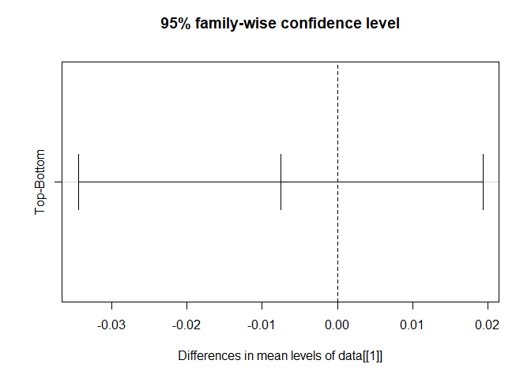
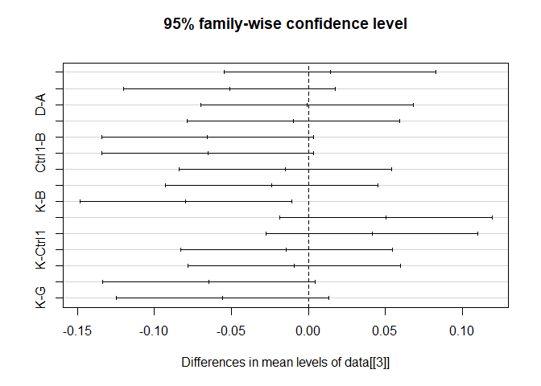
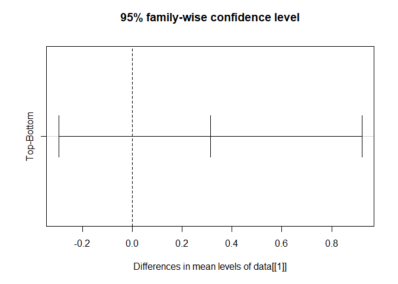
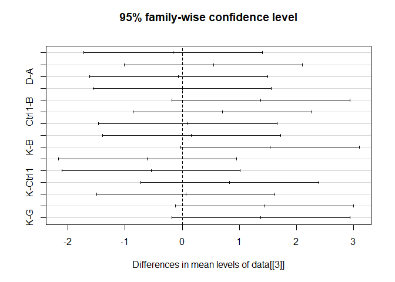
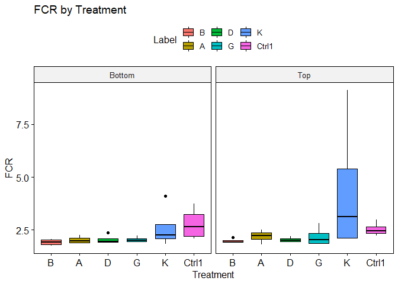
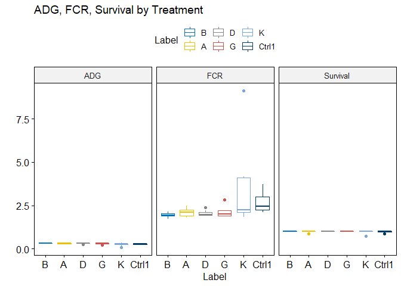
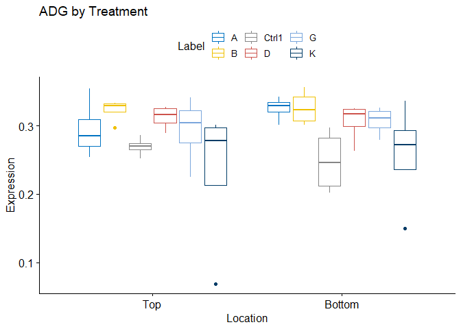
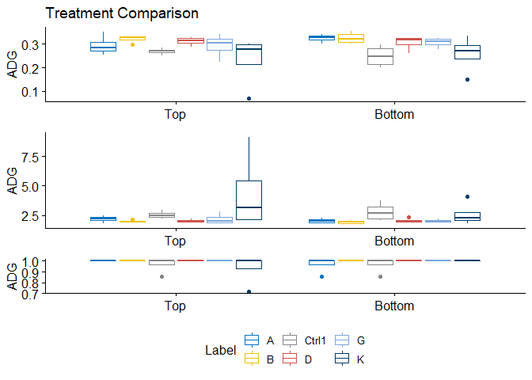

2wayANOVA
================

    ## # A tibble: 6 x 7
    ##   Location Location2 Label   ADG   FCR Survival CP   
    ##   <chr>    <chr>     <chr> <dbl> <dbl>    <dbl> <fct>
    ## 1 Top      Right     B     0.333  1.91        1 36   
    ## 2 Top      Right     B     0.331  1.92        1 36   
    ## 3 Bottom   Right     B     0.309  2.01        1 36   
    ## 4 Bottom   Right     B     0.337  1.85        1 36   
    ## 5 Top      Left      B     0.328  1.94        1 36   
    ## 6 Top      Left      B     0.297  2.14        1 36

## Summarize the data

``` r
library(Rmisc)
```

    ## Loading required package: lattice

    ## Loading required package: plyr

``` r
summarySE(data, measurevar="ADG", groupvars=c("Location","Label"))
```

    ##    Location Label N       ADG         sd          se         ci
    ## 1    Bottom     A 4 0.3252769 0.01751063 0.008755316 0.02786332
    ## 2    Bottom     B 4 0.3257475 0.02564890 0.012824451 0.04081313
    ## 3    Bottom Ctrl1 4 0.2480759 0.04628764 0.023143818 0.07365396
    ## 4    Bottom     D 4 0.3056478 0.02932007 0.014660037 0.04665478
    ## 5    Bottom     G 4 0.3067276 0.02065931 0.010329657 0.03287358
    ## 6    Bottom     K 4 0.2573920 0.07818746 0.039093729 0.12441369
    ## 7       Top     A 4 0.2944728 0.04272590 0.021362952 0.06798645
    ## 8       Top     B 4 0.3221939 0.01698950 0.008494752 0.02703409
    ## 9       Top Ctrl1 4 0.2693452 0.01403954 0.007019771 0.02234004
    ## 10      Top     D 4 0.3125000 0.01748616 0.008743079 0.02782438
    ## 11      Top     G 4 0.2933673 0.04978047 0.024890237 0.07921184
    ## 12      Top     K 4 0.2316156 0.11010256 0.055051280 0.17519774

``` r
summarySE(data, measurevar="FCR", groupvars=c("Location","Location2"))
```

    ##   Location Location2  N      FCR        sd         se        ci
    ## 1   Bottom      Left 12 2.004788 0.1802506 0.05203387 0.1145258
    ## 2   Bottom     Right 12 2.464976 0.7501594 0.21655237 0.4766285
    ## 3      Top      Left 12 2.203602 0.3006005 0.08677588 0.1909924
    ## 4      Top     Right 12 2.892232 2.0647446 0.59604044 1.3118762

## Two-way ANOVA (1)

``` r
#ANOVA Test - Parametric 
anova <- vector(mode = "list", length =3)
for (i in 4:5){
  anova[[i-1]] <-aov(data[[i]]~data[[1]]*data[[2]], data = data)
  cat(paste("* ", colnames(data)[i]),'\n')
  print(summary(anova[[i-1]]))
}
```

    ## *  ADG 
    ##                     Df  Sum Sq  Mean Sq F value Pr(>F)
    ## data[[1]]            1 0.00069 0.000686   0.253  0.618
    ## data[[2]]            1 0.00706 0.007060   2.600  0.114
    ## data[[1]]:data[[2]]  1 0.00099 0.000994   0.366  0.548
    ## Residuals           44 0.11949 0.002716               
    ## *  FCR 
    ##                     Df Sum Sq Mean Sq F value Pr(>F)  
    ## data[[1]]            1   1.18   1.176   0.950 0.3349  
    ## data[[2]]            1   3.96   3.959   3.200 0.0805 .
    ## data[[1]]:data[[2]]  1   0.16   0.157   0.127 0.7237  
    ## Residuals           44  54.44   1.237                 
    ## ---
    ## Signif. codes:  0 '***' 0.001 '**' 0.01 '*' 0.05 '.' 0.1 ' ' 1

### Two-way ANOVA (2)

``` r
#ANOVA Test - Parametric 
library(car)
```

    ## Loading required package: carData

``` r
anova <- vector(mode = "list", length =3)
for (i in 4:5){
  anova[[i-1]] <-lm(data[[i]]~data[[1]]*data[[2]], data = data)
                    # contrasts=list(data[[1]]=contr.sum, data[[2]]=contr.sum))
  cat(paste("* ", colnames(data)[i]),'\n')
  print(Anova(anova[[i-1]], type="II"))
  print(Anova(anova[[i-1]], type="III"))
}
```

    ## *  ADG 
    ## Anova Table (Type II tests)
    ## 
    ## Response: data[[i]]
    ##                       Sum Sq Df F value Pr(>F)
    ## data[[1]]           0.000686  1  0.2527 0.6177
    ## data[[2]]           0.007060  1  2.5998 0.1140
    ## data[[1]]:data[[2]] 0.000994  1  0.3659 0.5483
    ## Residuals           0.119491 44               
    ## Anova Table (Type III tests)
    ## 
    ## Response: data[[i]]
    ##                      Sum Sq Df  F value Pr(>F)    
    ## (Intercept)         1.16431  1 428.7301 <2e-16 ***
    ## data[[1]]           0.00167  1   0.6134 0.4377    
    ## data[[2]]           0.00668  1   2.4582 0.1241    
    ## data[[1]]:data[[2]] 0.00099  1   0.3659 0.5483    
    ## Residuals           0.11949 44                    
    ## ---
    ## Signif. codes:  0 '***' 0.001 '**' 0.01 '*' 0.05 '.' 0.1 ' ' 1
    ## *  FCR 
    ## Anova Table (Type II tests)
    ## 
    ## Response: data[[i]]
    ##                     Sum Sq Df F value  Pr(>F)  
    ## data[[1]]            1.176  1  0.9505 0.33493  
    ## data[[2]]            3.959  1  3.2003 0.08051 .
    ## data[[1]]:data[[2]]  0.157  1  0.1265 0.72374  
    ## Residuals           54.436 44                  
    ## ---
    ## Signif. codes:  0 '***' 0.001 '**' 0.01 '*' 0.05 '.' 0.1 ' ' 1
    ## Anova Table (Type III tests)
    ## 
    ## Response: data[[i]]
    ##                     Sum Sq Df F value    Pr(>F)    
    ## (Intercept)         48.230  1 38.9836 1.479e-07 ***
    ## data[[1]]            0.237  1  0.1917    0.6637    
    ## data[[2]]            1.271  1  1.0270    0.3164    
    ## data[[1]]:data[[2]]  0.157  1  0.1265    0.7237    
    ## Residuals           54.436 44                      
    ## ---
    ## Signif. codes:  0 '***' 0.001 '**' 0.01 '*' 0.05 '.' 0.1 ' ' 1

### Two-way ANOVA (3)

``` r
library(magicfor)
magic_for(silent = TRUE)
for(i in 4:5){
  anova <- summary(fm1 <- aov(data[[i]] ~ data[[1]] + data[[2]], data = data))
  name <- rep(colnames(data)[i],each=3)
  anova_DF <- anova[[1]]$Df
  anova_SumSq <- round(anova[[1]]$'Sum Sq',2)
  anova_MeanSq <- round(anova[[1]]$'Mean Sq',2)
  anova_Stats <- round(as.numeric(anova[[1]]$'F value'),2)
  anova_pvalue <- round(as.numeric(anova[[1]]$'Pr(>F)'),3)
  put(name, anova_DF,anova_SumSq,anova_MeanSq,anova_Stats,anova_pvalue)
}
magic_result_as_dataframe()
```

    ##   i name anova_DF anova_SumSq anova_MeanSq anova_Stats anova_pvalue
    ## 1 4  ADG        1        0.00         0.00        0.26        0.615
    ## 2 5  ADG        1        0.01         0.01        2.64        0.111
    ## 3 4  ADG       45        0.12         0.00          NA           NA
    ## 4 5  FCR        1        1.18         1.18        0.97        0.330
    ## 5 4  FCR        1        3.96         3.96        3.26        0.078
    ## 6 5  FCR       45       54.59         1.21          NA           NA

## Post-hoc Analysis

Tukey Honest Significant Differences based on this Studentized range
statistics.

``` r
library(rlist)
fm1 <- aov(data[[4]] ~ data[[1]] + data[[3]], data = data)
list.rbind(TukeyHSD(fm1, ordered=TRUE)) #multiple comparison
```

    ##                    diff          lwr        upr      p adj
    ## Bottom-Top 0.0075621276 -0.019307776 0.03443203 0.57288433
    ## Ctrl1-K    0.0142067118 -0.054666283 0.08307971 0.98919837
    ## G-K        0.0555436244 -0.013329370 0.12441662 0.17659636
    ## D-K        0.0645700838 -0.004302911 0.13344308 0.07733389
    ## A-K        0.0653709856 -0.003502009 0.13424398 0.07144159
    ## B-K        0.0794668565  0.010593862 0.14833985 0.01551581
    ## G-Ctrl1    0.0413369127 -0.027536082 0.11020991 0.48083720
    ## D-Ctrl1    0.0503633721 -0.018509623 0.11923637 0.26646505
    ## A-Ctrl1    0.0511642738 -0.017708721 0.12003727 0.25086206
    ## B-Ctrl1    0.0652601448 -0.003612850 0.13413314 0.07223337
    ## D-G        0.0090264594 -0.059846535 0.07789945 0.99871703
    ## A-G        0.0098273612 -0.059045634 0.07870036 0.99807134
    ## B-G        0.0239232321 -0.044949763 0.09279623 0.90217881
    ## A-D        0.0008009018 -0.068072093 0.06967390 0.99999999
    ## B-D        0.0148967727 -0.053976222 0.08376977 0.98661322
    ## B-A        0.0140958709 -0.054777124 0.08296887 0.98957644

``` r
plot(TukeyHSD(fm1, "data[[1]]")) #C.I
```

<!-- -->

``` r
plot(TukeyHSD(fm1, "data[[3]]")) #C.I
```

<!-- -->

``` r
fm1 <- aov(data[[5]] ~ data[[1]] + data[[3]], data = data)
list.rbind(TukeyHSD(fm1, ordered=TRUE)) #multiple comparison
```

    ##                   diff         lwr       upr      p adj
    ## Top-Bottom 0.313035409 -0.29526286 0.9213337 0.30476819
    ## D-B        0.096990212 -1.46220126 1.6561817 0.99996674
    ## A-B        0.159460969 -1.39973050 1.7186524 0.99961481
    ## G-B        0.161010762 -1.39818071 1.7202022 0.99959618
    ## Ctrl1-B    0.705276034 -0.85391543 2.2644675 0.75457679
    ## K-B        1.536052233 -0.02313923 3.0952437 0.05558245
    ## A-D        0.062470756 -1.49672071 1.6216622 0.99999627
    ## G-D        0.064020549 -1.49517092 1.6232120 0.99999578
    ## Ctrl1-D    0.608285822 -0.95090565 2.1674773 0.85015533
    ## K-D        1.439062021 -0.12012945 2.9982535 0.08529677
    ## G-A        0.001549793 -1.55764168 1.5607413 1.00000000
    ## Ctrl1-A    0.545815065 -1.01337640 2.1050065 0.89925121
    ## K-A        1.376591264 -0.18260020 2.9357827 0.11082510
    ## Ctrl1-G    0.544265273 -1.01492620 2.1034567 0.90033088
    ## K-G        1.375041471 -0.18415000 2.9342329 0.11153082
    ## K-Ctrl1    0.830776199 -0.72841527 2.3899677 0.60803507

``` r
plot(TukeyHSD(fm1, "data[[1]]"))
```

<!-- -->

``` r
plot(TukeyHSD(fm1, "data[[3]]"))
```

<!-- -->

## Boxplot

``` r
library(ggpubr)
```

    ## Loading required package: ggplot2

    ## 
    ## Attaching package: 'ggpubr'

    ## The following object is masked from 'package:plyr':
    ## 
    ##     mutate

``` r
library(gridExtra) #grid.arrange

#facet by Location
ggboxplot(data, x = "Label", y = "FCR", fill = "Label",
          title = "FCR by Treatment", ylab = "FCR", xlab = "Treatment",
          facet.by = "Location")
```

<!-- -->

``` r
#combine multiple y-variables 
ggboxplot(data, x = "Label",
                y = c("ADG", "FCR", "Survival"),
                title = "ADG, FCR, Survival by Treatment",combine=TRUE,
                ylab = "",
                color = "Label", palette = "jco")
```

<!-- -->

``` r
#combine multiple y-variables - each plot
p <- ggboxplot(data, x = "Location",
                y = c("ADG", "FCR", "Survival"),
                title = c("ADG by Treatment", "FCR by Treatment", "Survival by Treatment"),
                ylab = "Expression",
                color = "Label", palette = "jco")
p$ADG
```

<!-- -->

``` r
#combine multiple y-variables (2)
fig1 <- ggboxplot(data, x = "Location", y = "ADG", color = "Label",palette = "jco",
          title="Treatment Comparison", ylab="ADG",xlab = FALSE) + theme(legend.position = "none")
fig2 <- ggboxplot(data, x = "Location", y = "FCR", color = "Label",palette = "jco",
           ylab="ADG",xlab = FALSE)+ theme(legend.position = "none")
fig3 <- ggboxplot(data, x = "Location", y = "Survival", color = "Label",palette = "jco", legend="bottom",
          ylab="ADG",xlab = FALSE)
grid.arrange(fig1,fig2, fig3, ncol=1, nrow=3)
```

<!-- -->

## MANOVA

``` r
## MANOVA for a randomized block design
fit.manova <- manova(cbind(ADG,FCR) ~ Label, data=data)
summary(fit.manova)
```

    ##           Df  Pillai approx F num Df den Df  Pr(>F)  
    ## Label      5 0.42809   2.2876     10     84 0.01997 *
    ## Residuals 42                                         
    ## ---
    ## Signif. codes:  0 '***' 0.001 '**' 0.01 '*' 0.05 '.' 0.1 ' ' 1

``` r
summary.aov(fit.manova) #individual ANOVA
```

    ##  Response ADG :
    ##             Df   Sum Sq   Mean Sq F value   Pr(>F)   
    ## Label        5 0.040451 0.0080902  3.8708 0.005645 **
    ## Residuals   42 0.087781 0.0020900                    
    ## ---
    ## Signif. codes:  0 '***' 0.001 '**' 0.01 '*' 0.05 '.' 0.1 ' ' 1
    ## 
    ##  Response FCR :
    ##             Df Sum Sq Mean Sq F value  Pr(>F)  
    ## Label        5 13.915  2.7831  2.5515 0.04193 *
    ## Residuals   42 45.813  1.0908                  
    ## ---
    ## Signif. codes:  0 '***' 0.001 '**' 0.01 '*' 0.05 '.' 0.1 ' ' 1
