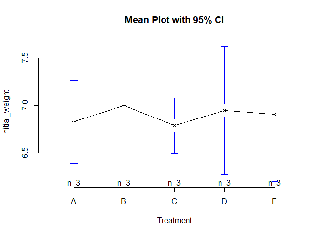
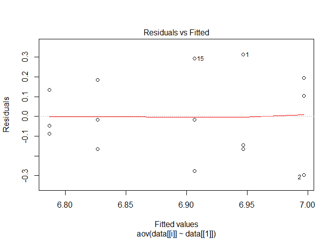
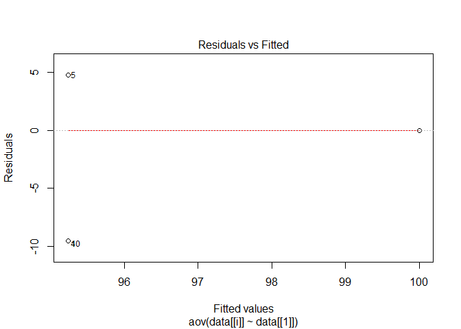
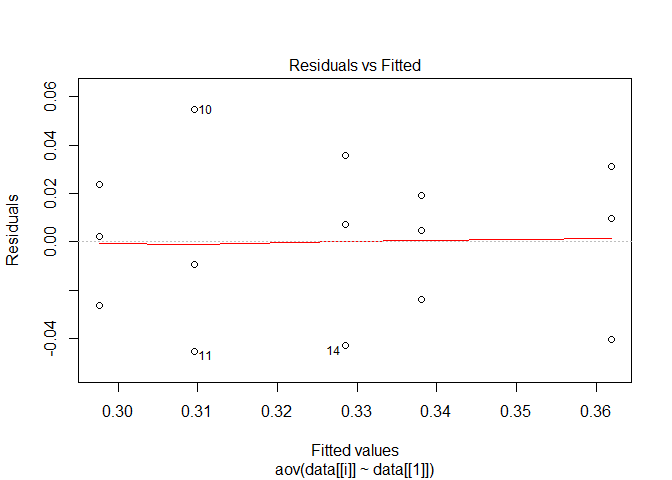
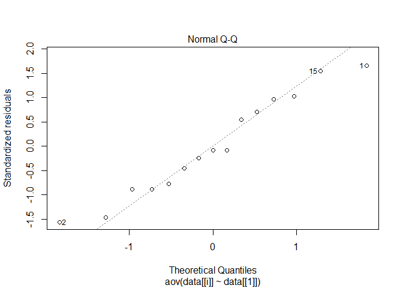
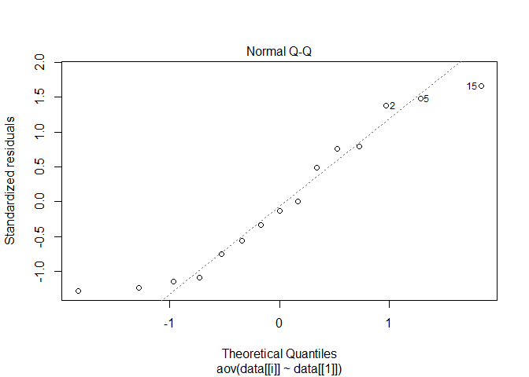
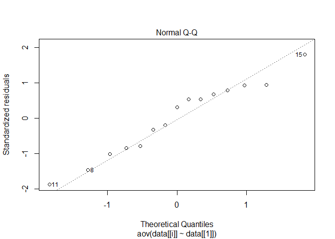
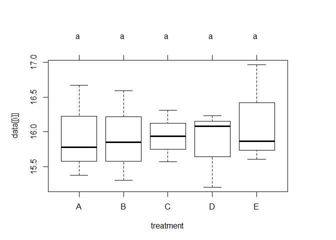
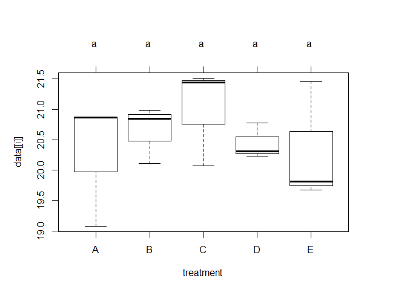
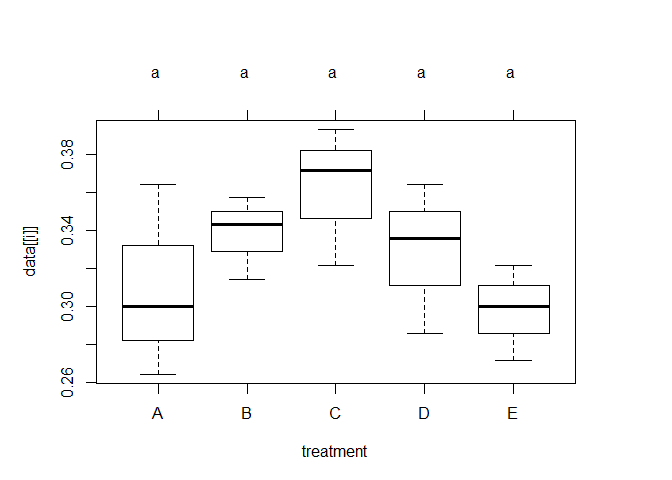

One-way ANOVA Analysis
================
Dahee Kim
2020-02-20

library(readxl) data &lt;- read\_excel("N:/DaheeKim/pHstomach\_feed/TID-77-18 pH stomachs and feed.xlsx")

``` r
library(readxl)
data <- read_excel("N:/DaheeKim/pHstomach_feed/TID-77-18 pH stomachs and feed.xlsx")
library(gplots)
```

    ## Warning: package 'gplots' was built under R version 3.6.2

    ## 
    ## Attaching package: 'gplots'

    ## The following object is masked from 'package:stats':
    ## 
    ##     lowess

``` r
library(car)
```

    ## Warning: package 'car' was built under R version 3.6.2

    ## Loading required package: carData

``` r
library(dplyr)
```

    ## 
    ## Attaching package: 'dplyr'

    ## The following object is masked from 'package:car':
    ## 
    ##     recode

    ## The following objects are masked from 'package:stats':
    ## 
    ##     filter, lag

    ## The following objects are masked from 'package:base':
    ## 
    ##     intersect, setdiff, setequal, union

Data Manipulation and summary
=============================

``` r
data <- read_excel("N:/DaheeKim/pHstomach_feed/TID-77-18 pH stomachs and feed.xlsx")
#change column names
oldnames = c("Initial weight","Final individual weight","Stomach pH","Weight gain")
newnames = c("Initial_weight","Final_individual_weight","Stomach_pH","Weight_gain")
colnames(data)[colnames(data) %in% oldnames] <- newnames
attach(data)

#summary of data
library(psych)
```

    ## Warning: package 'psych' was built under R version 3.6.2

    ## 
    ## Attaching package: 'psych'

    ## The following object is masked from 'package:car':
    ## 
    ##     logit

``` r
describe(data)
```

    ## Warning in describe(data): NAs introduced by coercion

    ## Warning in FUN(newX[, i], ...): no non-missing arguments to min; returning Inf

    ## Warning in FUN(newX[, i], ...): no non-missing arguments to max; returning -Inf

    ##                         vars  n   mean    sd median trimmed   mad    min    max
    ## Tank                       1 15  95.47 18.98 109.00   95.62 10.38  73.00 116.00
    ## treatment*                 2 15    NaN    NA     NA     NaN    NA    Inf   -Inf
    ## Initial_weight             3 15   6.89  0.21   6.81    6.88  0.16   6.63   7.26
    ## Initial group weight       4 15 111.70  3.63 111.09  111.56  3.74 106.47 118.72
    ## Initial count              5 15   7.00  0.00   7.00    7.00  0.00   7.00   7.00
    ## Final_individual_weight    6 15  15.96  0.52  15.87   15.94  0.53  15.21  16.96
    ## Stomach_pH                 7 15  20.54  0.71  20.78   20.57  0.98  19.08  21.51
    ## Final group weight         8 15 140.94  7.35 141.61  141.40  6.43 125.28 150.57
    ## Final count                9 15   6.87  0.35   7.00    6.92  0.00   6.00   7.00
    ## Survival                  10 15  98.10  5.03 100.00   98.90  0.00  85.71 100.00
    ## Weight_gain               11 15   4.58  0.54   4.50    4.58  0.74   3.70   5.50
    ## ADG                       12 15   0.33  0.04   0.32    0.33  0.05   0.26   0.39
    ##                         range  skew kurtosis   se
    ## Tank                    43.00 -0.11    -2.07 4.90
    ## treatment*               -Inf    NA       NA   NA
    ## Initial_weight           0.63  0.45    -1.38 0.05
    ## Initial group weight    12.25  0.34    -1.07 0.94
    ## Initial count            0.00   NaN      NaN 0.00
    ## Final_individual_weight  1.75  0.34    -1.07 0.13
    ## Stomach_pH               2.43 -0.31    -1.01 0.18
    ## Final group weight      25.29 -0.65    -0.59 1.90
    ## Final count              1.00 -1.95     1.93 0.09
    ## Survival                14.29 -1.95     1.93 1.30
    ## Weight_gain              1.80 -0.04    -1.28 0.14
    ## ADG                      0.13 -0.04    -1.28 0.01

``` r
#Mean, Sum of each Treatment
library(reshape2)
data <- data[,c(2,3,6,7,10,12)]
data$treatment <- as.factor(data$treatment)
data %>% group_by(treatment) %>% summarise_each(funs(mean, sd))
```

    ## Warning: funs() is soft deprecated as of dplyr 0.8.0
    ## Please use a list of either functions or lambdas: 
    ## 
    ##   # Simple named list: 
    ##   list(mean = mean, median = median)
    ## 
    ##   # Auto named with `tibble::lst()`: 
    ##   tibble::lst(mean, median)
    ## 
    ##   # Using lambdas
    ##   list(~ mean(., trim = .2), ~ median(., na.rm = TRUE))
    ## This warning is displayed once per session.

    ## # A tibble: 5 x 11
    ##   treatment Initial_weight_~ Final_individua~ Stomach_pH_mean Survival_mean
    ##   <fct>                <dbl>            <dbl>           <dbl>         <dbl>
    ## 1 A                     6.83             15.9            20.3          95.2
    ## 2 B                     7.00             15.9            20.7         100  
    ## 3 C                     6.79             15.9            21.0          95.2
    ## 4 D                     6.95             15.8            20.4         100  
    ## 5 E                     6.91             16.1            20.3         100  
    ## # ... with 6 more variables: ADG_mean <dbl>, Initial_weight_sd <dbl>,
    ## #   Final_individual_weight_sd <dbl>, Stomach_pH_sd <dbl>, Survival_sd <dbl>,
    ## #   ADG_sd <dbl>

``` r
# plotmeans
plotmeans(Initial_weight ~ treatment, data = data, frame = FALSE,
          xlab = "Treatment", ylab = "Initial_weight",
          main="Mean Plot with 95% CI") 
```

    ## Warning in plot.xy(xy.coords(x, y), type = type, ...): "frame" is not a
    ## graphical parameter

    ## Warning in axis(1, at = 1:length(means), labels = legends, ...): "frame" is not
    ## a graphical parameter

    ## Warning in plot.xy(xy.coords(x, y), type = type, ...): "frame" is not a
    ## graphical parameter



Assumption Test (1)
===================

``` r
# 1. Homogeneity of variances
#leveneTest
library(car)
levene <- vector(mode = "list", length = 5)
anova <- vector(mode = "list", length = 5)
for (i in 2:6){
  levene[[i-1]] <-leveneTest(data[[i]]~data[[1]],data=data, center=mean)
  cat(paste("* ", colnames(data)[i]),'\n')
  print(levene[[i-1]])
  anova[[i-1]] <-aov(data[[i]]~data[[1]],data=data)
  plot(anova[[i-1]], 1)
}
```

    ## *  Initial_weight 
    ## Levene's Test for Homogeneity of Variance (center = mean)
    ##       Df F value Pr(>F)
    ## group  4  0.8312 0.5351
    ##       10



    ## *  Final_individual_weight 
    ## Levene's Test for Homogeneity of Variance (center = mean)
    ##       Df F value Pr(>F)
    ## group  4    0.53 0.7168
    ##       10


    ## *  Stomach_pH 
    ## Levene's Test for Homogeneity of Variance (center = mean)
    ##       Df F value  Pr(>F)  
    ## group  4  2.7265 0.09035 .
    ##       10                  
    ## ---
    ## Signif. codes:  0 '***' 0.001 '**' 0.01 '*' 0.05 '.' 0.1 ' ' 1


    ## *  Survival 
    ## Levene's Test for Homogeneity of Variance (center = mean)
    ##       Df F value    Pr(>F)    
    ## group  4      12 0.0007828 ***
    ##       10                      
    ## ---
    ## Signif. codes:  0 '***' 0.001 '**' 0.01 '*' 0.05 '.' 0.1 ' ' 1



    ## *  ADG 
    ## Levene's Test for Homogeneity of Variance (center = mean)
    ##       Df F value Pr(>F)
    ## group  4  0.7493 0.5805
    ##       10

 H0 is that all variances are equal. The test reveals a p-value greater than 0.05, indicating that there is no significant difference between the group variances in location.

Assumption Test (2)
===================

``` r
# 2. Normality
# Run Shapiro-Wilk test
normtest <- vector(mode = "list", length = 5)
anova <- vector(mode = "list", length = 5)
for (i in 2:6){
  normtest[[i-1]] <-shapiro.test(data[[i]])
  cat(paste("* ", colnames(data)[i]),'\n')
  print(normtest[[i-1]])
  anova[[i-1]] <-aov(data[[i]]~data[[1]],data=data)
  plot(anova[[i-1]], 2)
}
```

    ## *  Initial_weight 
    ## 
    ##  Shapiro-Wilk normality test
    ## 
    ## data:  data[[i]]
    ## W = 0.90879, p-value = 0.1297



    ## *  Final_individual_weight 
    ## 
    ##  Shapiro-Wilk normality test
    ## 
    ## data:  data[[i]]
    ## W = 0.96614, p-value = 0.7974



    ## *  Stomach_pH 
    ## 
    ##  Shapiro-Wilk normality test
    ## 
    ## data:  data[[i]]
    ## W = 0.94971, p-value = 0.5199



    ## *  Survival 
    ## 
    ##  Shapiro-Wilk normality test
    ## 
    ## data:  data[[i]]
    ## W = 0.41281, p-value = 7.525e-07


    ## *  ADG 
    ## 
    ##  Shapiro-Wilk normality test
    ## 
    ## data:  data[[i]]
    ## W = 0.97007, p-value = 0.8591


parametric ANOVA
----------------

``` r
# ANOVA Test - Parametric 
anova <- vector(mode = "list", length = 2)
for (i in 2:3){
  anova[[i-1]] <-aov(data[[i]]~data[[1]],data=data)
  cat(paste("* ", colnames(data)[i]),'\n')
  print(summary(anova[[i-1]]))
}
```

    ## *  Initial_weight 
    ##             Df Sum Sq Mean Sq F value Pr(>F)
    ## data[[1]]    4 0.0886 0.02214   0.413  0.795
    ## Residuals   10 0.5355 0.05355               
    ## *  Final_individual_weight 
    ##             Df Sum Sq Mean Sq F value Pr(>F)
    ## data[[1]]    4  0.155  0.0388   0.108  0.977
    ## Residuals   10  3.604  0.3604

Post-hoc Analysis: letter grouping (1)
======================================

``` r
#Tukey HSD (Tukey Honest Significant Differences)
library(agricolae)
```

    ## Warning: package 'agricolae' was built under R version 3.6.2

``` r
anova <- vector(mode = "list", length = 2)
for (i in 2:3){
  anova[[i-1]] <-aov(data[[i]]~data[[1]],data=data)
  cat(paste("* ", colnames(data)[i]),'\n')
  print(TukeyHSD(anova[[i-1]]))
  print(HSD.test(anova[[i-1]],"data[[1]]", group=TRUE)$'groups')
}
```

    ## *  Initial_weight 
    ##   Tukey multiple comparisons of means
    ##     95% family-wise confidence level
    ## 
    ## Fit: aov(formula = data[[i]] ~ data[[1]], data = data)
    ## 
    ## $`data[[1]]`
    ##      diff       lwr      upr     p adj
    ## B-A  0.17 -0.451851 0.791851 0.8906455
    ## C-A -0.04 -0.661851 0.581851 0.9994697
    ## D-A  0.12 -0.501851 0.741851 0.9656537
    ## E-A  0.08 -0.541851 0.701851 0.9922123
    ## C-B -0.21 -0.831851 0.411851 0.7973270
    ## D-B -0.05 -0.671851 0.571851 0.9987261
    ## E-B -0.09 -0.711851 0.531851 0.9878922
    ## D-C  0.16 -0.461851 0.781851 0.9096195
    ## E-C  0.12 -0.501851 0.741851 0.9656537
    ## E-D -0.04 -0.661851 0.581851 0.9994697
    ## 
    ##   data[[i]] groups
    ## B  6.996667      a
    ## D  6.946667      a
    ## E  6.906667      a
    ## A  6.826667      a
    ## C  6.786667      a
    ## *  Final_individual_weight 
    ##   Tukey multiple comparisons of means
    ##     95% family-wise confidence level
    ## 
    ## Fit: aov(formula = data[[i]] ~ data[[1]], data = data)
    ## 
    ## $`data[[1]]`
    ##             diff       lwr      upr     p adj
    ## B-A -0.026666667 -1.639946 1.586613 0.9999976
    ## C-A -0.003333333 -1.616613 1.609946 1.0000000
    ## D-A -0.103333333 -1.716613 1.509946 0.9994785
    ## E-A  0.203333333 -1.409946 1.816613 0.9927929
    ## C-B  0.023333333 -1.589946 1.636613 0.9999986
    ## D-B -0.076666667 -1.689946 1.536613 0.9998399
    ## E-B  0.230000000 -1.383279 1.843279 0.9885518
    ## D-C -0.100000000 -1.713279 1.513279 0.9995417
    ## E-C  0.206666667 -1.406613 1.819946 0.9923360
    ## E-D  0.306666667 -1.306613 1.919946 0.9674269
    ## 
    ##   data[[i]] groups
    ## E  16.14667      a
    ## A  15.94333      a
    ## C  15.94000      a
    ## B  15.91667      a
    ## D  15.84000      a

Post-hoc Analysis: letter grouping (2)
======================================

``` r
library(multcomp)
Tukey <- vector(mode = "list", length = 5)
for (i in 2:6){
  anova[[i-1]] <-aov(data[[i]]~treatment,data=data)
  cat(paste("* ", colnames(data)[i]),'\n')
  print(cld(summary(glht(anova[[i-1]], linfct = mcp(treatment = "Tukey")))))
  old.par <- par(mai=c(1,1,1.25,1), no.readonly = TRUE)
  plot(cld(summary(glht(anova[[i-1]], linfct = mcp(treatment = "Tukey")))))
  par(old.par)
}
```

    ## *  Initial_weight 
    ##   A   B   C   D   E 
    ## "a" "a" "a" "a" "a"


    ## *  Final_individual_weight 
    ##   A   B   C   D   E 
    ## "a" "a" "a" "a" "a"



    ## *  Stomach_pH 
    ##   A   B   C   D   E 
    ## "a" "a" "a" "a" "a"



    ## *  Survival 
    ##   A   B   C   D   E 
    ## "a" "a" "a" "a" "a"


    ## *  ADG 
    ##   A   B   C   D   E 
    ## "a" "a" "a" "a" "a"



non-parametric ANOVA: Kruskal Wallis
------------------------------------

``` r
kruskal <- vector(mode = "list", length = 2)
for (i in 2:3){
  kruskal[[i-1]] <-kruskal.test(data[[i]]~treatment,data=data)
  cat(paste("* ", colnames(data)[i]),'\n')
  print(kruskal[[i-1]])
}
```

    ## *  Initial_weight 
    ## 
    ##  Kruskal-Wallis rank sum test
    ## 
    ## data:  data[[i]] by treatment
    ## Kruskal-Wallis chi-squared = 1.2606, df = 4, p-value = 0.868
    ## 
    ## *  Final_individual_weight 
    ## 
    ##  Kruskal-Wallis rank sum test
    ## 
    ## data:  data[[i]] by treatment
    ## Kruskal-Wallis chi-squared = 0.43333, df = 4, p-value = 0.9797

``` r
kruskal.test(Initial_weight ~ treatment, data=data)
```

    ## 
    ##  Kruskal-Wallis rank sum test
    ## 
    ## data:  Initial_weight by treatment
    ## Kruskal-Wallis chi-squared = 1.2606, df = 4, p-value = 0.868

``` r
#https://cran.r-project.org/web/packages/PMCMR/vignettes/PMCMR.pdf

#2
pairwise.wilcox.test(data$Initial_weight, data$treatment,
                     p.adjust.method = "BH")
```

    ## Warning in wilcox.test.default(xi, xj, paired = paired, ...): cannot compute
    ## exact p-value with ties

    ## 
    ##  Pairwise comparisons using Wilcoxon rank sum test 
    ## 
    ## data:  data$Initial_weight and data$treatment 
    ## 
    ##   A B C D
    ## B 1 - - -
    ## C 1 1 - -
    ## D 1 1 1 -
    ## E 1 1 1 1
    ## 
    ## P value adjustment method: BH

post-hoc tests
==============

``` r
#Pairwise comparisons using Tukey and Kramer (Nemenyi) test with Tukey-Dist approximation for independent samples 
library(PMCMR)
```

    ## PMCMR is superseded by PMCMRplus and will be no longer maintained. You may wish to install PMCMRplus instead.

    ## 
    ## Attaching package: 'PMCMR'

    ## The following object is masked from 'package:agricolae':
    ## 
    ##     durbin.test

``` r
nemenyi <- vector(mode = "list", length = 2)
for (i in 2:3){
  nemenyi[[i-1]] <-posthoc.kruskal.nemenyi.test(x=data[[i]],g=data$treatment, dist="Tukey")
  cat(paste("* ", colnames(data)[i]),'\n')
  print(summary(nemenyi[[i-1]]))
}
```

    ## Warning in posthoc.kruskal.nemenyi.test.default(x = data[[i]], g =
    ## data$treatment, : Ties are present, p-values are not corrected.

    ## *  Initial_weight 
    ## 
    ##  Pairwise comparisons using Tukey and Kramer (Nemenyi) test  
    ##                    with Tukey-Dist approximation for independent samples 
    ## 
    ## data:  data[[i]] and data$treatment 
    ## 
    ## 
    ## P value adjustment method: none 
    ##         H0  statistic p.value
    ## 1  A  =  B 0.96824584    0.96
    ## 2  A  =  C 0.32274861    1.00
    ## 3  A  =  D 0.90369611    0.97
    ## 4  A  =  E 0.38729833    1.00
    ## 5  B  =  C 1.29099445    0.89
    ## 6  B  =  D 0.06454972    1.00
    ## 7  B  =  E 0.58094750    0.99
    ## 8  C  =  D 1.22644473    0.91
    ## 9  C  =  E 0.71004695    0.99
    ## 10 D  =  E 0.51639778    1.00
    ## 
    ##  Pairwise comparisons using Tukey and Kramer (Nemenyi) test  
    ##                    with Tukey-Dist approximation for independent samples 
    ## 
    ## data:  data[[i]] and data$treatment 
    ## 
    ##   A    B    C    D   
    ## B 0.96 -    -    -   
    ## C 1.00 0.89 -    -   
    ## D 0.97 1.00 0.91 -   
    ## E 1.00 0.99 0.99 1.00
    ## 
    ## P value adjustment method: none 
    ## *  Final_individual_weight 
    ## 
    ##  Pairwise comparisons using Tukey and Kramer (Nemenyi) test  
    ##                    with Tukey-Dist approximation for independent samples 
    ## 
    ## data:  data[[i]] and data$treatment 
    ## 
    ## 
    ## P value adjustment method: none 
    ##         H0 statistic p.value
    ## 1  A  =  B 0.1290994    1.00
    ## 2  A  =  C 0.2581989    1.00
    ## 3  A  =  D 0.1290994    1.00
    ## 4  A  =  E 0.6454972    0.99
    ## 5  B  =  C 0.3872983    1.00
    ## 6  B  =  D 0.0000000    1.00
    ## 7  B  =  E 0.7745967    0.98
    ## 8  C  =  D 0.3872983    1.00
    ## 9  C  =  E 0.3872983    1.00
    ## 10 D  =  E 0.7745967    0.98
    ## 
    ##  Pairwise comparisons using Tukey and Kramer (Nemenyi) test  
    ##                    with Tukey-Dist approximation for independent samples 
    ## 
    ## data:  data[[i]] and data$treatment 
    ## 
    ##   A    B    C    D   
    ## B 1.00 -    -    -   
    ## C 1.00 1.00 -    -   
    ## D 1.00 1.00 1.00 -   
    ## E 0.99 0.98 1.00 0.98
    ## 
    ## P value adjustment method: none
