ANOVA
================
Dahee Kim
2021-10-07

# Data summary

``` r
#change column names
oldnames = c("Initial_ind_weight","Final_ind_weight")
newnames = c("Initial_weight","Final_individual_weight")
colnames(data)[colnames(data) %in% oldnames] <- newnames

#summary of data
library(psych)
```

    ## 
    ## Attaching package: 'psych'

    ## The following object is masked from 'package:car':
    ## 
    ##     logit

``` r
#str(data)

#Subset data
data$Label[data$Label == "Ctrl 1"] <- "Ctrl1"
data$Label[data$Label == "Ctrl 2"] <- "Ctrl2"
data$Label <- as.factor(data$Label)

#Mean, Sum of each Treatment
data <- data[,c(2,17,19,21)]
data %>% group_by(Label) %>% summarise_each(funs(mean, sd))
```

    ## Warning: `summarise_each_()` is deprecated as of dplyr 0.7.0.
    ## Please use `across()` instead.
    ## This warning is displayed once every 8 hours.
    ## Call `lifecycle::last_warnings()` to see where this warning was generated.

    ## Warning: `funs()` is deprecated as of dplyr 0.8.0.
    ## Please use a list of either functions or lambdas: 
    ## 
    ##   # Simple named list: 
    ##   list(mean = mean, median = median)
    ## 
    ##   # Auto named with `tibble::lst()`: 
    ##   tibble::lst(mean, median)
    ## 
    ##   # Using lambdas
    ##   list(~ mean(., trim = .2), ~ median(., na.rm = TRUE))
    ## This warning is displayed once every 8 hours.
    ## Call `lifecycle::last_warnings()` to see where this warning was generated.

    ## # A tibble: 18 x 7
    ##    Label Weight_gain_mean ADG_mean FCR_mean Weight_gain_sd ADG_sd FCR_sd
    ##    <fct>            <dbl>    <dbl>    <dbl>          <dbl>  <dbl>  <dbl>
    ##  1 A                258.    0.310      2.04           32.2 0.0344  0.242
    ##  2 B                274.    0.324      1.93           20.4 0.0202  0.122
    ##  3 C                264.    0.314      2.01           30.1 0.0347  0.265
    ##  4 Ctrl1            216.    0.259      2.43           33.3 0.0336  0.354
    ##  5 Ctrl2            198.    0.238      2.63           17.0 0.0182  0.222
    ##  6 D                261.    0.309      2.03           24.4 0.0226  0.161
    ##  7 E                276.    0.331      1.89           26.8 0.0242  0.141
    ##  8 F                301.    0.361      1.74           32.6 0.0290  0.140
    ##  9 G                256.    0.300      2.14           33.1 0.0360  0.313
    ## 10 H                249.    0.297      2.11           21.9 0.0201  0.141
    ## 11 K                205.    0.245      3.29           75.6 0.0895  2.46 
    ## 12 L                261.    0.314      2.04           31.8 0.0412  0.307
    ## 13 P                252.    0.300      2.10           33.6 0.0316  0.235
    ## 14 Q                142.    0.169      3.76           16.2 0.0248  0.540
    ## 15 R                231.    0.280      2.24           18.0 0.0237  0.191
    ## 16 X                282.    0.339      1.86           25.7 0.0280  0.184
    ## 17 Y                234.    0.280      2.30           37.1 0.0462  0.500
    ## 18 Z                 77.2   0.0927     6.69           26.4 0.0306  2.59

``` r
test1 <- c("A","B","P","R","Ctrl1", "Ctrl2","K")
data <- data[data$Label %in% test1, ]
data <- droplevels(data)
```

``` r
# plotmeans
plotmeans(ADG ~ Label, data = data, frame = FALSE,
          xlab = "Treatment", ylab = "ADG",
          main="Mean Plot with 95% CI") 
```

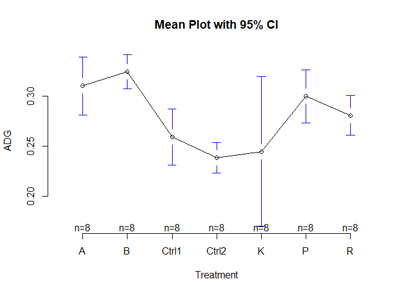<!-- -->

# Assumption Test

## Homogeneity of variances Test

``` r
# 1. Homogeneity of variances
#leveneTest
library(car)
levene <- vector(mode = "list", length = 3)
anova <- vector(mode = "list", length = 3)
for (i in 2:4){
  levene[[i-1]] <-leveneTest(data[[i]]~data[[1]],data=data, center=median) #default center is mean
  cat(paste("* ", colnames(data)[i]),'\n')
  print(levene[[i-1]])
  anova[[i-1]] <-aov(data[[i]]~data[[1]],data=data)
  plot(anova[[i-1]], 1)
}
```

    ## *  Weight_gain 
    ## Levene's Test for Homogeneity of Variance (center = median)
    ##       Df F value Pr(>F)
    ## group  6  1.8095 0.1167
    ##       49

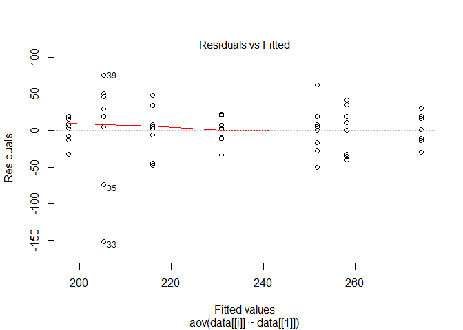<!-- -->

    ## *  ADG 
    ## Levene's Test for Homogeneity of Variance (center = median)
    ##       Df F value  Pr(>F)  
    ## group  6  1.9986 0.08382 .
    ##       49                  
    ## ---
    ## Signif. codes:  0 '***' 0.001 '**' 0.01 '*' 0.05 '.' 0.1 ' ' 1

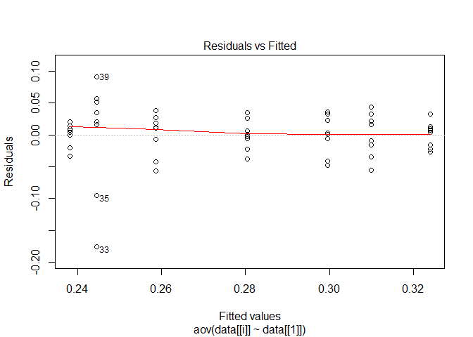<!-- -->

    ## *  FCR 
    ## Levene's Test for Homogeneity of Variance (center = median)
    ##       Df F value Pr(>F)
    ## group  6  1.5959 0.1684
    ##       49

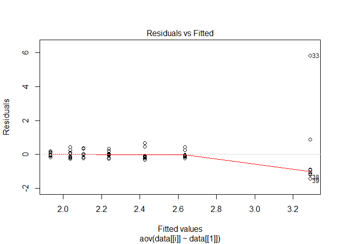<!-- --> H0 is that all
variances are equal. The test reveals a p-value greater than 0.05,
indicating that there is no significant difference between the group
variances in location.

## Normality Test

``` r
# 2. Normality
# Shapiro-Wilk test
normtest <- vector(mode = "list", length = 3)
anova <- vector(mode = "list", length = 3)
for (i in 2:4){
  normtest[[i-1]] <-shapiro.test(data[[i]])
  cat(paste("* ", colnames(data)[i]),'\n')
  print(normtest[[i-1]]$p.value)
  anova[[i-1]] <-aov(data[[i]]~data[[1]],data=data)
  plot(anova[[i-1]], 2)
}
```

    ## *  Weight_gain 
    ## [1] 0.002803425

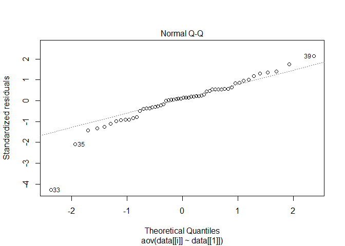<!-- -->

    ## *  ADG 
    ## [1] 0.0001883612

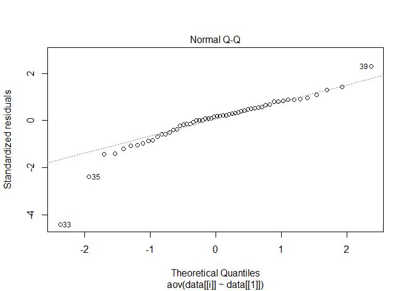<!-- -->

    ## *  FCR 
    ## [1] 1.482104e-13

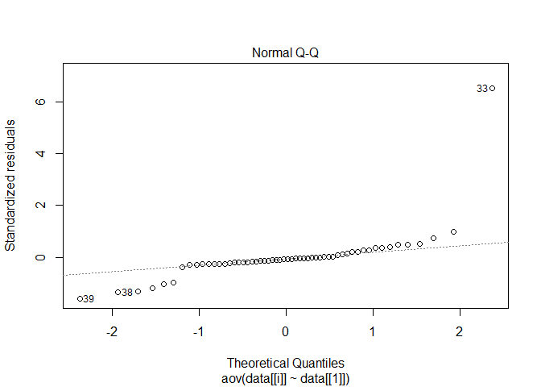<!-- -->

# Data transformation

``` r
#square root
st <- function(p) { sqrt(p) }
stnorm <- vector(mode = "list", length = 5)
for (i in 2:4){
  stnorm[[i-1]] <-shapiro.test(st(data[[i]]))
  cat(paste("* ", colnames(data)[i]),'\n')
  print(stnorm[[i-1]]$p.value)
}
```

    ## *  Weight_gain 
    ## [1] 4.656161e-06
    ## *  ADG 
    ## [1] 6.264633e-07
    ## *  FCR 
    ## [1] 8.055978e-12

``` r
#1/square root
re_sqrt <- function(p) { 1/sqrt(p) }


#logit
logitTransform <- function(p) { log(p/(1-p)) }
logitnorm <- vector(mode = "list", length = 5)
# for (i in 2:4){
#   logitnorm[[i-1]] <-shapiro.test(logitTransform(data[[i]]))
#   cat(paste("* ", colnames(data)[i]),'\n')
#   print(logitnorm[[i-1]]$p.value)
# }

#log
logTransform <- function(p) { log(p) }
lognorm <- vector(mode = "list", length = 5)
for (i in 2:4){
  lognorm[[i-1]] <-shapiro.test(logTransform(data[[i]]))
  cat(paste("* ", colnames(data)[i]),'\n')
  print(lognorm[[i-1]]$p.value)
}
```

    ## *  Weight_gain 
    ## [1] 5.09057e-09
    ## *  ADG 
    ## [1] 1.720997e-09
    ## *  FCR 
    ## [1] 1.479355e-09

``` r
#1/log
relogTransform <- function(p) { 1/(log(p)) }

#loglog
loglogTransform <- function(p) { log(log(p)) }


#1/loglog
reloglogTransform <- function(p) { 1/(log(log(p))) }

#asine
asinTransform <- function(p) { asin(sqrt(p)) }

#normalized
rangeScale <- function(x) { (x-min(x)) / (max(x)-min(x)) }


#scaled
scaledf <- function(x){ scale(x) }
scalednorm <- vector(mode = "list", length = 5)
for (i in 2:4){
  scalednorm[[i-1]] <-shapiro.test(scaledf(data[[i]]))
  cat(paste("* ", colnames(data)[i]),'\n')
  print(scalednorm[[i-1]]$p.value)
}
```

    ## *  Weight_gain 
    ## [1] 0.002803425
    ## *  ADG 
    ## [1] 0.0001883612
    ## *  FCR 
    ## [1] 1.482104e-13

# parametric ANOVA

``` r
#ANOVA Test - Parametric 
anova <- vector(mode = "list", length =3)
for (i in 2:4){
  anova[[i-1]] <-aov(data[[i]]~data[[1]],data=data)
  cat(paste("* ", colnames(data)[i]),'\n')
  print(summary(anova[[i-1]]))
}
```

    ## *  Weight_gain 
    ##             Df Sum Sq Mean Sq F value   Pr(>F)    
    ## data[[1]]    6  40073    6679   4.667 0.000795 ***
    ## Residuals   49  70130    1431                     
    ## ---
    ## Signif. codes:  0 '***' 0.001 '**' 0.01 '*' 0.05 '.' 0.1 ' ' 1
    ## *  ADG 
    ##             Df  Sum Sq  Mean Sq F value   Pr(>F)    
    ## data[[1]]    6 0.05338 0.008897   4.933 0.000512 ***
    ## Residuals   49 0.08838 0.001804                     
    ## ---
    ## Signif. codes:  0 '***' 0.001 '**' 0.01 '*' 0.05 '.' 0.1 ' ' 1
    ## *  FCR 
    ##             Df Sum Sq Mean Sq F value Pr(>F)  
    ## data[[1]]    6  10.45  1.7414     1.9 0.0996 .
    ## Residuals   49  44.91  0.9165                 
    ## ---
    ## Signif. codes:  0 '***' 0.001 '**' 0.01 '*' 0.05 '.' 0.1 ' ' 1

# parametric post-hoc tests: multiple pairwise-comparison

## pairewise t-test

``` r
pairtt <- vector(mode = "list", length = 2)
for (i in 2:4){
  pairtt[[i-1]] <- pairwise.t.test(data[[i]], data[[1]], p.adjust.method = "BH") 
  # c("holm", "hochberg", "hommel", "bonferroni", "BH", "BY", "fdr", "none")
  cat(paste("* ", colnames(data)[i]),'\n')
  print(pairtt[[i-1]] )
}
```

    ## *  Weight_gain 
    ## 
    ##  Pairwise comparisons using t tests with pooled SD 
    ## 
    ## data:  data[[i]] and data[[1]] 
    ## 
    ##       A      B      Ctrl1  Ctrl2  K      P     
    ## B     0.4898 -      -      -      -      -     
    ## Ctrl1 0.0707 0.0175 -      -      -      -     
    ## Ctrl2 0.0167 0.0037 0.4406 -      -      -     
    ## K     0.0258 0.0067 0.6354 0.7196 -      -     
    ## P     0.7350 0.3563 0.1358 0.0258 0.0531 -     
    ## R     0.2731 0.0682 0.5055 0.1608 0.2935 0.3873
    ## 
    ## P value adjustment method: BH 
    ## *  ADG 
    ## 
    ##  Pairwise comparisons using t tests with pooled SD 
    ## 
    ## data:  data[[i]] and data[[1]] 
    ## 
    ##       A      B      Ctrl1  Ctrl2  K      P     
    ## B     0.5636 -      -      -      -      -     
    ## Ctrl1 0.0519 0.0145 -      -      -      -     
    ## Ctrl2 0.0101 0.0039 0.4428 -      -      -     
    ## K     0.0145 0.0050 0.5636 0.7656 -      -     
    ## P     0.6618 0.3847 0.1146 0.0198 0.0374 -     
    ## R     0.2782 0.1069 0.4351 0.1089 0.1693 0.4595
    ## 
    ## P value adjustment method: BH 
    ## *  FCR 
    ## 
    ##  Pairwise comparisons using t tests with pooled SD 
    ## 
    ## data:  data[[i]] and data[[1]] 
    ## 
    ##       A    B    Ctrl1 Ctrl2 K    P   
    ## B     0.87 -    -     -     -    -   
    ## Ctrl1 0.74 0.65 -     -     -    -   
    ## Ctrl2 0.57 0.52 0.84  -     -    -   
    ## K     0.12 0.12 0.33  0.54  -    -   
    ## P     0.89 0.84 0.79  0.64  0.12 -   
    ## R     0.84 0.79 0.84  0.74  0.17 0.86
    ## 
    ## P value adjustment method: BH

## wilcox Rank Sum tests

# parametric post-hoc Analysis: letter grouping (1)

``` r
#Tukey HSD (Tukey Honest Significant Differences)
#LSD (Least Significant Difference)
library(agricolae) #HSD.test, LSD.test
anova <- vector(mode = "list", length = 2)
for (i in 2:4){
  anova[[i-1]] <-aov(data[[i]]~data[[1]],data=data)
  cat(paste("* ", colnames(data)[i]),'\n')
  print(TukeyHSD(anova[[i-1]]))
  #plot(TukeyHSD(anova[[i-1]])) # C.I plot
  print(HSD.test(anova[[i-1]],"data[[1]]", group=TRUE)$'groups')
  print(LSD.test(anova[[i-1]], "data[[1]]", group=TRUE, p.adj= "holm")$'groups')
}
```

    ## *  Weight_gain 
    ##   Tukey multiple comparisons of means
    ##     95% family-wise confidence level
    ## 
    ## Fit: aov(formula = data[[i]] ~ data[[1]], data = data)
    ## 
    ## $`data[[1]]`
    ##                   diff         lwr         upr     p adj
    ## B-A          16.180606  -41.967109  74.3283220 0.9773665
    ## Ctrl1-A     -42.195538 -100.343254  15.9521776 0.2985344
    ## Ctrl2-A     -60.587144 -118.734860  -2.4394288 0.0360381
    ## K-A         -52.876148 -111.023864   5.2715676 0.0970436
    ## P-A          -6.439627  -64.587342  51.7080891 0.9998624
    ## R-A         -27.250551  -85.398267  30.8971642 0.7771996
    ## Ctrl1-B     -58.376144 -116.523860  -0.2284287 0.0485156
    ## Ctrl2-B     -76.767751 -134.915466 -18.6200351 0.0031560
    ## K-B         -69.056754 -127.204470 -10.9090387 0.0106007
    ## P-B         -22.620233  -80.767949  35.5274828 0.8923864
    ## R-B         -43.431158 -101.578873  14.7165579 0.2666266
    ## Ctrl2-Ctrl1 -18.391606  -76.539322  39.7561093 0.9576267
    ## K-Ctrl1     -10.680610  -68.828326  47.4671057 0.9975174
    ## P-Ctrl1      35.755911  -22.391804  93.9036272 0.4962596
    ## R-Ctrl1      14.944987  -43.202729  73.0927023 0.9848936
    ## K-Ctrl2       7.710996  -50.436719  65.8587121 0.9996086
    ## P-Ctrl2      54.147518   -4.000198 112.2952336 0.0831901
    ## R-Ctrl2      33.336593  -24.811123  91.4843087 0.5788675
    ## P-K          46.436522  -11.711194 104.5842372 0.1986347
    ## R-K          25.625597  -32.522119  83.7733123 0.8224158
    ## R-P         -20.810925  -78.958641  37.3367908 0.9250524
    ## 
    ##       data[[i]] groups
    ## B      274.3487      a
    ## A      258.1681     ab
    ## P      251.7284    abc
    ## R      230.9175    abc
    ## Ctrl1  215.9725     bc
    ## K      205.2919     bc
    ## Ctrl2  197.5809      c
    ##       data[[i]] groups
    ## B      274.3487      a
    ## A      258.1681     ab
    ## P      251.7284    abc
    ## R      230.9175    abc
    ## Ctrl1  215.9725    abc
    ## K      205.2919     bc
    ## Ctrl2  197.5809      c
    ## *  ADG 
    ##   Tukey multiple comparisons of means
    ##     95% family-wise confidence level
    ## 
    ## Fit: aov(formula = data[[i]] ~ data[[1]], data = data)
    ## 
    ## $`data[[1]]`
    ##                    diff          lwr           upr     p adj
    ## B-A          0.01409587 -0.051179065  7.937081e-02 0.9939758
    ## Ctrl1-A     -0.05116427 -0.116439210  1.411066e-02 0.2166597
    ## Ctrl2-A     -0.07173773 -0.137012662 -6.462790e-03 0.0226557
    ## K-A         -0.06537099 -0.130645921 -9.604992e-05 0.0494394
    ## P-A         -0.01028434 -0.075559272  5.499060e-02 0.9989510
    ## R-A         -0.02941567 -0.094690607  3.585926e-02 0.8068643
    ## Ctrl1-B     -0.06526014 -0.130535080  1.479092e-05 0.0500868
    ## Ctrl2-B     -0.08583360 -0.151108533 -2.055866e-02 0.0033164
    ## K-B         -0.07946686 -0.144741792 -1.419192e-02 0.0081323
    ## P-B         -0.02438021 -0.089655143  4.089473e-02 0.9095805
    ## R-B         -0.04351154 -0.108786478  2.176339e-02 0.3983471
    ## Ctrl2-Ctrl1 -0.02057345 -0.085848388  4.470148e-02 0.9583305
    ## K-Ctrl1     -0.01420671 -0.079481647  5.106822e-02 0.9937161
    ## P-Ctrl1      0.04087994 -0.024394998  1.061549e-01 0.4741256
    ## R-Ctrl1      0.02174860 -0.043526333  8.702354e-02 0.9458804
    ## K-Ctrl2      0.00636674 -0.058908195  7.164168e-02 0.9999346
    ## P-Ctrl2      0.06145339 -0.003821546  1.267283e-01 0.0772927
    ## R-Ctrl2      0.04232205 -0.022952881  1.075970e-01 0.4319781
    ## P-K          0.05508665 -0.010188287  1.203616e-01 0.1501733
    ## R-K          0.03595531 -0.029319621  1.012302e-01 0.6236320
    ## R-P         -0.01913133 -0.084406270  4.614360e-02 0.9707037
    ## 
    ##       data[[i]] groups
    ## B     0.3239707      a
    ## A     0.3098748      a
    ## P     0.2995905     ab
    ## R     0.2804592     ab
    ## Ctrl1 0.2587105     ab
    ## K     0.2445038      b
    ## Ctrl2 0.2381371      b
    ##       data[[i]] groups
    ## B     0.3239707      a
    ## A     0.3098748     ab
    ## P     0.2995905    abc
    ## R     0.2804592    abc
    ## Ctrl1 0.2587105    abc
    ## K     0.2445038     bc
    ## Ctrl2 0.2381371      c
    ## *  FCR 
    ##   Tukey multiple comparisons of means
    ##     95% family-wise confidence level
    ## 
    ## Fit: aov(formula = data[[i]] ~ data[[1]], data = data)
    ## 
    ## $`data[[1]]`
    ##                    diff        lwr       upr     p adj
    ## B-A         -0.10431108 -1.5757803 1.3671582 0.9999901
    ## Ctrl1-A      0.38855262 -1.0829166 1.8600219 0.9826456
    ## Ctrl2-A      0.59793448 -0.8735348 2.0694037 0.8710443
    ## K-A          1.25152676 -0.2199425 2.7229960 0.1439389
    ## P-A          0.06740167 -1.4040676 1.5388709 0.9999993
    ## R-A          0.20205556 -1.2694137 1.6735248 0.9995216
    ## Ctrl1-B      0.49286371 -0.9786055 1.9643329 0.9445412
    ## Ctrl2-B      0.70224557 -0.7692237 2.1737148 0.7623972
    ## K-B          1.35583784 -0.1156314 2.8273071 0.0891723
    ## P-B          0.17171276 -1.2997565 1.6431820 0.9998133
    ## R-B          0.30636664 -1.1651026 1.7778359 0.9950561
    ## Ctrl2-Ctrl1  0.20938186 -1.2620874 1.6808511 0.9994131
    ## K-Ctrl1      0.86297413 -0.6084951 2.3344434 0.5525896
    ## P-Ctrl1     -0.32115095 -1.7926202 1.1503183 0.9936211
    ## R-Ctrl1     -0.18649706 -1.6579663 1.2849722 0.9996986
    ## K-Ctrl2      0.65359227 -0.8178770 2.1250615 0.8170472
    ## P-Ctrl2     -0.53053281 -2.0020020 0.9409364 0.9225541
    ## R-Ctrl2     -0.39587893 -1.8673482 1.0755903 0.9809124
    ## P-K         -1.18412508 -2.6555943 0.2873442 0.1914838
    ## R-K         -1.04947120 -2.5209404 0.4219980 0.3182576
    ## R-P          0.13465388 -1.3368154 1.6061231 0.9999550
    ## 
    ##       data[[i]] groups
    ## K      3.288235      a
    ## Ctrl2  2.634643      a
    ## Ctrl1  2.425261      a
    ## R      2.238764      a
    ## P      2.104110      a
    ## A      2.036709      a
    ## B      1.932398      a
    ##       data[[i]] groups
    ## K      3.288235      a
    ## Ctrl2  2.634643      a
    ## Ctrl1  2.425261      a
    ## R      2.238764      a
    ## P      2.104110      a
    ## A      2.036709      a
    ## B      1.932398      a

## letter grouping (2)

``` r
library(multcomp)  # for glht() and cld() functions
Tukey <- vector(mode = "list", length = 2)
for (i in 2:4){
  anova[[i-1]] <-aov(data[[i]]~Label,data=data)
  cat(paste("* ", colnames(data)[i]),'\n')
  print(cld(summary(glht(anova[[i-1]], linfct = mcp(Label = "Tukey")))))
  old.par <- par(mai=c(1,1,1.25,1), no.readonly = TRUE)
  plot(cld(summary(glht(anova[[i-1]], linfct = mcp(Label = "Tukey")))))
  par(old.par)
}
```

    ## *  Weight_gain 
    ##     A     B Ctrl1 Ctrl2     K     P     R 
    ##  "bc"   "c"  "ab"   "a"  "ab"  "ac"  "ac"

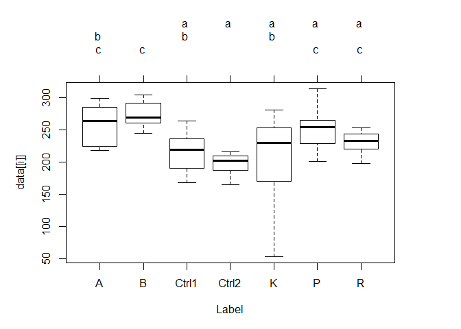<!-- -->

    ## *  ADG 
    ##     A     B Ctrl1 Ctrl2     K     P     R 
    ##   "b"   "b"  "ab"   "a"   "a"  "ab"  "ab"

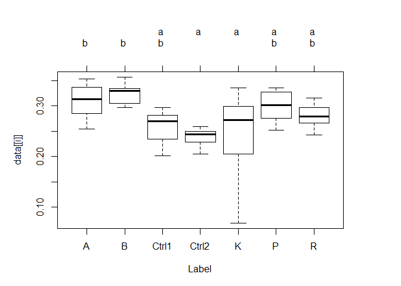<!-- -->

    ## *  FCR 
    ##     A     B Ctrl1 Ctrl2     K     P     R 
    ##   "a"   "a"   "a"   "a"   "a"   "a"   "a"

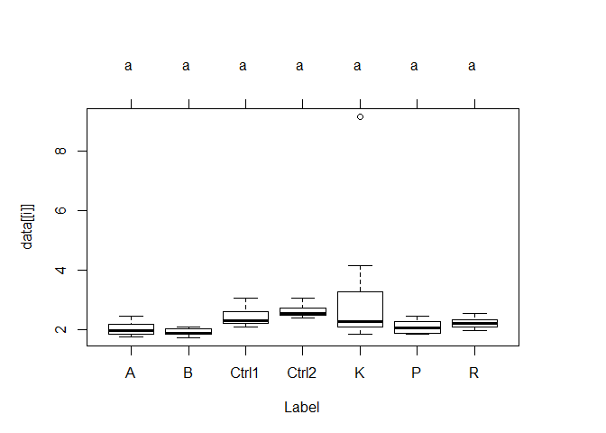<!-- -->

## letter grouping (3)

``` r
library(multcompView)
data1 <- as.data.frame(data)
multcompBoxplot(ADG~Label, data1,compFn = "TukeyHSD",sortFn=mean) #order by mean
```

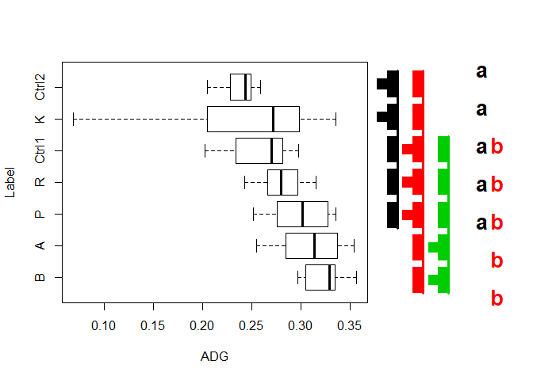<!-- -->

``` r
#multcompBoxplot(ADG~Label, data1,compFn = "TukeyHSD",sortFn=median) #order by median
#multcompBoxplot(ADG~Label, data1,compFn = "TukeyHSD",sortFn=NA)
#multcompBoxplot(ADG~Label, data1,compFn = "TukeyHSD",sortFn=NULL)
#multcompBoxplot(ADG~Label, data1)
#multcompBoxplot(ADG~Label, data1)
```

# non-parametric ANOVA

## Kurskal-Wallis test

Non parametric tests: Kruskal, Friedman, Durbin, Van Der Waerden,
Median. Kruskal-wallis test is an analysis of variancc performed on
ranks. If the distributons among group are similars, Kruskal-Wallis test
can test for a difference in medians. When the distributions are
significantly different, rejection of null hypothesis can be happened by
lack of independence. If we found differences among different levels of
a group, post-hoc analysis can be performed to determine which levels of
the independent variable differ from each other level.

``` r
#Kruskal-wallis test
data <- read_excel("~/VScode_project/R_projects/Data/TSCW200102.xlsx")
data <- data[,c(6,7,10,13,14,18,19)]
model<-aov(ADG ~ Treatment, data=data)
kruskal <- vector(mode = "list", length = 2)
for (i in 5:7){
  kruskal[[i-1]] <- kruskal.test(data[[i]]~data[[2]],data=data)
  cat(paste("* ", colnames(data)[i]),'\n')
  print(kruskal[[i-1]])
}
```

    ## *  ADG 
    ## 
    ##  Kruskal-Wallis rank sum test
    ## 
    ## data:  data[[i]] by data[[2]]
    ## Kruskal-Wallis chi-squared = 92.317, df = 17, p-value = 2.308e-12
    ## 
    ## *  FCR 
    ## 
    ##  Kruskal-Wallis rank sum test
    ## 
    ## data:  data[[i]] by data[[2]]
    ## Kruskal-Wallis chi-squared = 65.6, df = 17, p-value = 1.216e-07
    ## 
    ## *  Survival 
    ## 
    ##  Kruskal-Wallis rank sum test
    ## 
    ## data:  data[[i]] by data[[2]]
    ## Kruskal-Wallis chi-squared = 63.682, df = 17, p-value = 2.561e-07

# non-parametric post-hoc tests

## multiple pairwise-comparison(Dunn’s test)

Dunn’s test can even apply to unequal number of observations in each
level of the group.  
To be free from type I error, p-value adjustment needs to be made. The
options can be; “sidak”, “holm”, “hs”, “hochberg”, “bh”, “by”,
“bonferroni”

``` r
library(rcompanion)
library(FSA)

Dunn <- vector(mode = "list", length = 2)
for (i in 4){
  Dunn[[i-1]] <-dunnTest(data[[i]]~data[[1]],data=data,method="bh")
  # c("holm", "hochberg", "hommel", "bonferroni", "BH", "BY", "fdr", "none")
  PT = Dunn[[i-1]]$res
  print(PT)
  print(cldList(comparison = Dunn[[i-1]]$res$Comparison,
        p.value    = Dunn[[i-1]]$res$P.adj,
        threshold  = 0.05))
}
```

    ##        Comparison           Z      P.unadj        P.adj
    ## 1           A - B -0.49445348 6.209859e-01 7.143673e-01
    ## 2           A - C -0.23374165 8.151856e-01 8.542698e-01
    ## 3           B - C  0.26071184 7.943147e-01 8.381390e-01
    ## 4       A - Ctrl1  2.14263177 3.214268e-02 8.781839e-02
    ## 5       B - Ctrl1  2.63708525 8.362181e-03 3.120521e-02
    ## 6       C - Ctrl1  2.37637342 1.748376e-02 5.691522e-02
    ## 7       A - Ctrl2  2.82587658 4.715143e-03 2.061191e-02
    ## 8       B - Ctrl2  3.32033007 8.991108e-04 5.502558e-03
    ## 9       C - Ctrl2  3.05961823 2.216193e-03 1.093798e-02
    ## 10  Ctrl1 - Ctrl2  0.68324482 4.944522e-01 6.150502e-01
    ## 11          A - D  0.19778139 8.432161e-01 8.717031e-01
    ## 12          B - D  0.69223488 4.887898e-01 6.180566e-01
    ## 13          C - D  0.43152304 6.660881e-01 7.438794e-01
    ## 14      Ctrl1 - D -1.94485037 5.179299e-02 1.257830e-01
    ## 15      Ctrl2 - D -2.62809519 8.586448e-03 3.127921e-02
    ## 16          A - E -0.91998315 3.575816e-01 5.019264e-01
    ## 17          B - E -0.42552967 6.704506e-01 7.433257e-01
    ## 18          C - E -0.68624150 4.925608e-01 6.177197e-01
    ## 19      Ctrl1 - E -3.06261492 2.194122e-03 1.119002e-02
    ## 20      Ctrl2 - E -3.74585973 1.797770e-04 1.719118e-03
    ## 21          D - E -1.11776454 2.636676e-01 4.034114e-01
    ## 22          A - F -1.95384044 5.072009e-02 1.251641e-01
    ## 23          B - F -1.45938695 1.444586e-01 2.695387e-01
    ## 24          C - F -1.72009879 8.541449e-02 1.815058e-01
    ## 25      Ctrl1 - F -4.09647221 4.194938e-05 5.348546e-04
    ## 26      Ctrl2 - F -4.77971702 1.755421e-06 4.476323e-05
    ## 27          D - F -2.15162183 3.142715e-02 8.742462e-02
    ## 28          E - F -1.03385729 3.012029e-01 4.518043e-01
    ## 29          A - G  0.50344355 6.146525e-01 7.124381e-01
    ## 30          B - G  0.99789703 3.183293e-01 4.594753e-01
    ## 31          C - G  0.73718520 4.610097e-01 6.028589e-01
    ## 32      Ctrl1 - G -1.63918822 1.011741e-01 2.091842e-01
    ## 33      Ctrl2 - G -2.32243304 2.020963e-02 6.441820e-02
    ## 34          D - G  0.30566215 7.598619e-01 8.073533e-01
    ## 35          E - G  1.42342670 1.546125e-01 2.719047e-01
    ## 36          F - G  2.45728399 1.399920e-02 4.656255e-02
    ## 37          A - H  0.71620838 4.738627e-01 6.144152e-01
    ## 38          B - H  1.21066187 2.260250e-01 3.678918e-01
    ## 39          C - H  0.94995003 3.421376e-01 4.892249e-01
    ## 40      Ctrl1 - H -1.42642339 1.537462e-01 2.735252e-01
    ## 41      Ctrl2 - H -2.10966820 3.488695e-02 9.046954e-02
    ## 42          D - H  0.51842699 6.041604e-01 7.056224e-01
    ## 43          E - H  1.63619153 1.017995e-01 2.076710e-01
    ## 44          F - H  2.67004882 7.584022e-03 2.975270e-02
    ## 45          G - H  0.21276483 8.315104e-01 8.654496e-01
    ## 46          A - K  1.74407229 8.114648e-02 1.748650e-01
    ## 47          B - K  2.23852578 2.518679e-02 7.270903e-02
    ## 48          C - K  1.97781394 4.794970e-02 1.202673e-01
    ## 49      Ctrl1 - K -0.39855948 6.902178e-01 7.597362e-01
    ## 50      Ctrl2 - K -1.08180429 2.793395e-01 4.231579e-01
    ## 51          D - K  1.54629090 1.220343e-01 2.305093e-01
    ## 52          E - K  2.66405544 7.720484e-03 2.953085e-02
    ## 53          F - K  3.69791273 2.173796e-04 1.847727e-03
    ## 54          G - K  1.24062874 2.147429e-01 3.571268e-01
    ## 55          H - K  1.02786391 3.040138e-01 4.515934e-01
    ## 56          A - L -0.16481783 8.690874e-01 8.805985e-01
    ## 57          B - L  0.32963566 7.416753e-01 7.935407e-01
    ## 58          C - L  0.06892382 9.450503e-01 9.512677e-01
    ## 59      Ctrl1 - L -2.30744960 2.102977e-02 6.566438e-02
    ## 60      Ctrl2 - L -2.99069441 2.783439e-03 1.290503e-02
    ## 61          D - L -0.36259922 7.169043e-01 7.779174e-01
    ## 62          E - L  0.75516532 4.501498e-01 5.937321e-01
    ## 63          F - L  1.78902261 7.361117e-02 1.632248e-01
    ## 64          G - L -0.66826138 5.039668e-01 6.119596e-01
    ## 65          H - L -0.88102621 3.783036e-01 5.261860e-01
    ## 66          K - L -1.90889012 5.627627e-02 1.345355e-01
    ## 67          A - P  0.52741705 5.979040e-01 7.036870e-01
    ## 68          B - P  1.02187054 3.068422e-01 4.514121e-01
    ## 69          C - P  0.76115870 4.465623e-01 5.941220e-01
    ## 70      Ctrl1 - P -1.61521472 1.062642e-01 2.084413e-01
    ## 71      Ctrl2 - P -2.29845953 2.153565e-02 6.336450e-02
    ## 72          D - P  0.32963566 7.416753e-01 7.991290e-01
    ## 73          E - P  1.44740020 1.477849e-01 2.724227e-01
    ## 74          F - P  2.48125749 1.309198e-02 4.451272e-02
    ## 75          G - P  0.02397350 9.808737e-01 9.808737e-01
    ## 76          H - P -0.18879133 8.502564e-01 8.730820e-01
    ## 77          K - P -1.21665524 2.237354e-01 3.680808e-01
    ## 78          L - P  0.69223488 4.887898e-01 6.232070e-01
    ## 79          A - Q  3.50612471 4.546821e-04 3.312684e-03
    ## 80          B - Q  4.00057820 6.318790e-05 7.436730e-04
    ## 81          C - Q  3.73986636 1.841181e-04 1.657063e-03
    ## 82      Ctrl1 - Q  1.36349294 1.727272e-01 2.904095e-01
    ## 83      Ctrl2 - Q  0.68024813 4.963474e-01 6.075292e-01
    ## 84          D - Q  3.30834332 9.384968e-04 5.522693e-03
    ## 85          E - Q  4.42610786 9.594856e-06 1.835016e-04
    ## 86          F - Q  5.45996515 4.762281e-08 3.643145e-06
    ## 87          G - Q  3.00268116 2.676126e-03 1.279523e-02
    ## 88          H - Q  2.78991633 5.272166e-03 2.240671e-02
    ## 89          K - Q  1.76205242 7.806044e-02 1.706178e-01
    ## 90          L - Q  3.67094254 2.416577e-04 1.945980e-03
    ## 91          P - Q  2.97870766 2.894668e-03 1.302601e-02
    ## 92          A - R  1.38147307 1.671336e-01 2.905845e-01
    ## 93          B - R  1.87592655 6.066537e-02 1.385343e-01
    ## 94          C - R  1.61521472 1.062642e-01 2.111484e-01
    ## 95      Ctrl1 - R -0.76115870 4.465623e-01 5.993336e-01
    ## 96      Ctrl2 - R -1.44440351 1.486255e-01 2.707107e-01
    ## 97          D - R  1.18369168 2.365351e-01 3.730915e-01
    ## 98          E - R  2.30145622 2.136586e-02 6.537952e-02
    ## 99          F - R  3.33531351 8.520328e-04 5.431709e-03
    ## 100         G - R  0.87802952 3.799277e-01 5.190084e-01
    ## 101         H - R  0.66526469 5.058812e-01 6.094474e-01
    ## 102         K - R -0.36259922 7.169043e-01 7.834740e-01
    ## 103         L - R  1.54629090 1.220343e-01 2.333907e-01
    ## 104         P - R  0.85405602 3.930740e-01 5.322152e-01
    ## 105         Q - R -2.12465164 3.361569e-02 8.867588e-02
    ## 106         A - X -1.37248301 1.699131e-01 2.888523e-01
    ## 107         B - X -0.87802952 3.799277e-01 5.236841e-01
    ## 108         C - X -1.13874136 2.548110e-01 3.937989e-01
    ## 109     Ctrl1 - X -3.51511477 4.395640e-04 3.362664e-03
    ## 110     Ctrl2 - X -4.19835959 2.688555e-05 4.113489e-04
    ## 111         D - X -1.57026440 1.163536e-01 2.253431e-01
    ## 112         E - X -0.45249986 6.509089e-01 7.322725e-01
    ## 113         F - X  0.58135743 5.609996e-01 6.705698e-01
    ## 114         G - X -1.87592655 6.066537e-02 1.406333e-01
    ## 115         H - X -2.08869139 3.673551e-02 9.367556e-02
    ## 116         K - X -3.11655530 1.829774e-03 9.653633e-03
    ## 117         L - X -1.20766518 2.271761e-01 3.620619e-01
    ## 118         P - X -1.89990006 5.744624e-02 1.352196e-01
    ## 119         Q - X -4.87860772 1.068373e-06 3.269222e-05
    ## 120         R - X -2.75395608 5.887967e-03 2.370681e-02
    ## 121         A - Y  1.20766518 2.271761e-01 3.658731e-01
    ## 122         B - Y  1.70211866 8.873313e-02 1.859749e-01
    ## 123         C - Y  1.44140683 1.494698e-01 2.690456e-01
    ## 124     Ctrl1 - Y -0.93496659 3.498055e-01 4.955578e-01
    ## 125     Ctrl2 - Y -1.61821141 1.056170e-01 2.126238e-01
    ## 126         D - Y  1.00988378 3.125510e-01 4.554314e-01
    ## 127         E - Y  2.12764833 3.336625e-02 8.956204e-02
    ## 128         F - Y  3.16150562 1.569558e-03 8.576513e-03
    ## 129         G - Y  0.70422163 4.812948e-01 6.188076e-01
    ## 130         H - Y  0.49145680 6.231034e-01 7.114539e-01
    ## 131         K - Y -0.53640711 5.916772e-01 7.017567e-01
    ## 132         L - Y  1.37248301 1.699131e-01 2.920978e-01
    ## 133         P - Y  0.68024813 4.963474e-01 6.124286e-01
    ## 134         Q - Y -2.29845953 2.153565e-02 6.460695e-02
    ## 135         R - Y -0.17380789 8.620164e-01 8.792568e-01
    ## 136         X - Y  2.58014818 9.875793e-03 3.434082e-02
    ## 137         A - Z  3.97960138 6.903092e-05 7.544093e-04
    ## 138         B - Z  4.47405487 7.675003e-06 1.677536e-04
    ## 139         C - Z  4.21334303 2.516185e-05 4.277514e-04
    ## 140     Ctrl1 - Z  1.83696961 6.621438e-02 1.489824e-01
    ## 141     Ctrl2 - Z  1.15372480 2.486130e-01 3.881407e-01
    ## 142         D - Z  3.78181999 1.556859e-04 1.587997e-03
    ## 143         E - Z  4.89958453 9.603952e-07 3.673512e-05
    ## 144         F - Z  5.93344182 2.966492e-09 4.538732e-07
    ## 145         G - Z  3.47615783 5.086528e-04 3.537449e-03
    ## 146         H - Z  3.26339300 1.100867e-03 6.238249e-03
    ## 147         K - Z  2.23552909 2.538263e-02 7.191746e-02
    ## 148         L - Z  4.14441921 3.406760e-05 4.738494e-04
    ## 149         P - Z  3.45218433 5.560677e-04 3.699059e-03
    ## 150         Q - Z  0.47347667 6.358731e-01 7.206562e-01
    ## 151         R - Z  2.59812831 9.373346e-03 3.335167e-02
    ## 152         X - Z  5.35208439 8.694683e-08 4.434288e-06
    ## 153         Y - Z  2.77193620 5.572396e-03 2.304261e-02
    ##    Group Letter MonoLetter
    ## 1      A  abcde   abcde   
    ## 2      B   abcd   abcd    
    ## 3      C  abcde   abcde   
    ## 4  Ctrl1   efgh       efgh
    ## 5  Ctrl2    fgh        fgh
    ## 6      D  abcde   abcde   
    ## 7      E    abd   ab d    
    ## 8      F      a   a       
    ## 9      G  bcdef    bcdef  
    ## 10     H  bcdef    bcdef  
    ## 11     K  cefgh     c efgh
    ## 12     L  abcde   abcde   
    ## 13     P  bcdef    bcdef  
    ## 14     Q     gh         gh
    ## 15     R  bcefg    bc efg 
    ## 16     X     ad   a  d    
    ## 17     Y  bcefg    bc efg 
    ## 18     Z      h          h

## post-hoc tests(Nemenyi test)

Nemenyi test is one of the post-hoc method of Kruskal-walli. It is not
appropriate for groups with unequal numbers of observations. “holm”,
“hochberg”, “hommel”, “bonferroni”, “BH”, “BY”, “fdr”, “none”

``` r
#Pairwise comparisons using Tukey and Kramer (Nemenyi) test with Tukey-Dist approximation for independent samples 
library(PMCMRplus)
data1 <- data
nemenyi <- vector(mode = "list", length = 3)
# for (i in 73){
#   cat(paste("* ", colnames(data)[i]),'\n')
#   nemenyi[[i-1]] <-kwAllPairsNemenyiTest(data1[[i]] ~ data1$Label,data = data1)
#   print(summary(nemenyi[[i-1]]))
#   plot(nemenyi[[i-1]])
# }
```

``` r
# Shapiro-Wilk test (2)
library(magicfor) 
#magic_for(print, silent = TRUE) 
for (i in 4:5){
  normtest <-shapiro.test(data[[i]])
  name <- colnames(data)[i]
  stat <- normtest$statistic
  pvalue <- normtest$p.value
  if (pvalue < 0.05){
    result = " X(Not Normal) "
  }else{
    result = " O(Normal) "
  }
  print(name, stat,pvalue, result)
}
```

    ## [1] "Average Final Weight"
    ## [1] "ADG"

``` r
magic_result_as_dataframe()
```

    ## data frame with 0 columns and 0 rows
