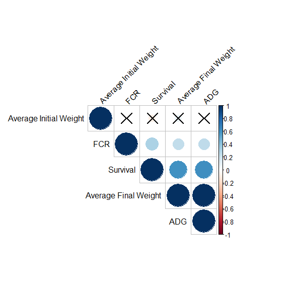

Correlation Analysis
================

### Correlation between 2 variables

``` r
# Pearson correlation between 2 variables
library(readxl)
data <- read_excel("~/VScode_project/R_projects/Data/TSCW200102.xlsx")
data <- data[, c(10,13,14,18,19)]
cor(data$ADG, data$FCR) # “pearson”
```

    ## [1] 0.2510967

``` r
cor(data$ADG, data$FCR, method = "spearman")
```

    ## [1] -0.6813481

``` r
cor(data$ADG, data$FCR, method = "kendall")
```

    ## [1] -0.6550083

  - **Pearson correlation** is often used for quantitative continuous
    variables that have a linear relationship
  - **Spearman correlation** which is actually similar to Pearson but
    based on the ranked values for each variable rather than on the raw
    data, is often used to evaluate relationships involving qualitative
    ordinal variables or quantitative variables if the link is partially
    linear
  - **Kendall** which is computed from the number of concordant and
    discordant pairs is often used for qualitative ordinal variables

Hypothesis

  - H0: ρ=0 (there is no linear relationship between the two variables)
  - H1: ρ≠0 (there is a linear relationship between the two variables)

### Correlation for all variables

``` r
library(GGally)
```

    ## Loading required package: ggplot2

    ## Registered S3 method overwritten by 'GGally':
    ##   method from   
    ##   +.gg   ggplot2

``` r
ggpairs(data)
```

<!-- -->

``` r
#plot(data)
```

#### 1\. Pearson correlation test Correlogram

``` r
library(corrplot)
```

    ## corrplot 0.84 loaded

``` r
cor.mtest <- function(mat, ...) {
  mat <- as.matrix(mat)
  n <- ncol(mat)
  p.mat<- matrix(NA, n, n)
  diag(p.mat) <- 0
  for (i in 1:(n - 1)) {
    for (j in (i + 1):n) {
      tmp <- cor.test(mat[, i], mat[, j],method="pearson")
      p.mat[i, j] <- p.mat[j, i] <- tmp$p.value
    }
  }
  colnames(p.mat) <- rownames(p.mat) <- colnames(mat)
  p.mat
}
# matrix of the p-value of the correlation
p.mat <- cor.mtest(data)
M1 <- cor(data, method="pearson")
corrplot(M1,  type="upper", order="hclust", # addCoef.col = "black",
         tl.col="black", tl.srt=45, 
         p.mat = p.mat, sig.level = 0.05)
```

<!-- -->

#### 2.Spearman’s rho correlation test

statistic is also used to estimate a rank-based measure of association.
This test may be used if the data do not come from a bivariate normal
distribution.

``` r
library(corrplot)
M1 <- cor(data)
cor.mtest <- function(mat, ...) {
  mat <- as.matrix(mat)
  n <- ncol(mat)
  p.mat<- matrix(NA, n, n)
  diag(p.mat) <- 0
  for (i in 1:(n - 1)) {
    for (j in (i + 1):n) {
      tmp <- cor.test(mat[, i], mat[, j],method = "spearman")
      p.mat[i, j] <- p.mat[j, i] <- tmp$p.value
    }
  }
  colnames(p.mat) <- rownames(p.mat) <- colnames(mat)
  p.mat
}
# matrix of the p-value of the correlation
p.mat <- cor.mtest(data)
M1 <- cor(data, method="spearman")
corrplot(M1,  type="upper", order="hclust", # addCoef.col = "black",
         tl.col="black", tl.srt=45, 
         p.mat = p.mat, sig.level = 0.05)
```

<!-- -->

#### 3.Kendall’s tau correlation test

used to estimate a rank-based measure of association. This test may be
used if the data do not necessarily come from a bivariate normal
distribution.

``` r
cor.mtest <- function(mat, ...) {
  mat <- as.matrix(mat)
  n <- ncol(mat)
  p.mat<- matrix(NA, n, n)
  diag(p.mat) <- 0
  for (i in 1:(n - 1)) {
    for (j in (i + 1):n) {
      tmp <- cor.test(mat[, i], mat[, j],method="kendall")
      p.mat[i, j] <- p.mat[j, i] <- tmp$p.value
    }
  }
  colnames(p.mat) <- rownames(p.mat) <- colnames(mat)
  p.mat
}
# matrix of the p-value of the correlation
p.mat <- cor.mtest(data)
M1 <- cor(data, method="kendall")
corrplot(M1,  type="upper", order="hclust", addCoef.col = "black", 
         tl.col="black", tl.srt=20, 
         p.mat = p.mat, sig.level = 0.05)
```

<!-- -->

``` r
library(rstatix)
cor.mat <- 
  cor_mat(
  data,
  vars = NULL,
  method = "pearson", #"kendall", or "spearman"
  alternative = "two.sided",
  conf.level = 0.95)
cor.mat %>%
  cor_reorder() %>%
  pull_upper_triangle() %>%
  cor_plot(label = TRUE)
```

<!-- -->

``` r
# cor.mat %>% cor_get_pval() # Significance levels 
# cor.mat %>% cor_gather() # Gather/collapse correlation matrix into long format
```

### Plot

``` r
plot(data)
```

<!-- -->

### Heatmap

``` r
M <- cor(data)
heatmap(M)
```

<!-- -->
