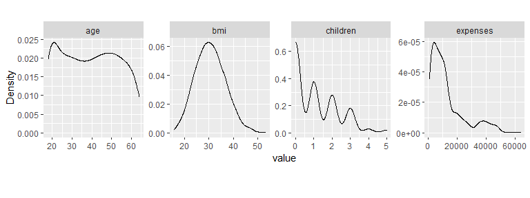
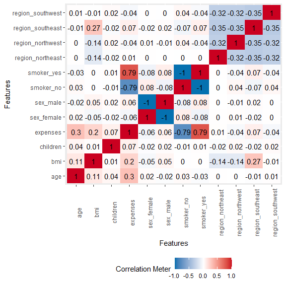
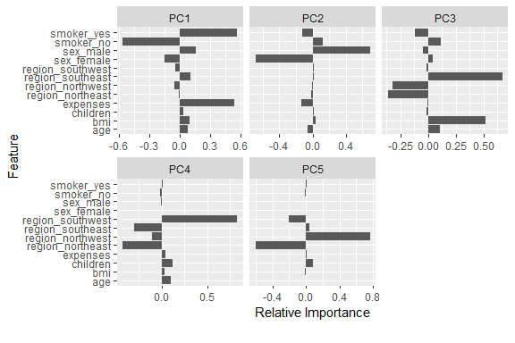

Easy EDA with *DataExplorer* package
================
Dahee Kim
January 5, 2020

  - [Easy Data Profiling Report](#easy-data-profiling-report)
  - [Structure of data](#structure-of-data)
  - [Variable information](#variable-information)
  - [Missing Data by features](#missing-data-by-features)
  - [Continuous Variable](#continuous-variable)
      - [Histogram for Continuous
        Variables](#histogram-for-continuous-variables)
      - [Scatterplot `bmi` with all other continuous
        features](#scatterplot-bmi-with-all-other-continuous-features)
      - [QQ plot of all continuous
        variables](#qq-plot-of-all-continuous-variables)
      - [Density estimates for each continuous
        features](#density-estimates-for-each-continuous-features)
  - [Categorical Variable](#categorical-variable)
      - [Categorical Data - Frequency
        Table](#categorical-data---frequency-table)
      - [Boxplot by Categorical
        Variables](#boxplot-by-categorical-variables)
  - [Correlation Analysis](#correlation-analysis)
  - [Visualize principle component
    analysis](#visualize-principle-component-analysis)
  - [Feature Engineering](#feature-engineering)

## Easy Data Profiling Report

To get a report for the insurance dataset with response variable bmi,
`create_report(dataname)`

``` r
#create_report(dt, y = "bmi")
```

  - Basic Statistics
      - Raw Counts
      - Percentages
  - Data Structure
  - Missing Data Profile
  - Univariate Distribution
      - Histogram
      - Bar Chart (by frequency)
      - Bar Chart (by bmi)
      - QQ Plot
      - QQ Plot (by bmi)
  - Correlation Analysis
  - Principal Component Analysis
  - Bivariate Distribution
      - Boxplot (by bmi)
      - Scatterplot (by bmi)

## Structure of data

``` r
data_list <- list(dt)
plot_str(data_list)
```

## Variable information

``` r
plot_intro(dt)
```

<!-- -->

## Missing Data by features

``` r
plot_missing(dt)
```

<!-- -->

## Continuous Variable

### Histogram for Continuous Variables

``` r
plot_histogram(dt)
```

<!-- -->

### Scatterplot `bmi` with all other continuous features

``` r
plot_scatterplot(split_columns(dt)$continuous, by = "bmi")
```

<!-- -->

### QQ plot of all continuous variables

``` r
plot_qq(dt)
```

<!-- -->

``` r
plot_qq(dt, by = "bmi",theme_config = list("aspect.ratio" = 1))
```

<!-- -->

### Density estimates for each continuous features

``` r
plot_density(dt,theme_config = list(
  "aspect.ratio" = 1
))
```

<!-- -->

## Categorical Variable

### Categorical Data - Frequency Table

``` r
plot_bar(dt)
```

<!-- -->

### Boxplot by Categorical Variables

``` r
plot_boxplot(dt, by= 'sex',  ncol = 2)
```

<!-- -->

``` r
plot_boxplot(dt, by= 'smoker',  ncol = 2)
```

<!-- -->

``` r
plot_boxplot(dt, by= 'region',  ncol = 2)
```

<!-- -->

## Correlation Analysis

``` r
plot_correlation(dt)
```

<!-- -->

## Visualize principle component analysis

``` r
plot_prcomp(dt)
```

<!-- --><!-- -->

## Feature Engineering

``` r
#Dummify diamonds dataset
head(dummify(dt))
```

    ##   age  bmi children expenses sex_female sex_male smoker_no smoker_yes
    ## 1  19 27.9        0 16884.92          1        0         0          1
    ## 2  18 33.8        1  1725.55          0        1         1          0
    ## 3  28 33.0        3  4449.46          0        1         1          0
    ## 4  33 22.7        0 21984.47          0        1         1          0
    ## 5  32 28.9        0  3866.86          0        1         1          0
    ## 6  31 25.7        0  3756.62          1        0         1          0
    ##   region_northeast region_northwest region_southeast region_southwest
    ## 1                0                0                0                1
    ## 2                0                0                1                0
    ## 3                0                0                1                0
    ## 4                0                1                0                0
    ## 5                0                1                0                0
    ## 6                0                0                1                0

``` r
#Update columns
head(update_columns(dt, c("sex", "smoker","region"), as.factor))
```

    ##   age    sex  bmi children smoker    region expenses
    ## 1  19 female 27.9        0    yes southwest 16884.92
    ## 2  18   male 33.8        1     no southeast  1725.55
    ## 3  28   male 33.0        3     no southeast  4449.46
    ## 4  33   male 22.7        0     no northwest 21984.47
    ## 5  32   male 28.9        0     no northwest  3866.86
    ## 6  31 female 25.7        0     no southeast  3756.62

``` r
#Drop columns
head(drop_columns(dt, 1:2),5)
```

    ##    bmi children smoker    region expenses
    ## 1 27.9        0    yes southwest 16884.92
    ## 2 33.8        1     no southeast  1725.55
    ## 3 33.0        3     no southeast  4449.46
    ## 4 22.7        0     no northwest 21984.47
    ## 5 28.9        0     no northwest  3866.86
