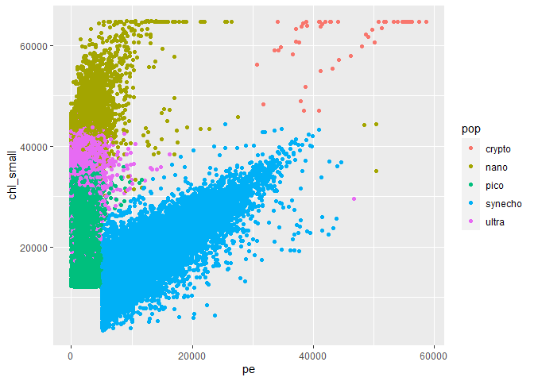

SeaFlow instrument
================
Dahee kim
July 29, 2019

In this assignment, you will be working with data from the SeaFlow
environmental flow cytometry instrument.

A flow cytometer delivers a flow of particles through capilliary. By
shining lasers of different wavelengths and measuring the absorption and
refraction patterns, you can determine how large the particle is and
some information about its color and other properties, allowing you to
detect it.

The technology was developed for medical applciations, where the
particles were potential pathogens in, say, serum, and the goal was to
give a diagnosis. But the technology was adapted for use in
environmental science to understand microbial population profiles.

The SeaFlow instrument, developed by the Armbrust Lab at the University
of Washington, is unique in that it is deployed on research vessels and
takes continuous measurements of population profiles in the open ocean.

The scale of the data can be quite large, and is expected to grow
significantly: A two-week cruise from one vessel can generate hundreds
of gigabytes per day, and the vision is to deploy one of these
instruments on not only research vessels but the commercial shipping
fleet as well.

While there are a number of challenging analytics tasks associated with
this data, a central task is classification of particles. Based on the
optical measurements of the particle, it can be identified as one of
several populations.

\#\#Step 1: Read and summarize the data Using R, read the file
seaflow\_21min.csv and get the overall counts for each category of
particle.

``` r
library("knitr")
data <- read.csv("https://raw.githubusercontent.com/uwescience/datasci_course_materials/master/assignment5/seaflow_21min.csv")
summary(data$fsc_small)
```

    ##    Min. 1st Qu.  Median    Mean 3rd Qu.    Max. 
    ##   10005   31341   35483   34919   39184   65424

``` r
table(data$pop)
```

    ## 
    ##  crypto    nano    pico synecho   ultra 
    ##     102   12698   20860   18146   20537

  - **file\_id**: The data arrives in files, where each file represents
    a three-minute window; this field represents which file the data
    came from. The number is ordered by time, but is otherwise not
    significant.

  - **time**: This is an integer representing the time the particle
    passed through the instrument. Many particles may arrive at the same
    time; time is not a key for this relation.

  - **cell\_id**: A unique identifier for each cell WITHIN a file.
    (file\_id, cell\_id) is a key for this relation.

  - **d1, d2**: Intensity of light at the two main sensors, oriented
    perpendicularly. These sensors are primarily used to determine
    whether the particles are properly centered in the stream. Used
    primarily in preprocesssing; they are unlikely to be useful for
    classification.

  - **fsc\_small, fsc\_perp, fsc\_big**: Forward scatter small,
    perpendicular, and big. These values help distingish different sizes
    of particles.

  - **pe**: A measurement of phycoerythrin fluorescence, which is
    related to the wavelength associated with an orange color in
    microorganisms

  - **chl\_small**, chl\_big: Measurements related to the wavelength of
    light corresponding to chlorophyll.

\#\#Step 2: Split the data into test and training sets

``` r
#install.packages("caret")
library(caret)
set.seed(3000)
trainIndex <- createDataPartition(data$pop, p = .5, 
                                  list = FALSE)
Train <- data[ trainIndex,]
Test  <- data[-trainIndex,]
summary(Train)
```

    ##     file_id           time          cell_id            d1       
    ##  Min.   :203.0   Min.   : 12.0   Min.   :    0   Min.   : 1328  
    ##  1st Qu.:204.0   1st Qu.:174.0   1st Qu.: 7456   1st Qu.: 7312  
    ##  Median :206.0   Median :362.0   Median :14920   Median :17648  
    ##  Mean   :206.2   Mean   :341.4   Mean   :14974   Mean   :17028  
    ##  3rd Qu.:208.0   3rd Qu.:503.0   3rd Qu.:22370   3rd Qu.:24496  
    ##  Max.   :209.0   Max.   :643.0   Max.   :32078   Max.   :54048  
    ##        d2          fsc_small        fsc_perp        fsc_big     
    ##  Min.   :   32   Min.   :10016   Min.   :    0   Min.   :32384  
    ##  1st Qu.: 9584   1st Qu.:31291   1st Qu.:13448   1st Qu.:32400  
    ##  Median :18432   Median :35456   Median :18019   Median :32400  
    ##  Mean   :17409   Mean   :34899   Mean   :17631   Mean   :32405  
    ##  3rd Qu.:24640   3rd Qu.:39200   3rd Qu.:22262   3rd Qu.:32416  
    ##  Max.   :54096   Max.   :65424   Max.   :62173   Max.   :32464  
    ##        pe          chl_small        chl_big           pop       
    ##  Min.   :    0   Min.   : 3675   Min.   :    0   crypto :   51  
    ##  1st Qu.: 1635   1st Qu.:22565   1st Qu.: 2784   nano   : 6349  
    ##  Median : 2408   Median :30519   Median : 7744   pico   :10430  
    ##  Mean   : 5328   Mean   :30182   Mean   : 8331   synecho: 9073  
    ##  3rd Qu.: 5885   3rd Qu.:38305   3rd Qu.:12832   ultra  :10269  
    ##  Max.   :58627   Max.   :64805   Max.   :52608

\#\#Step 3: Plot the data split the data into 20/80

``` r
library(ggplot2)
ggplot(Train, aes(x=pe,y=chl_small,color=pop)) + geom_point()
```

<!-- -->

``` r
ggplot(Test, aes(x=pe,y=chl_small,color=pop)) + geom_point()
```

<!-- -->

\#\#Step 4: Train a decision tree.

``` r
head(Train)
```

    ##    file_id time cell_id    d1    d2 fsc_small fsc_perp fsc_big    pe chl_small
    ## 1      203   12       1 25344 27968     34677    14944   32400  2216     28237
    ## 4      203   12       9  7712 14528     28744    10219   32416  1248     35392
    ## 5      203   12      11 30368 21440     28861     6101   32400 12989     23421
    ## 6      203   12      15 30032 22704     31221    13488   32400  1883     27323
    ## 8      203   12      23 17008  7072     38987    20315   32416  1509     36680
    ## 10     203   12      26 31312 22608     34133    21829   32400  2525     28205
    ##    chl_big     pop
    ## 1     5072    pico
    ## 4    10704   ultra
    ## 5     5920 synecho
    ## 6     6560    pico
    ## 8    15072   ultra
    ## 10    2336    pico

``` r
library(rpart)
fol <- formula(pop ~ fsc_small + fsc_perp + fsc_big + pe + chl_small + chl_big)
dt_model <- rpart(fol, method="class", data=Train)
print(dt_model)
```

    ## n= 36172 
    ## 
    ## node), split, n, loss, yval, (yprob)
    ##       * denotes terminal node
    ## 
    ##  1) root 36172 25742 pico (0.0014 0.18 0.29 0.25 0.28)  
    ##    2) pe< 5001.5 26343 15958 pico (0 0.22 0.39 0 0.38)  
    ##      4) chl_small< 32596 11828  2222 pico (0 0.00034 0.81 0 0.19) *
    ##      5) chl_small>=32596 14515  6595 ultra (0 0.4 0.054 0 0.55)  
    ##       10) chl_small>=41292 5192   658 nano (0 0.87 0.00019 0 0.13) *
    ##       11) chl_small< 41292 9323  2060 ultra (0 0.14 0.083 0 0.78) *
    ##    3) pe>=5001.5 9829   756 synecho (0.0052 0.054 0.0046 0.92 0.013)  
    ##      6) chl_small>=38113.5 655   134 nano (0.078 0.8 0 0.063 0.064) *
    ##      7) chl_small< 38113.5 9174   142 synecho (0 0.00087 0.0049 0.98 0.0097) *

\#\#Step 5: Evaluate the decision tree on the test data.

``` r
dt_predict <- predict(dt_model, newdata=Test, type="class")
dt_result = dt_predict == Test$pop
summary(dt_result)
```

    ##    Mode   FALSE    TRUE 
    ## logical    5283   30888

``` r
#0.856
```

For example, in this bogus tree, a particle with chl\_small=25000 and
pe=2000 would take branch 2, branch 4, and be classified as pico. Crypto
population is not recognizing. chl\_small is the most important vairable
in predicting the class population.

\#\#Step 6: Build and evaluate a random forest.

``` r
library(randomForest)
rf_model <- randomForest(fol, data=Train)
rf_predict = predict(rf_model, newdata=Test)
rf_result = rf_predict == Test$pop
summary(rf_result)
```

    ##    Mode   FALSE    TRUE 
    ## logical    2882   33289

``` r
importance(rf_model)
```

    ##           MeanDecreaseGini
    ## fsc_small        2712.2526
    ## fsc_perp         2107.5250
    ## fsc_big           201.5438
    ## pe               9003.0716
    ## chl_small        8002.4482
    ## chl_big          4827.8646

``` r
#0.9207
```

Appear most important in terms of gini impurity measure are pe and
chl\_small

\#\#Step 7: Train a support vector machine model and compare results.

``` r
library(e1071)
svm_model = svm(fol, data=Train)
svm_predict = predict(svm_model, newdata=Test)
svm_result = svm_predict == Test$pop
summary(svm_result)
```

    ##    Mode   FALSE    TRUE 
    ## logical    2883   33288

accuracy is 0.9194.

\#\#Step 8: Construct confusion matrices

``` r
table(pred = dt_predict, true = Test$pop) # Decision tree
```

    ##          true
    ## pred      crypto nano pico synecho ultra
    ##   crypto       0    0    0       0     0
    ##   nano        51 5017    0      41   720
    ##   pico         0    3 9663       0  2258
    ##   synecho      0   16   47    9032   114
    ##   ultra        0 1313  720       0  7176

``` r
table(pred = rf_predict, true = Test$pop) # Random Forest
```

    ##          true
    ## pred      crypto  nano  pico synecho ultra
    ##   crypto      51     0     0       0     0
    ##   nano         0  5551     0       1   346
    ##   pico         0     0 10044       0  1341
    ##   synecho      0     2    10    9070     8
    ##   ultra        0   796   376       2  8573

``` r
table(pred = svm_predict, true = Test$pop) # Support Vector Machine
```

    ##          true
    ## pred      crypto  nano  pico synecho ultra
    ##   crypto      48     0     0       1     0
    ##   nano         1  5627     0       2   395
    ##   pico         0     0 10037      32  1322
    ##   synecho      2     2    62    9031     6
    ##   ultra        0   720   331       7  8545

``` r
plot(data$chl_big, data$chl_small)
```

<!-- -->

``` r
plot(data$fsc_big, data$fsc_small)
```

<!-- -->

``` r
plot(data$fsc_perp, data$pe)
```

<!-- --> Ultra and
Pico appears to be the most common error. We assumed variables were
continuous, but fsc\_big has lot of clustering.

\#\#Step 9: Remove File 208 from the mix and run the SVM again. What’s
the change in accuracy?

``` r
newfol <- formula(pop ~ fsc_small + fsc_perp + pe + chl_big + chl_small)
data2 = subset(data, data$file_id != 208)

# Resample.
set.seed(3000)
trainIndex <- createDataPartition(data2$pop, p = .5, 
                                  list = FALSE)
Train2 <- data2[ trainIndex,]
Test2  <- data2[-trainIndex,]


library("e1071")
new_svm_model = svm(newfol, data=Train2)
new_svm_predict = predict(new_svm_model, newdata=Test2)
new_svm_result = new_svm_predict == Test2$pop
summary(new_svm_result)
```

    ##    Mode   FALSE    TRUE 
    ## logical     825   29348

Difference in accuracy 0.9725 - 0.9194 = 0.053
