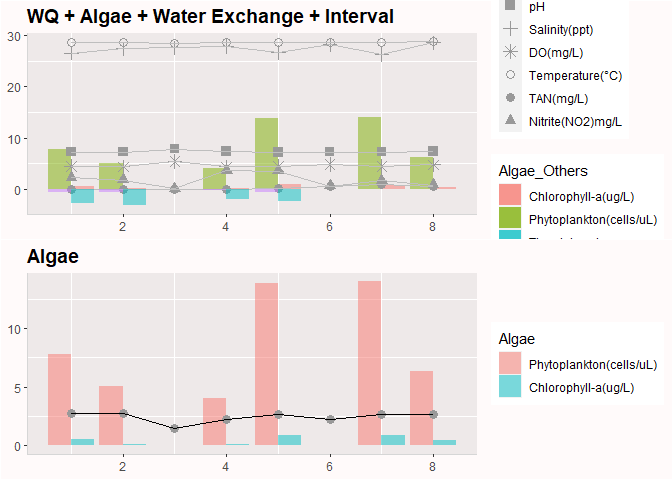
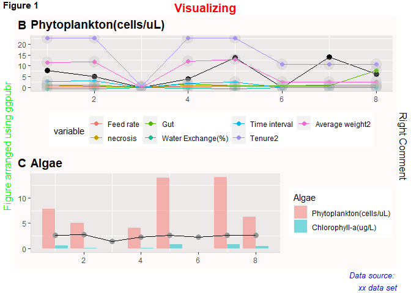
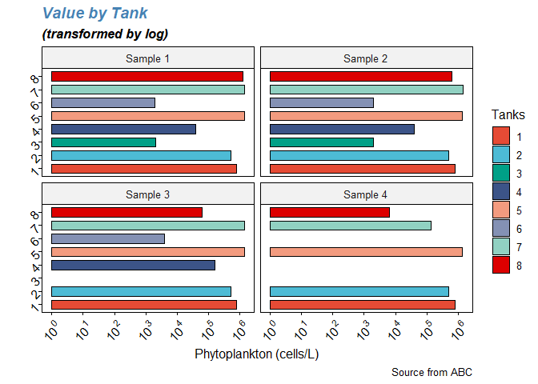
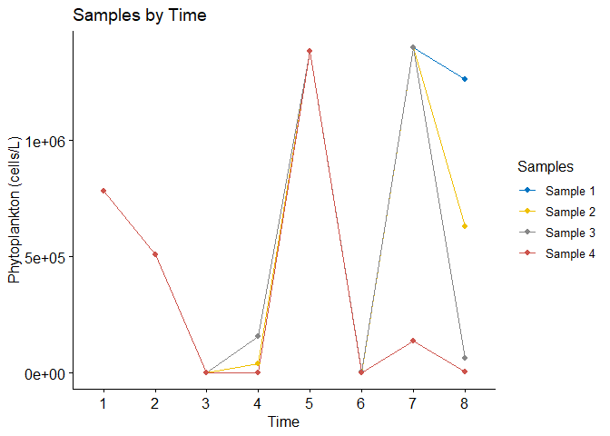
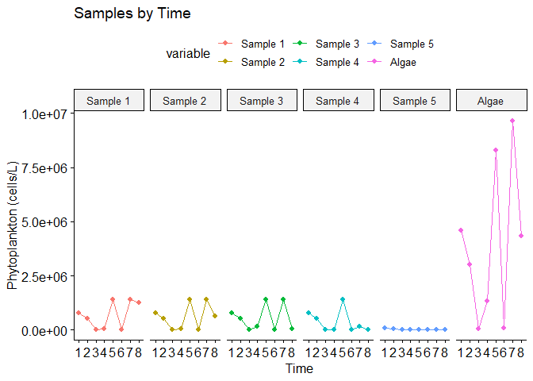
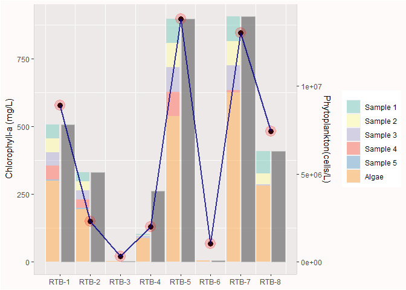

Combining Plots(grid,gridExtra,ggpubr packages)
================
Dahee Kim
2021-10-20

  - [Package *grid*](#package-grid)
  - [Package *gridExtra*](#package-gridextra)
  - [Package *ggpubr*](#package-ggpubr)
      - [Using combine=TRUE](#using-combinetrue)
      - [Using merge=TRUE](#using-mergetrue)
      - [Using facet\_grid/facet\_wrap](#using-facet_gridfacet_wrap)
  - [Multiple datasets & dual axis using
    *ggplot2*](#multiple-datasets--dual-axis-using-ggplot2)

``` r
a <- ggplot() +
  geom_bar(data=Algae2, aes(x=Tank, y=value, fill=Algae_Others),stat="identity", position=position_dodge(),alpha = 0.5) + 
  geom_point(data=WQ2, aes(x=Tank, y=value,shape=WQ),size=3,color='#999999')+ scale_shape_manual(values=c(15,3,8,1,16,17))+
  geom_line(data=WQ2,aes(x=Tank, y=value,group = variable),color="grey") +
  geom_bar(data=Time2, aes(x=Tank, y=value,fill=variable),stat="identity", position=position_dodge(),alpha = 0.5)+
  ggtitle("WQ + Algae + Water Exchange + Interval")+
  theme(plot.title = element_text(size=14, family = "Times",face="bold"),
        panel.background=element_rect(fill = "snow2"),
        axis.title=element_blank(),
        axis.line = element_line(color="grey84", size = 0.5),
        plot.background = element_rect(fill = "snow1"),
        panel.grid.major = element_blank())
b <- ggplot() +
  geom_point(data=data, aes(x=Tank, y=data$"Phytoplankton(cells/uL)"),size=3) + 
  geom_line(data=data, aes(x=Tank, y=data$"Phytoplankton(cells/uL)",group=1))+
  geom_point(data=Third2, aes(x=Tank, y=value,color=variable),size=2)+
  geom_point(data=Third2, aes(x=Tank, y=value,color=variable),size=6,alpha = 0.3,color="grey")+
  geom_line(data=Third2, aes(x=Tank, y=value,group=variable,color=variable),size=0.7) +
  ggtitle("Phytoplankton(cells/uL)")+
  theme(plot.title = element_text(size=14, family = "Times",face="bold"),
        panel.background=element_rect(fill = "snow2"),
        axis.title=element_blank(),
        axis.line = element_line(color="grey84", size = 0.5),
        plot.background = element_rect(fill = "snow1"),
        panel.grid.major = element_blank(),
        legend.position="bottom") 
c <- ggplot() +
  geom_bar(data=Algae22, aes(x=Tank, y=value, fill=Algae),stat="identity", position=position_dodge(),alpha = 0.5) + 
  geom_point(data=data, aes(x=data$Tank, y=data$"Maturity Index"),size=3,color='#999999')+
  geom_line(data=data, aes(x=data$Tank, y=data$"Maturity Index",group=1),size=0.7) +
  ggtitle("Algae")+
  theme(plot.title = element_text(size=14, family = "Times",face="bold"),
        panel.background=element_rect(fill = "snow2"),
        axis.title=element_blank(),
        axis.line = element_line(color="grey84", size = 0.5),
        plot.background = element_rect(fill = "snow1"),
        panel.grid.major = element_blank()) 
```

# Package *grid*

``` r
library(grid)
grid.newpage()

# Create layout : nrow = 2, ncol = 1
pushViewport(viewport(layout = grid.layout(nrow = 2, ncol = 1)))
# A helper function to define a region on the layout
define_region <- function(row, col){
  viewport(layout.pos.row = row, layout.pos.col = col)
} 
# Arrange the plots
print(a, vp = define_region(row = 1, col = 1))   # Span over two columns
print(c, vp = define_region(row = 2, col = 1))
```

<!-- -->

# Package *gridExtra*

``` r
library(gridExtra)
grid.arrange(a,c, ncol=1,nrow=2)
```

<!-- -->

# Package *ggpubr*

``` r
library(ggpubr)
figure <- ggarrange(b,c,ncol = 1, nrow = 2,labels = c("B", "C"),heights = c(1.2,1)) # common.legend = TRUE
annotate_figure(figure,
                top = text_grob("Visualizing", color = "red", face = "bold", size = 14),
                bottom = text_grob("Data source: \n xx data set", color = "blue",
                                   hjust = 1, x = 1, face = "italic", size = 10),
                left = text_grob("Figure arranged using ggpubr", color = "green", rot = 90),
                right = "Right Comment",
                fig.lab = "Figure 1", fig.lab.face = "bold"
)
```

<!-- -->

## Using combine=TRUE

``` r
library(ggpubr)
# combine = True
p <- ggbarplot(data=data2, x="Tank", y=c("Sample 1", "Sample 2","Sample 3","Sample 4"), fill="Tank", group="Tank", combine=TRUE) 

ggpar(p,
     main = "Value by Tank",font.main = c(14,"bold.italic", "Steelblue"), 
     submain = "(transformed by log)", font.submain = c(13, "bold.italic"),
     ylab = "Phytoplankton (cells/L)",
     xlab = "",
     caption = "Source from ABC",
     xtickslab.rt = 45, ytickslab.rt = 45,  #rotate
     yscale = "log10", format.scale = TRUE, #scale 
     legend = "right", legend.title = "Tanks",
     palette = "npg",  #"grey", "npg", "aaas", "lancet", "jco", "ucscgb", "uchicago", "simpsons", "rickandmorty","Dark2"
     orientation = "horiz")
```

<!-- -->

## Using merge=TRUE

``` r
ggline(data=data2, x="Tank",y=c("Sample 1", "Sample 2","Sample 3","Sample 4"), merge = TRUE,palette = "jco",
      main="Samples by Time", xlab="Time",ylab="Phytoplankton (cells/L)",legend.title="Samples", legend="right")
```

<!-- -->

## Using facet\_grid/facet\_wrap

``` r
data2m$variable <- factor(data2m$variable, labels = c("Sample 1", "Sample 2","Sample 3","Sample 4","Sample 5","Algae"))
ggline(data=data2m, x="Tank",y="value",color="variable",main="Samples by Time", xlab="Time",ylab="Phytoplankton (cells/L)") +      
        facet_grid(~variable) #facet_wrap(~variable)
```

<!-- -->

# Multiple datasets & dual axis using *ggplot2*

``` r
library(ggplot2)
ggplot()+
  geom_bar(data=data2m, aes(x=Tank, y=value*900/13880000 , group=variable, fill=variable),stat="identity",width=0.45,alpha=0.6)+
  geom_bar(data=data, aes(x=Tank,y=data$"Phytoplankton(cells/L)"*900/13880000,group=1),stat="identity",width=0.45,color="grey",alpha=0.6, position = position_nudge(x = 0.5))+
  scale_fill_brewer(palette="Set3")+
  # x-axis, tick breaks and labels
  scale_x_continuous("Tank",breaks = c(1.25,2.25,3.25,4.25,5.25,6.25,7.25,8.25),
                     label=c("RTB-1","RTB-2","RTB-3","RTB-4","RTB-5","RTB-6","RTB-7","RTB-8"))+
  geom_point(data=data,aes(x = Tank+0.25, y = data$"Chlorophyll-a (mg/L)"),size=3)+
  geom_point(data=data,aes(x = Tank+0.25, y = data$"Chlorophyll-a (mg/L)"),size=6,color="red",alpha=0.2)+
  geom_line(data=data,aes(x = Tank+0.25, y = data$"Chlorophyll-a (mg/L)", group=1),color="darkblue",size=1,alpha=0.8)+
  # y-axis 
  scale_y_continuous(name = expression("Chlorophyll-a (mg/L)"), sec.axis = sec_axis(~ . * 13880000 / 900 , name = "Phytoplankton(cells/L)"))+
  theme(plot.title = element_text(size=14, family = "Times",face="bold"),
        panel.background=element_rect(fill = "snow2"),
        axis.title.x=element_blank(),
        axis.line = element_line(color="grey84", size = 0.5),
        plot.background = element_rect(fill = "snow1"),
        panel.grid.major = element_blank(),
        legend.title = element_blank()) +
  scale_color_brewer(palette="Dark2")
```

<!-- -->
