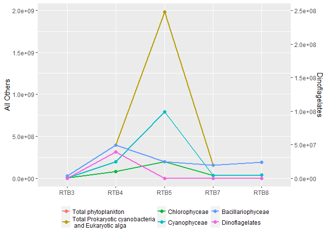
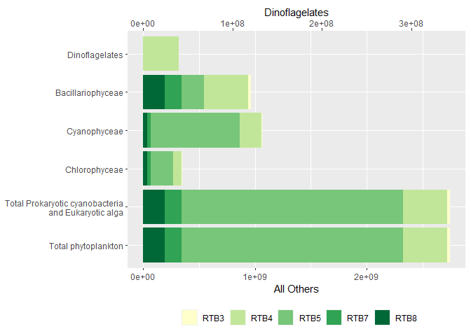
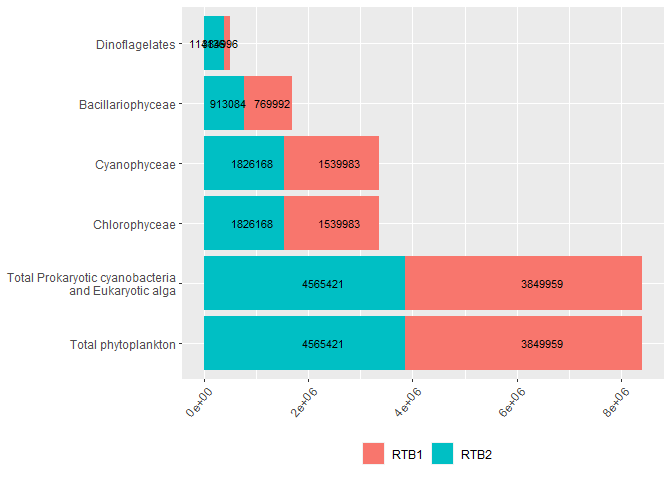
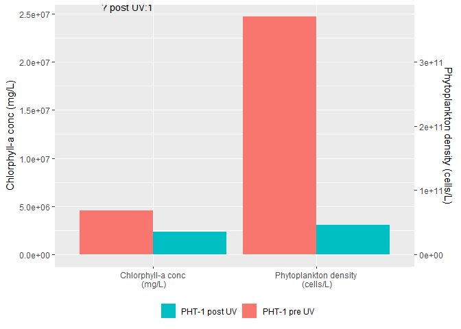
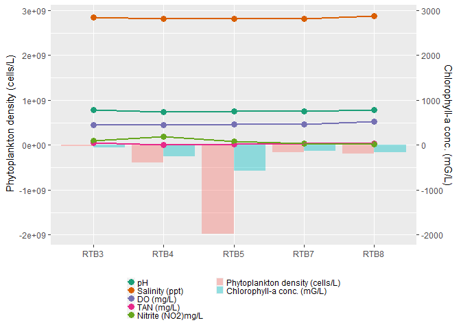
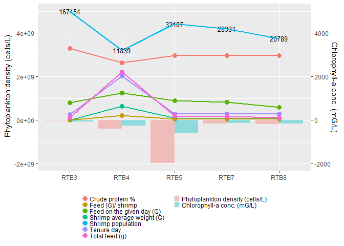
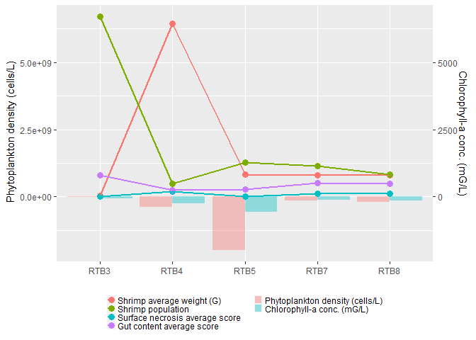
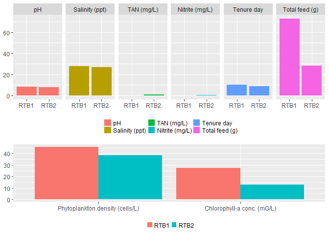
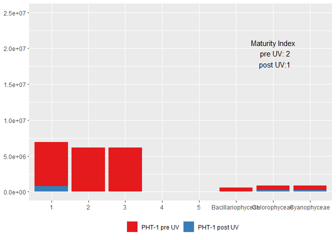

ggplot2 advanced
================

## graph 1(1)

``` r
library(ggplot2)
library(reshape2)
library(readxl)
s2 <- read_excel("~/VScode_project/R_projects/Data/Result analysis-graphs-2020(Feb).xlsx",sheet="plot1")
s2$'Dinoflagelates' <- s2$'Dinoflagelates'*8
ls<- c("RTB3","RTB4","RTB5","RTB7","RTB8")
s21 <- s2[which(s2$Tank %in% ls),] 
s21 <- melt(s21, id.vars="Tank")
levels(s21$variable) <- c('Total phytoplankton', 'Total Prokaryotic cyanobacteria\n and Eukaryotic alga', 'Chlorophyceae', 'Cyanophyceae', 'Bacillariophyceae','Dinoflagelates')
ggplot() + 
  geom_point(data=s21,aes(x=Tank, y=value,group=variable,color=variable),size=2)+
  geom_line(data=s21,aes(x=Tank, y=value,group=variable,color=variable),size=1) +
  scale_y_continuous(name = expression("All Others"), sec.axis = sec_axis(~ ./8, name = "Dinoflagelates"))+
  theme(axis.title.x = element_blank(),
        legend.position="bottom",
        legend.title=element_blank(),
        legend.key.size = unit(0.5, "cm"),
        legend.spacing.x = unit(0.1,"cm")) +
  guides(fill=guide_legend(nrow=2,byrow=TRUE))
```

<!-- -->

## graph 1(2)

``` r
ggplot()+
  geom_bar(data=s21, aes(x=variable, y=value,fill=Tank),stat="identity")+
  scale_y_continuous(name = expression("All Others"), sec.axis = sec_axis(~ ./8, name = "Dinoflagelates"))+
  scale_fill_brewer(palette="YlGn")+
  coord_flip()+
  theme(
        axis.title.y = element_blank(),
        legend.position="bottom",
        legend.title=element_blank())
```

<!-- -->

## graph 2

``` r
library(scales)
s2 <- read_excel("~/VScode_project/R_projects/Data/Result analysis-graphs-2020(Feb).xlsx",sheet="plot1")
ls<- c("RTB1","RTB2")
s21 <- s2[which(s2$Tank %in% ls),] 
s21 <- melt(s21, id.vars="Tank")
levels(s21$variable) <- c('Total phytoplankton', 'Total Prokaryotic cyanobacteria\n and Eukaryotic alga', 'Chlorophyceae', 'Cyanophyceae', 'Bacillariophyceae','Dinoflagelates')
ggplot()+#, position=position_dodge()
  geom_bar(data=s21, aes(x=variable, y=value,fill=Tank),stat="identity",alpha=1)+
  geom_text(data=s21, aes(x=variable, y=value,label=round(value,0)),size=3,angle = 0, position = position_stack(vjust = 0.5))+
  coord_flip()+
  theme(axis.title.x = element_blank(),
        axis.title.y = element_blank(),
        legend.position="bottom",
        legend.title=element_blank(),
        axis.text.x=element_text(angle=50,hjust=1))
```

<!-- -->

## graph 3

``` r
s3 <- read_excel("~/VScode_project/R_projects/Data/Result analysis-graphs-2020(Feb).xlsx",sheet="plot3")
s3$`Maturity index` <- s3$`Maturity index`*1000000
s31 <- melt(s3, id.vars="Tank")

ls2<- c("Maturity index")
s33 <- s31[which(!s31$variable  %in% ls2),]
s34 <- s31[which(s31$variable =="Maturity index"),] 

#dataframe for text
df <- data.frame(x1="Chlorophyceae",y1 =25000000,text="Maturity Index\n  ? pre UV: 2\n  ? post UV:1")
#change the order 
s33$Tank <- factor(s33$Tank, levels = c("PHT-1 pre UV", "PHT-1 post UV"))
#change the label
levels(s33$variable) <- c('Total phytoplankton', 'Total Prokaryotic cyanobacteria\n and Eukaryotic alga', 'Chlorophyceae', 'Cyanophyceae', 'Bacillariophyceae','Flagellates and Amoebas',
                          "Crawling and free-swimming ciliates","Stalked ciliates and suctorians","Maturity index")
#Reverse legend label
df <- data.frame(x1="Stalked ciliates and suctorians",y1 =17000000,text="Maturity Index\n  . pre UV: 2\n  . post UV:1")
ggplot(df, aes(x1, y1))+
  coord_flip()+
  geom_text(aes(label = text), vjust = "inward", hjust=0)+
  geom_bar(data=s33, aes(x=variable, y=value,fill=Tank),stat="identity")+
  #coord_flip()+
  theme(axis.title.x = element_blank(),
        axis.title.y = element_blank(),
        legend.position="bottom",
        legend.title=element_blank())
```

<!-- -->

## graph 4

``` r
s4 <- read_excel("~/VScode_project/R_projects/Data/Result analysis-graphs-2020(Feb).xlsx",sheet="plot4")
s4 <- s4[,c(1,2,3,11),]
s4$`Chlorphyll-a conc (mg/L)` <- s4$`Chlorphyll-a conc (mg/L)`*15000
s41 <- melt(s4, id.vars="Tank")
s45 <- s41[which(s41$variable %in% c("Phytoplankton density (cells/L)","Chlorphyll-a conc (mg/L)")),]

df2 <- data.frame(x1=c("Chlorphyll-a conc\n (mg/L)"),y1=c(6000000),
                 text=c("Maturity Index\n  ? pre UV: 2\n  ? post UV:1"))
s45$Tank <- factor(s45$Tank, levels = c("PHT-1 pre UV", "PHT-1 post UV"))
levels(s45$variable) <- c('Phytoplankton density\n (cells/L)', 'Chlorphyll-a conc\n (mg/L)',"Maturity index")
ggplot(df2, aes(x1, y1))+
  geom_text(aes(label = text), vjust =-5, hjust=1)+
  geom_bar(data=s45, aes(x=variable, y=value,fill=Tank),stat="identity", position=position_dodge())+
  scale_y_continuous(name = expression("Chlorphyll-a conc (mg/L)"), sec.axis = sec_axis(~ .*15000, name = "Phytoplankton density (cells/L)"))+
  scale_fill_discrete(breaks = rev(levels(s45$Tank)))+
  theme(axis.title.x = element_blank(),
      legend.position="bottom",
      legend.title=element_blank())
```

<!-- -->

## graph 5

``` r
s5 <- read_excel("~/VScode_project/R_projects/Data/Result analysis-graphs-2020(Feb).xlsx",sheet="plot5")
s5$`Chlorophyll-a conc. (mG/L)` = s5$`Chlorophyll-a conc. (mG/L)`*1000000
s51 <- reshape2::melt(s5, id.vars="Tank")
ls2 <-c("Chlorophyll-a conc. (mG/L)","Phytoplankton density (cells/L)")
s52 <- s51[which(s51$variable  %in% ls2),]
ls3 <-c("pH","Salinity (ppt)","DO (mg/L)","Temperature (?C)","TAN (mg/L)","Nitrite (NO2)mg/L")
s54 <- s51[which(s51$variable  %in% ls3),]
ggplot() +
  geom_bar(data=s52,aes(x=Tank, y=value*-1,fill=variable),stat="identity",alpha=0.4, position=position_dodge())+
  scale_y_continuous(name = expression("Phytoplankton density (cells/L)"), sec.axis = sec_axis(~ ./1000000, name = "Chlorophyll-a conc. (mG/L)"))+
  geom_point(data=s54,aes(x=Tank, y=value*100000000,group=variable,color=variable),size=3)+
  geom_line(data=s54, aes(x=Tank, y=value*100000000,group=variable,color=variable),size=1)+
  scale_color_brewer(palette="Dark2")+
  theme(axis.title.x = element_blank(),
        legend.direction = 'vertical',
        legend.position="bottom",
        legend.title=element_blank(),
        legend.key.size = unit(0.3, "cm"),
        legend.spacing.x = unit(0.1,"cm"))
```

<!-- -->

## graph 6

``` r
s6 <- read_excel("~/VScode_project/R_projects/Data/Result analysis-graphs-2020(Feb).xlsx",sheet="plot5")
s6$`Shrimp average weight (G)` <- s6$`Shrimp average weight (G)`*100
s6$`Feed on the given day (G)` <- s6$`Feed on the given day (G)`/2
s6$`Total feed (G)`<- s6$'Total feed (g)'/100
s6$`Feed (G)/ shrimp` <- s6$`Feed (G)/ shrimp`*1000
s6$`Tenure day` <- s6$`Tenure day`*100
s6$`Crude protein %` <- s6$`Crude protein %`*330
s6$`Chlorophyll-a conc. (mG/L)` = s6$`Chlorophyll-a conc. (mG/L)`*1000000
s61 <- melt(s6, id.vars="Tank")
ls2 <-c("Chlorophyll-a conc. (mG/L)","Phytoplankton density (cells/L)")
s62 <- s61[which(s61$variable  %in% ls2),]

ls3 <-c("Shrimp average weight (G)","Tenure day","Crude protein %","Feed on the given day (G)","Feed (G)/ shrimp")
s64 <- s61[which(s61$variable  %in% ls3),]
ls4 <-c("Total feed (g)")
s65 <- s61[which(s61$variable  %in% ls4),]
df <- data.frame(x1=c("RTB3","RTB4","RTB5","RTB7","RTB8"),y =c(5000000000,3210340000,4426420000,4199860000,3747340000),text=c(167454,11839,32107,28331,20789))
df$variable <- "Shrimp population"
ggplot(df, aes(x1, y))+
  geom_text(aes(label = text),size=3.5)+
  geom_point(data=s64,aes(x=Tank, y=value*200000,group=variable,color=variable),size=3)+
  geom_line(data=s64, aes(x=Tank, y=value*200000,group=variable,color=variable),size=1)+
  geom_point(data=s65,aes(x=Tank, y=value*2000,group=variable,color=variable),size=3)+
  geom_line(data=s65, aes(x=Tank, y=value*2000,group=variable,color=variable),size=1)+
  geom_line(data=df,aes(x=x1, y=y,group=variable,color=variable),size=1)+
  geom_bar(data=s62,aes(x=Tank, y=value*-1,fill=variable),alpha=0.4,stat="identity", position=position_dodge())+
  scale_y_continuous(name = expression("Phytoplankton density (cells/L)"), sec.axis = sec_axis(~ ./1000000, name = "Chlorophyll-a conc. (mG/L)"))+
  theme(axis.title.x = element_blank(),
        legend.direction = 'vertical',
        legend.position="bottom",
        legend.title=element_blank(),
        legend.key.size = unit(0.3, "cm"),
        legend.spacing.x = unit(0.1,"cm"))
```

<!-- -->

## graph 7

``` r
s7 <- read_excel("~/VScode_project/R_projects/Data/Result analysis-graphs-2020(Feb).xlsx",sheet="plot7")
colnames(s7)
```

    ## [1] "Tank"                            "Shrimp average weight (G)"      
    ## [3] "Shrimp population"               "Surface necrosis average score" 
    ## [5] "Gut content average score"       "Phytoplankton density (cells/L)"
    ## [7] "Chlorophyll-a conc. (mG/L)"

``` r
s7$`Chlorophyll-a conc. (mG/L)` = s7$`Chlorophyll-a conc. (mG/L)`*1000000
s7$`Shrimp population`<- s7$`Shrimp population`/5000
s71 <- melt(s7, id.vars="Tank")
ls2 <-c("Chlorophyll-a conc. (mG/L)","Phytoplankton density (cells/L)")
s72 <- s71[which(s71$variable  %in% ls2),]
ls3 <-c("Shrimp population","Surface necrosis average score","Gut content average score","Shrimp average weight (G)")
s73 <- s71[which(s71$variable  %in% ls3),]
ggplot() +
geom_bar(data=s72,aes(x=Tank, y=value*-1,fill=variable),alpha=0.4,stat="identity", position=position_dodge())+
  scale_y_continuous(name = expression("Phytoplankton density (cells/L)"), sec.axis = sec_axis(~ ./1000000, name = "Chlorophyll-a conc. (mG/L)"))+
  geom_point(data=s73,aes(x=Tank, y=value*200000000,group=variable,color=variable),size=3)+
  geom_line(data=s73, aes(x=Tank, y=value*200000000,group=variable,color=variable),size=1)+
  theme(axis.title.x = element_blank(),
        legend.direction = 'vertical',
        legend.position="bottom",
        legend.title=element_blank(),
        legend.key.size = unit(0.3, "cm"),
        legend.spacing.x = unit(0.1,"cm"))
```

<!-- -->

## graph 8

``` r
s8 <- read_excel("~/VScode_project/R_projects/Data/Result analysis-graphs-2020(Feb).xlsx",sheet="plot8")
s8$`TAN (mg/L)` = s8$`TAN (mg/L)`*30
s8$`Nitrite (NO2)mg/L` = s8$`Nitrite (NO2)mg/L`*30
s8$`Total feed (g)` = s8$`Total feed (g)`/300
s8$`Chlorophyll-a conc. (mG/L)` = s8$`Chlorophyll-a conc. (mG/L)`/10
s8$`Phytoplankton density (cells/L)` = s8$`Phytoplankton density (cells/L)`/100000
s81 <- melt(s8, id.vars="Tank")
ls2 <-c("Chlorophyll-a conc. (mG/L)","Phytoplankton density (cells/L)")
s82 <- s81[which(s81$variable  %in% ls2),]
s83 <- s81[which(!s81$variable  %in% ls2),]
levels(s83$variable) <- c('pH', 'Salinity (ppt)', 'TAN (mg/L)', 'Nitrite (mg/L)', 'Tenure day','Total feed (g)',
                          "Phytoplankton density (cells/L)","Chlorophyll-a conc. (mG/L)" )
a<- ggplot() +
  geom_bar(data=s83,aes(x=Tank, y=value,group=variable,fill=variable),stat="identity")+
  facet_grid(~variable)+
  theme(axis.title.x = element_blank(),
        axis.title.y = element_blank(),
        legend.position="bottom",
        legend.title=element_blank(),
        legend.key.size = unit(0.4, "cm"),
        legend.spacing.x = unit(0.1,"cm"))
b<- ggplot() +
  geom_bar(data=s82,aes(x=variable, y=value,fill=Tank),stat="identity", position=position_dodge())+
  theme(axis.title.x = element_blank(),
        axis.title.y = element_blank(),
        legend.position="bottom",
        legend.title=element_blank(),
        legend.key.size = unit(0.3, "cm"),
        legend.spacing.x = unit(0.1,"cm"))
library(ggpubr)
ggarrange(a, b, heights = c(1.5,1), 
          ncol = 1, nrow = 2)
```

<!-- -->

## graph 9

``` r
s9 <- read_excel("~/VScode_project/R_projects/Data/Result analysis-graphs-2020(Feb).xlsx",sheet="plot9")
#head(s9)
s91 <- s9[which(s9$Group=="Algae Family"),]
s92 <- s9[which(s9$Group=="Ranking"),]

s91$Pre_Post <- factor(s91$Pre_Post, levels = c("PHT-1 pre UV", "PHT-1 post UV"))
s92$Pre_Post <- factor(s92$Pre_Post, levels = c("PHT-1 pre UV", "PHT-1 post UV"))
df <- data.frame(x1="Chlorophyceae",y1 =25000000,text="Maturity Index\n  pre UV: 2\n  post UV:1")
ggplot(df, aes(x1, y1))+
  geom_text(aes(label = text), vjust = 2, hjust = 0.5)+
  geom_bar(data=s91,aes(x=Tank,y=Value,fill=Pre_Post),stat="identity")+ 
  geom_bar(data=s92,aes(x=Tank,y=Value,fill=Pre_Post),stat="identity")+
  scale_fill_brewer('Variables', palette='Set1')+
  theme(
        axis.title.x = element_blank(),
        axis.title.y = element_blank(),
        legend.position="bottom",
        legend.title=element_blank())
```

<!-- -->

## graph 10

``` r
s10 <- read_excel("~/VScode_project/R_projects/Data/Result analysis-graphs-2020(Feb).xlsx",sheet="plot10")
#colnames(s10)
s10$`Chlorphyll-a conc (mg/L)` <- s10$`Chlorphyll-a conc (mg/L)`*15000
#head(s10)
s101 <- melt(s10, id.vars="Tank")
ls2 <-c("Chlorphyll-a conc (mg/L)","Phytoplankton density (cells/L)")
s102 <- s101[which(s101$variable  %in% ls2 ),]
s103 <- s101[which(!s101$variable  %in% ls2 ),]
 
a <- ggplot()+
  geom_bar(data=s103,aes(x=Tank, y=value,fill=variable),stat="identity")+
  facet_grid(~variable)+
  geom_text(data=s103,aes(x=Tank, y=value,label=value),position = position_dodge(0.1),size=3)+
  theme(axis.text.x = element_text(angle=30, hjust=1),
        axis.title.x = element_blank(),
        axis.title.y = element_blank(),
        legend.position="bottom",
        legend.title=element_blank())


s102$Tank <- factor(s102$Tank, levels = c("PHT-1 pre UV", "PHT-1 post UV"))
s102$variable <- factor(s102$variable, levels = c("Phytoplankton density (cells/L)", "Chlorphyll-a conc (mg/L)"))
df <- data.frame(x1="",y1 =27000000,text="Maturity Index\n  pre UV: 2\n  post UV:1")
b <- ggplot()+
    geom_bar(data=s102,aes(x=variable,y=value,fill=Tank),stat="identity",position = "dodge")+
    scale_y_continuous(labels = scales::scientific,name = expression("Phytoplankton density (cells/L)"), sec.axis = sec_axis(~ ./15000, name = "Chlorophyll-a conc. (mG/L)"))+
    theme(
        axis.title.x = element_blank(),
        legend.position="bottom",
        legend.title=element_blank())
library(ggpubr)
figure <- ggarrange(a, b, heights = c(1.5,1), 
          ncol = 1, nrow = 2)
annotate_figure(figure,
                bottom = text_grob("Maturity Index\n  ? pre UV: 2\n  ? post UV:1", color = "black", face = "bold", size = 10))
```

<!-- -->
