ggplot implement 2
================

## plot 1

``` r
library(reshape2)
library(ggplot2)
library(readxl)
data <- read_excel("~/VScode_project/R_projects/Data/Result_analysis-graphs-2020(March).xlsx", sheet = "plot1")
data$`Maturity index` = data$`Maturity index`*4000000000
melt <-reshape2::melt(data,id.vars="Tank")

melt$Type <- rep(c("Higher life forms","Algal family"),c(30,30))
melt$variable <- factor(melt$variable, levels = c("Total phytoplankton","Chlorophyceae","Cyanophyceae","Bacillariophyceae","Dinophyceae",
                                                  "Maturity index","Flagellates & amoeba","Ciliates-free swimming & crawl","Ciliates stalked",
                                                  "Nematodes"))
ggplot()+
  geom_bar(data=melt, aes(x=Tank, y=value, fill=variable),stat="identity")+
  facet_wrap(~Type)+
  theme(axis.title.x=element_blank(),
        axis.title.y=element_blank(),
        legend.title = element_blank(), 
        legend.position = "bottom",
        legend.direction = "vertical",
        legend.key.size = unit(0.3, "cm"))+
  guides(fill=guide_legend(nrow = 4))
```

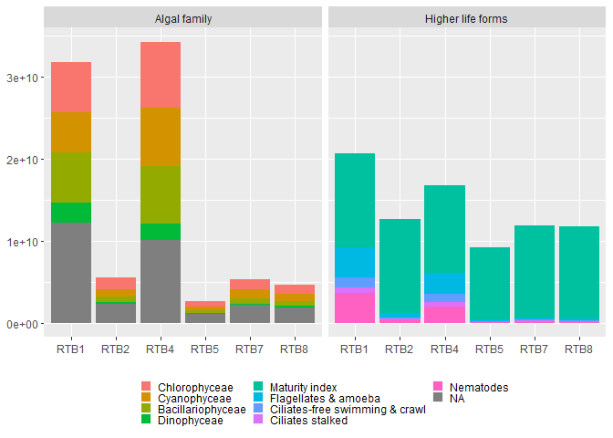<!-- -->

## plot 2

``` r
data <- read_excel("~/VScode_project/R_projects/Data/Result_analysis-graphs-2020(March).xlsx",sheet="plot2")
data$'Chlorophyll-a conc. (mg/L)' = data$'Chlorophyll-a conc. (mg/L)'*10000000
data$'Chlorophyll-b conc. (mg/L)' = data$'Chlorophyll-b conc. (mg/L)'*10000000
melt <-reshape2::melt(data,id.vars="Tank")
#table(melt$variable)
melt$Type <- rep(c("Total Phytoplankton (cells/L)", "Total chlorphyll conc (mg/L)"),times=c(6,18))
ls3 <- c("Total Chlorophyll conc. (mg/L)")
d2 <- melt[which(!melt$variable %in% ls3),]

d2$Type <- factor(d2$Type, levels = c("Total Phytoplankton (cells/L)","Total chlorphyll conc (mg/L)"))
ggplot(data=d2, aes(x=Tank, y=value, fill=variable)) +
  geom_bar(stat="identity", position=position_stack()) +
  scale_y_continuous(name = expression("All Others"), sec.axis = sec_axis(~ ./10000000, name = "Maturity index"))+
  facet_wrap(~Type)+
  theme(legend.position  = "bottom",
        axis.title.x = element_blank(),
        axis.title.y = element_blank(),
        legend.title = element_blank(),
        legend.key.size = unit(0.3, "cm"))+
  guides(fill=guide_legend(nrow=3))
```

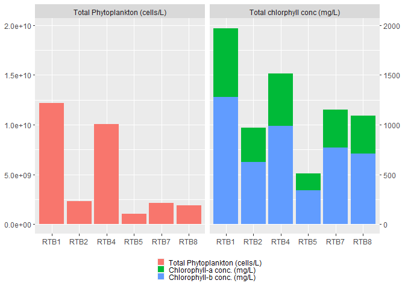<!-- -->

## plot 3

``` r
data <- read_excel("~/VScode_project/R_projects/Data/Result_analysis-graphs-2020(March).xlsx",sheet="plot3")
melt <-reshape2::melt(data,id.vars="Tank")
ls <- c("Total Phytoplankton (cells/L)")
d1 <- melt[which(melt$variable %in% ls),]
d2 <- melt[which(!melt$variable %in% ls),]
ggplot()+
  geom_point(data=d2, aes(x=Tank, y=value*1000000000,color=variable),size=3)+
  geom_line(data=d2, aes(x=Tank, y=value*1000000000,color=variable,group=variable),size=1)+
  geom_bar(data=d1, aes(x=Tank, y=value*-1,fill=variable),stat="identity",alpha=0.4)+
  scale_y_continuous(name = expression("Total phytoplankton density"), sec.axis = sec_axis(~ ./1000000000, name = "Water Quality"))+
  theme(legend.position  = "bottom",
        axis.title.x = element_blank(),
        axis.title.y = element_text(colour = "grey46"),
        legend.title = element_blank(),
        legend.key.size = unit(0.3, "cm"))+
  guides(color=guide_legend(nrow=3))
```

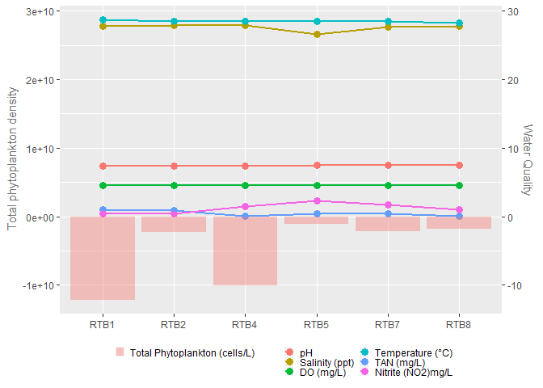<!-- -->

``` r
d1$variable <- factor(d1$variable, label="Total Phytoplankton\n(cells/L)")
a<- ggplot()+
  geom_bar(data=d1, aes(x=Tank, y=value,fill=variable),stat="identity")+
  theme(legend.position  = "right",
        axis.title.x = element_blank(),
        axis.title.y = element_blank(),
        legend.title = element_blank(),
        legend.key.size = unit(0.5, "cm"))+
  guides(color=guide_legend(nrow=3))
a
```

<!-- -->

``` r
b<- ggplot()+
  geom_bar(data=d2, aes(x=Tank, y=value,fill=variable),stat="identity")+
  facet_grid(~variable)+
  geom_text(data=d2, aes(x=Tank, y=value,label=value),vjust=-0.4, size = 2.5)+
  theme(legend.position  = "none",
        axis.text.x=element_blank(),
        axis.title.x = element_blank(),
        axis.title.y = element_blank(),
        legend.title = element_blank(),
        legend.key.size = unit(0.3, "cm"),
        axis.ticks.x=element_blank()
        )+
  guides(color=guide_legend(nrow=3))
library(ggpubr)
ggarrange(a, b, heights = c(0.8,1),ncol=1)
```

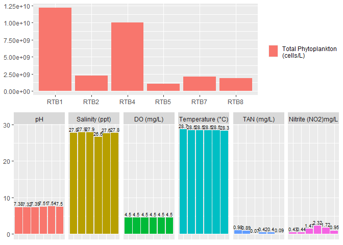<!-- -->

## plot 4

``` r
data <- read_excel("~/VScode_project/R_projects/Data/Result_analysis-graphs-2020(March).xlsx",sheet="plot4")
data$`Excess feed on the given day (G)` = data$`Excess feed on the given day (G)`/2
data$'Shrimp average weight' = data$'Shrimp average weight'*3
data$`Feed on the given day (G)` = data$`Feed on the given day (G)`/100
data$`Total feed (G) in the entire tenure period` = data$`Total feed (G) in the entire tenure period`/1000
data$`Shrimp population` = data$`Shrimp population`/1000

melt <-reshape2::melt(data,id.vars="Tank")
ls <- c("Total phytoplankton")
ls <- c("Shrimp population","Feed on the given day (G)")
d1 <- melt[which(melt$variable %in% ls),]
d2 <- melt[which(!melt$variable %in% ls),]

ggplot()+
  geom_point(data=melt, aes(x=Tank, y=value,color=variable),size=3)+
  geom_line(data=melt, aes(x=Tank, y=value,color=variable,group=variable),size=1)+
  facet_grid(variable~.,scales = "free_y", labeller = label_wrap_gen(width=15))+
  theme(legend.position  = "bottom",
        strip.text.y = element_blank(),
        axis.title.y=element_blank(),
        axis.title.x=element_blank(),
        legend.title=element_blank(),
        legend.key.size = unit(0.1, "cm"))+
  guides(color=guide_legend(nrow=4))
```

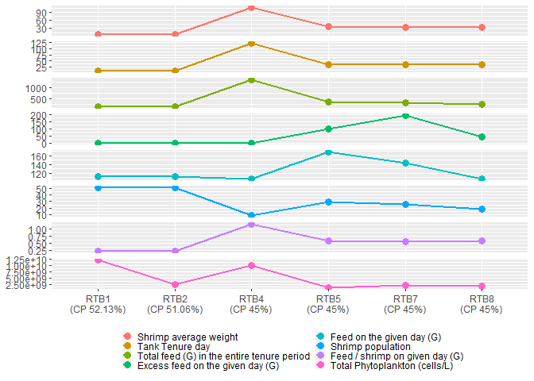<!-- -->

``` r
ggplot()+
  geom_point(data=d2, aes(x=Tank, y=value,color=variable),size=3)+
  geom_line(data=d2, aes(x=Tank, y=value,color=variable,group=variable),size=1)+
  facet_grid(variable~.,scales = "free_y", labeller = label_wrap_gen(width=15))+
  theme(legend.position  = "bottom",
        strip.text.y = element_blank(),
        axis.title.y=element_blank(),
        axis.title.x=element_blank(),
        legend.title=element_blank(),
        legend.key.size = unit(0.1, "cm"))+
  guides(color=guide_legend(nrow=6))
```

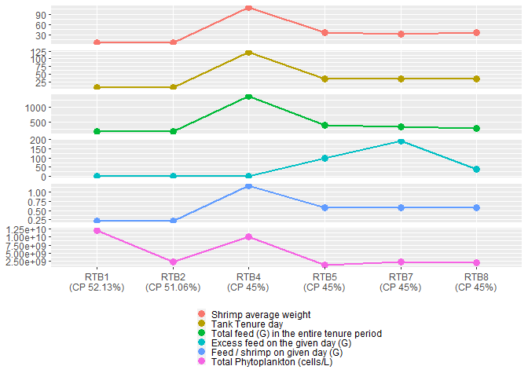<!-- -->

``` r
ggplot()+
  geom_point(data=d2, aes(x=Tank, y=value,color=variable),size=3)+
  geom_line(data=d2, aes(x=Tank,y=value,color=variable,group=variable),size=1)+
  facet_wrap(variable~.,scales = "free_y", ncol=1)+
  theme(legend.position  = "none",
        axis.title.y=element_blank(),
        axis.title.x=element_blank())
```

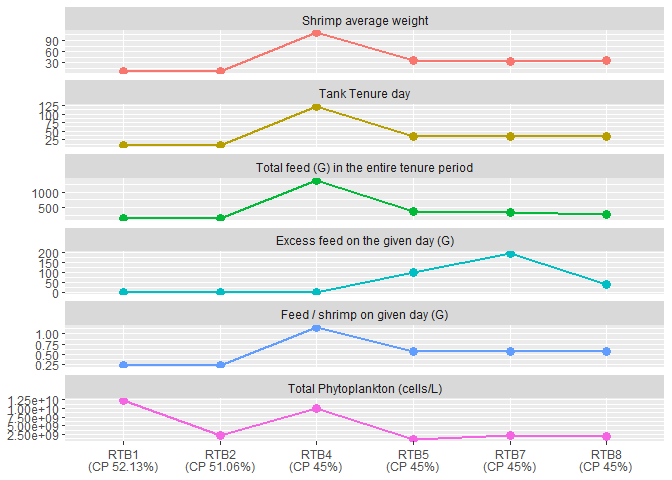<!-- -->

``` r
ggplot()+
  geom_point(data=d2, aes(x=Tank, y=value,color=variable),size=3)+
  geom_line(data=d2, aes(x=Tank, y=value,color=variable,group=variable),size=1)+
  facet_grid(variable~.,scales = "free_y", labeller = label_wrap_gen(width=15))+
  theme(legend.position  = "none",
        axis.title.y=element_blank(),
        axis.title.x=element_blank(),
        legend.title=element_blank())+
  guides(color=guide_legend(nrow=4))
```

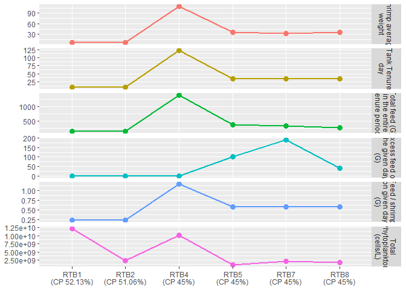<!-- -->

## plot 5

``` r
data <- read_excel("~/VScode_project/R_projects/Data/Result_analysis-graphs-2020(March).xlsx",sheet="plot5")
melt <-reshape2::melt(data,id.vars="Tank")
#table(melt$variable)
ls <- c("Total phytoplankton")
d1 <- melt[which(melt$variable %in% ls),]
d2 <- melt[which(!melt$variable %in% ls),]

ggplot()+
  geom_point(data=d2, aes(x=Tank, y=value*5000000000,color=variable),size=3)+
  geom_line(data=d2, aes(x=Tank, y=value*5000000000,color=variable,group=variable),size=1)+
  geom_bar(data=d1, aes(x=Tank, y=value*-1,fill=variable),stat="identity",alpha=0.4)+
  scale_y_continuous(name = expression("Total phytoplankton density"), sec.axis = sec_axis(~ ./5000000000, name = "Necrosis & Gut Content"))+
  theme(legend.position  = "bottom",
        axis.title.x = element_blank(),
        legend.title = element_blank(),
        legend.key.size = unit(0.2, "cm"),
        axis.title.y = element_text(colour = "grey46"))+
  guides(color=guide_legend(nrow=2))
```

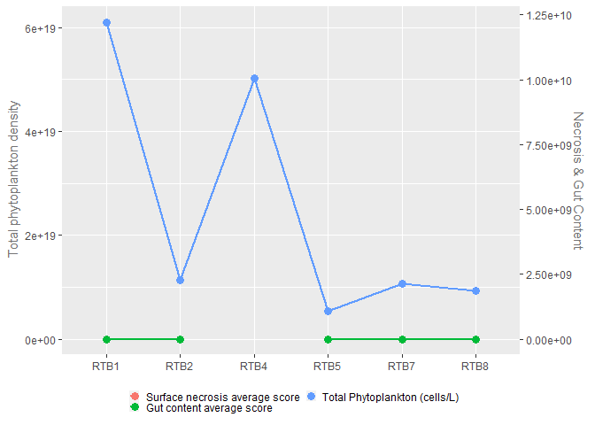<!-- -->

## plot 6

``` r
data <- read_excel("~/VScode_project/R_projects/Data/Result_analysis-graphs-2020(March).xlsx",sheet="plot6")
data$Orthophosphorus = data$Orthophosphorus*10
data$`Nitrite (NO2)` = data$`Nitrite (NO2)`*100
data$TAN = data$TAN*100
melt <-reshape2::melt(data,id.vars="Tank")
ls <- c("Total Phytoplankton (cells/L)","Chlorphyll-a conc (mg/L)","Chlorphyll-b conc (mg/L)")
ls3 <- c("pH","salinity","Nitrite (NO2)","Nitrate (NO3)","TAN","Alkalinity","Orthophosphorus")
d1 <- melt[which(melt$variable %in% ls),]
d1$Type <- rep(c("Total Phytoplankton (cells/L)", "Total chlorphyll conc (mg/L)"),times=c(2,4))
d3 <- melt[which(melt$variable %in% ls3),]

d1$Tank <- factor(d1$Tank, levels = c("PHT-1 pre UV","PHT-1 post UV"))
d1$Type <- factor(d1$Type, levels = c("Total Phytoplankton (cells/L)", "Total chlorphyll conc (mg/L)"))
a <- ggplot()+
  geom_bar(data=d1, aes(x=Tank, y=value, fill=variable),stat='identity',position = position_stack())+
  facet_wrap(~Type, scales = "free")+
  theme(#legend.position  = "bottom",
        axis.title.x = element_blank(),
        axis.title.y = element_blank(),
        axis.text.x = element_text(angle = 0,vjust=0.7),
        legend.title = element_blank(),
        legend.key.size = unit(0.5, "cm"))+
  guides(fill=guide_legend(nrow=3))
df <- data.frame(Tank=d3$Tank, value=c(7.92, 7.92, 27.2, 27.2,0.02, 0.02, 40, 40, 0.03,0.03, 392,392,0.73,0.73 ), variable = d3$variable)
d3$Tank <- factor(d3$Tank, levels = c("PHT-1 pre UV","PHT-1 post UV"))
b<- ggplot()+
  geom_bar(data=subset(d3,d3$Tank=="PHT-1 pre UV"), aes(x=Tank, y=value, group=variable,fill=variable),stat='identity')+
  ylim(0, 410)+
  geom_text(data=subset(df,df$Tank=="PHT-1 pre UV"), aes(x=Tank, y=value,label=value),vjust=-0.5,size=3)+
  facet_grid(~variable)+
  theme(legend.position  = "none",
        axis.title.x = element_blank(),
        axis.title.y = element_blank(),
        axis.text.x= element_blank(),
        legend.title = element_blank(),
        legend.key.size = unit(0.2, "cm"),
        axis.ticks.x=element_blank())+
  guides(fill=guide_legend(nrow=1))
library(ggpubr)
ggarrange(a, b, heights = c(0.8,1),ncol=1)
```

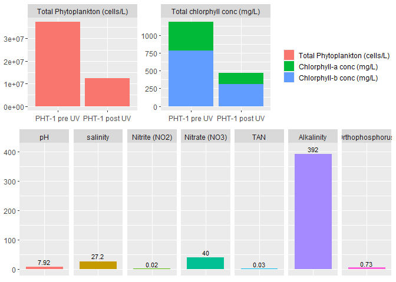<!-- -->

## plot 7

``` r
data <- read_excel("~/VScode_project/R_projects/Data/Result_analysis-graphs-2020(March).xlsx",sheet="plot7")
melt <-reshape2::melt(data,id.vars="Tank")
#table(melt$variable)
melt$Type <- rep(c("Phytoplankton density (cells/L)","Total chlorphyll conc (mg/L)","Algal Family"),times=c(2,4,8))

melt$Tank <- factor(melt$Tank, levels = c("PHT-1 pre UV","PHT-1 post UV"))
melt$Type <- factor(melt$Type, levels = c("Phytoplankton density (cells/L)","Algal Family","Total chlorphyll conc (mg/L)"))
melt$variable <- factor(melt$variable, levels = c("Phytoplankton density (cells/L)","Chlorophyceae","Cyanophyceae","Bacillariophyceae","Dinophyceae","Chlorphyll-a conc (mg/L)","Chlorphyll-b conc (mg/L)"))
ggplot() +
  geom_bar(data=melt, aes(x=Tank,y=value,fill=variable),stat="identity",position=position_stack())+
  facet_wrap(~Type, scales = "free")+
  theme(legend.position = "bottom",
        axis.title.x = element_blank(),
        axis.title.y = element_blank(),
        axis.text.x = element_text(angle = 10,vjust=0.7),
        legend.title = element_blank(),
        legend.box = "vertical",
        legend.key.size = unit(0.4, "cm"))+
  guides(fill=guide_legend(nrow=5))
```

<!-- -->

## plot 8

``` r
data <- read_excel("~/VScode_project/R_projects/Data/Result_analysis-graphs-2020(March).xlsx",sheet="plot8")
#head(data)
melt <-reshape2::melt(data,id.vars="Tank")
#table(melt$variable)
library(scales)
ggplot() +
  geom_line(data=melt, aes(x=Tank, y=value,group=variable,color=variable),size=1)+
  geom_point(data=melt, aes(x=Tank, y=value,group=variable,color=variable),size=3)+
  geom_bar(data=melt, aes(x=Tank,y=value,fill=variable),stat="identity",width=0.5,alpha=0.5)+
  scale_y_continuous(labels=function(x) format(x, big.mark = ",", scientific = FALSE))+
  facet_grid(variable~.,scales="free")+
  theme(legend.position = "bottom",
        axis.title.x = element_blank(),
        axis.title.y = element_blank(),
        legend.title = element_blank(),
        strip.text.y = element_blank(),
        legend.box = "vertical",
        legend.key.size = unit(0.3, "cm"))+
  guides(color=guide_legend(nrow=3))
```

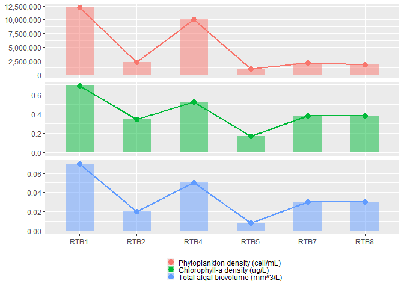<!-- -->

``` r
data <- read_excel("~/VScode_project/R_projects/Data/Result_analysis-graphs-2020(March).xlsx",sheet="plot8")
#head(data)
a <- ggplot() +
  geom_line(data=data, aes(y=data$`Chlorophyll-a density (ug/L)`, x=data$`Phytoplankton density (cell/mL)`,group=1),size=1)+
  geom_point(data=data, aes(y=data$`Chlorophyll-a density (ug/L)`, x=data$`Phytoplankton density (cell/mL)`),size=3)+
  xlab("Phytoplankton (cell/mL)")+
  ylab("Chlorophyll-a (ug/L)")

b <- ggplot() +
  geom_line(data=data, aes(y=data$`Total algal biovolume (mm^3/L)`, x=data$`Phytoplankton density (cell/mL)`,group=1),size=1)+
  geom_point(data=data, aes(y=data$`Total algal biovolume (mm^3/L)`, x=data$`Phytoplankton density (cell/mL)`),size=3) +
  xlab("Phytoplankton (cell/mL)")+
  ylab("Total algal bio-volume (mm^3/L)")
c <- ggplot() +
  geom_line(data=data, aes(y=data$`Total algal biovolume (mm^3/L)`, x=data$`Chlorophyll-a density (ug/L)`,group=1),size=1)+
  geom_point(data=data, aes(y=data$`Total algal biovolume (mm^3/L)`, x=data$`Chlorophyll-a density (ug/L)`),size=3)+
  xlab("Chlorophyll-a (ug/L)")+
  ylab("Total algal bio-volume (mm^3/L)")
  
  library(ggpubr)
ggarrange(a, b,c,nrow=1)
```

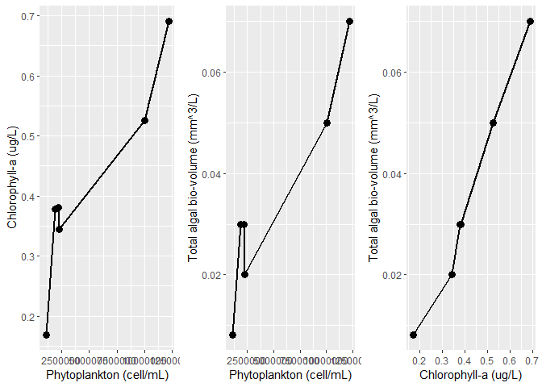<!-- -->

## plot 9

``` r
data <- read_excel("~/VScode_project/R_projects/Data/Result_analysis-graphs-2020(March).xlsx",sheet="plot9")
#head(data)
melt <-reshape2::melt(data,id.vars="Tank")
#table(melt$variable)
melt$Type <- rep(c("Chlorophyll-a","Chlorophyll-b","Total Chlorophyll","Algal Family"),times=c(6,6,6,24))
melt$variable <- factor(melt$variable, levels = c("Chlorophyceae","Cyanophyceae","Bacillariophyceae","Dinophyceae","Chlorophyll-a conc. (mg/L)","Chlorophyll-b conc. (mg/L)","Total Chlorophyll conc. (mg/L)"))
ggplot()+
  geom_bar(data=melt, aes(x=Tank,y=value,fill=variable),stat="identity",position=position_stack())+
  facet_wrap(.~Type, scales = "free_y",ncol=1)+
  theme(legend.position = "bottom",
        axis.title.x=element_blank(),
        axis.title.y=element_blank(),
        legend.title = element_blank(),
        legend.key.size = unit(0.3, "cm"))+
  guides(fill=guide_legend(nrow=4))
```

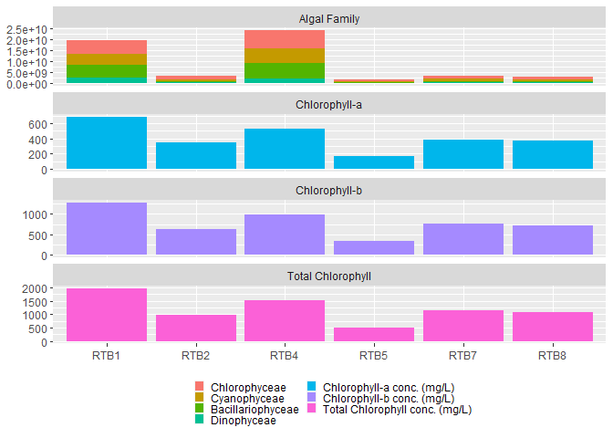<!-- -->
