Data Visualization
================
Dahee Kim
March 3, 2019

  - [Data Set Information:](#data-set-information)
      - [Attribute Information:](#attribute-information)
  - [Scatter plot](#scatter-plot)
  - [Correlation Matrix - first 10
    protein](#correlation-matrix---first-10-protein)
  - [Correlogram](#correlogram)
  - [Boxplot](#boxplot)
  - [Violin plot](#violin-plot)
  - [Dendrogram plot](#dendrogram-plot)
  - [Chord-diagrams](#chord-diagrams)
  - [Radar Plot](#radar-plot)
  - [ggplot2](#ggplot2)
  - [Plotly](#plotly)
  - [Lollipop](#lollipop)
  - [Density plot](#density-plot)

## Data Set Information:

The data set consists of the expression levels of 77 proteins/protein
modifications that produced detectable signals in the nuclear fraction
of cortex. There are 38 control mice and 34 trisomic mice (Down
syndrome), for a total of 72 mice. In the experiments, 15 measurements
were registered of each protein per sample/mouse. Therefore, for control
mice, there are 38x15, or 570 measurements, and for trisomic mice, there
are 34x15, or 510 measurements. The dataset contains a total of 1080
measurements per protein. Each measurement can be considered as an
independent sample/mouse.

The eight classes of mice are described based on features such as
genotype, behavior and treatment. According to genotype, mice can be
control or trisomic. According to behavior, some mice have been
stimulated to learn (context-shock) and others have not (shock-context)
and in order to assess the effect of the drug memantine in recovering
the ability to learn in trisomic mice, some mice have been injected with
the drug and others have not.

Classes:

  - c-CS-s: control mice, stimulated to learn, injected with saline (9
    mice)

  - c-CS-m: control mice, stimulated to learn, injected with memantine
    (10 mice)

  - c-SC-s: control mice, not stimulated to learn, injected with saline
    (9 mice)

  - c-SC-m: control mice, not stimulated to learn, injected with
    memantine (10 mice)

  - t-CS-s: trisomy mice, stimulated to learn, injected with saline (7
    mice)

  - t-CS-m: trisomy mice, stimulated to learn, injected with memantine
    (9 mice)

  - t-SC-s: trisomy mice, not stimulated to learn, injected with saline
    (9 mice)

  - t-SC-m: trisomy mice, not stimulated to learn, injected with
    memantine (9 mice)

### Attribute Information:

1.  Mouse ID
2.  Values of expression levels of 77 proteins; indicating that they
    were measured in the nuclear fraction. For example: DYRK1A\_n
3.  Genotype: control (c) or trisomy (t)
4.  Treatment type: memantine (m) or saline (s)
5.  Behavior: context-shock (CS) or shock-context (SC)
6.  Class: c-CS-s, c-CS-m, c-SC-s, c-SC-m, t-CS-s, t-CS-m, t-SC-s,
    t-SC-m

Data Source:
[linked](https://archive.ics.uci.edu/ml/datasets/Mice+Protein+Expression)

``` r
library(readxl)
data <- read_excel("~/VScode_project/R_projects/Data/Data_Cortex_Nuclear.xls")
head(data)
```

    ## # A tibble: 6 x 82
    ##   MouseID DYRK1A_N ITSN1_N BDNF_N NR1_N NR2A_N pAKT_N pBRAF_N pCAMKII_N pCREB_N
    ##   <chr>      <dbl>   <dbl>  <dbl> <dbl>  <dbl>  <dbl>   <dbl>     <dbl>   <dbl>
    ## 1 309_1      0.504   0.747  0.430  2.82   5.99  0.219   0.178      2.37   0.232
    ## 2 309_2      0.515   0.689  0.412  2.79   5.69  0.212   0.173      2.29   0.227
    ## 3 309_3      0.509   0.730  0.418  2.69   5.62  0.209   0.176      2.28   0.230
    ## 4 309_4      0.442   0.617  0.359  2.47   4.98  0.223   0.176      2.15   0.207
    ## 5 309_5      0.435   0.617  0.359  2.37   4.72  0.213   0.174      2.13   0.192
    ## 6 309_6      0.448   0.628  0.367  2.39   4.81  0.219   0.176      2.14   0.195
    ## # ... with 72 more variables: pELK_N <dbl>, pERK_N <dbl>, pJNK_N <dbl>,
    ## #   PKCA_N <dbl>, pMEK_N <dbl>, pNR1_N <dbl>, pNR2A_N <dbl>, pNR2B_N <dbl>,
    ## #   pPKCAB_N <dbl>, pRSK_N <dbl>, AKT_N <dbl>, BRAF_N <dbl>, CAMKII_N <dbl>,
    ## #   CREB_N <dbl>, ELK_N <dbl>, ERK_N <dbl>, GSK3B_N <dbl>, JNK_N <dbl>,
    ## #   MEK_N <dbl>, TRKA_N <dbl>, RSK_N <dbl>, APP_N <dbl>, Bcatenin_N <dbl>,
    ## #   SOD1_N <dbl>, MTOR_N <dbl>, P38_N <dbl>, pMTOR_N <dbl>, DSCR1_N <dbl>,
    ## #   AMPKA_N <dbl>, NR2B_N <dbl>, pNUMB_N <dbl>, RAPTOR_N <dbl>, TIAM1_N <dbl>,
    ## #   pP70S6_N <dbl>, NUMB_N <dbl>, P70S6_N <dbl>, pGSK3B_N <dbl>, pPKCG_N <dbl>,
    ## #   CDK5_N <dbl>, S6_N <dbl>, ADARB1_N <dbl>, AcetylH3K9_N <dbl>, RRP1_N <dbl>,
    ## #   BAX_N <dbl>, ARC_N <dbl>, ERBB4_N <dbl>, nNOS_N <dbl>, Tau_N <dbl>,
    ## #   GFAP_N <dbl>, GluR3_N <dbl>, GluR4_N <dbl>, IL1B_N <dbl>, P3525_N <dbl>,
    ## #   pCASP9_N <dbl>, PSD95_N <dbl>, SNCA_N <dbl>, Ubiquitin_N <dbl>,
    ## #   pGSK3B_Tyr216_N <dbl>, SHH_N <dbl>, BAD_N <dbl>, BCL2_N <dbl>, pS6_N <dbl>,
    ## #   pCFOS_N <dbl>, SYP_N <dbl>, H3AcK18_N <dbl>, EGR1_N <dbl>, H3MeK4_N <dbl>,
    ## #   CaNA_N <dbl>, Genotype <chr>, Treatment <chr>, Behavior <chr>, class <chr>

## Scatter plot

``` r
#Categorical independent variable
library(gridExtra)
library(ggplot2)  
a<- ggplot(data, aes(x=Treatment,y=ITSN1_N))+
  geom_point(aes(color=Behavior))+
  facet_wrap(~Genotype)+
  scale_fill_brewer() +
  theme(legend.position = c(0.85, 0.8))

#Continuous variables
b<- ggplot(data, aes(BDNF_N, ITSN1_N)) + 
  geom_point(aes(color = Behavior)) + 
  theme_bw()+
  labs(title="Scatterplot")+
  theme(legend.position = c(0.2, 0.8))

grid.arrange(a,b, ncol=2,nrow=1)
```

<!-- -->

``` r
ggplot(data, aes(ELK_N, ERK_N)) + 
  geom_point(aes(color = class)) + 
  theme_bw()+
  scale_colour_brewer(palette = "Set2")+
  facet_wrap(~class)
```

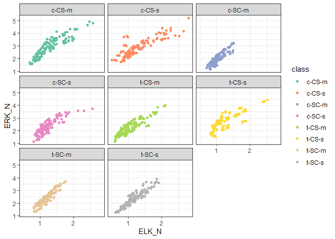<!-- -->

## Correlation Matrix - first 10 protein

``` r
library(corrplot)
data1 <- data[,c(3:12)]
data1 <- na.omit(data1)
names(data1)
```

    ##  [1] "ITSN1_N"   "BDNF_N"    "NR1_N"     "NR2A_N"    "pAKT_N"    "pBRAF_N"  
    ##  [7] "pCAMKII_N" "pCREB_N"   "pELK_N"    "pERK_N"

``` r
M1 <- cor(data1)
cor.mtest <- function(mat, ...) {
    mat <- as.matrix(mat)
    n <- ncol(mat)
    p.mat<- matrix(NA, n, n)
    diag(p.mat) <- 0
    for (i in 1:(n - 1)) {
        for (j in (i + 1):n) {
            tmp <- cor.test(mat[, i], mat[, j], ...)
            p.mat[i, j] <- p.mat[j, i] <- tmp$p.value
        }
    }
  colnames(p.mat) <- rownames(p.mat) <- colnames(mat)
  p.mat
}
# matrix of the p-value of the correlation
p.mat <- cor.mtest(mtcars)
corrplot(M1,  type="upper", order="hclust",tl.col="black", tl.srt=45, p.mat = p.mat, sig.level = 0.01)
```

<!-- -->

``` r
corrplot(M1, method="color",  
         type="upper", order="hclust", 
         addCoef.col = "black", 
         tl.col="black", tl.srt=45,
         p.mat = p.mat, sig.level = 0.01, insig = "blank", 
         diag=FALSE 
         )
```

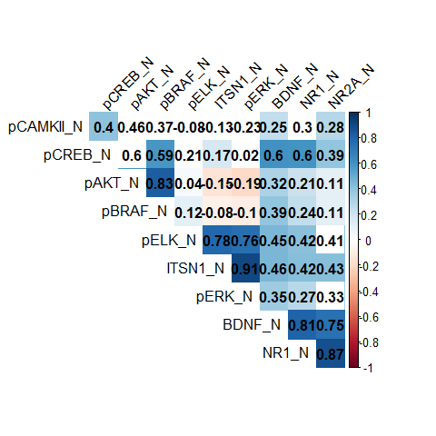<!-- -->

``` r
plot(data1)
```

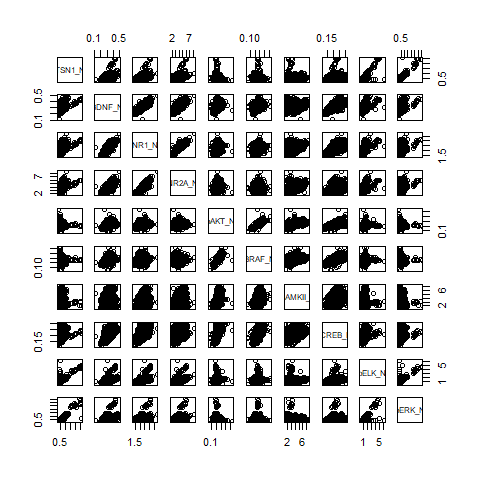<!-- -->

## Correlogram

``` r
library(corrgram)
data1 <- data[,60:82]
corrgram(data1, order=NULL, panel=panel.shade, text.panel=panel.txt,
           main="Correlogram") 
```

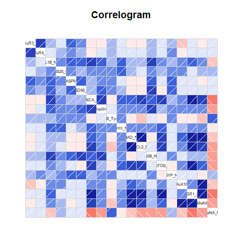<!-- -->

## Boxplot

``` r
library(reshape2)
library(ggplot2)
library(plotly)
library(ggthemes) #custom theme background
#using ggplot
g <- ggplot(data, aes(class,ITSN1_N,fill=class)) 
g +  geom_boxplot()+
  scale_y_continuous("ITSN1_N", breaks= seq(0,15000, by=500))+
  labs(title="Box plot", 
       subtitle="ITSN1_N gene grouped by Treatment",
       caption="Source: mpg",
       x="Treatment",
       y="ITSN1_N") +
  guides(fill=guide_legend("Treatment"))+ 
  theme_stata() + #background theme
  scale_color_stata() + #background theme
  theme(axis.text.x = element_text(angle=65, vjust=0.6)) 
```

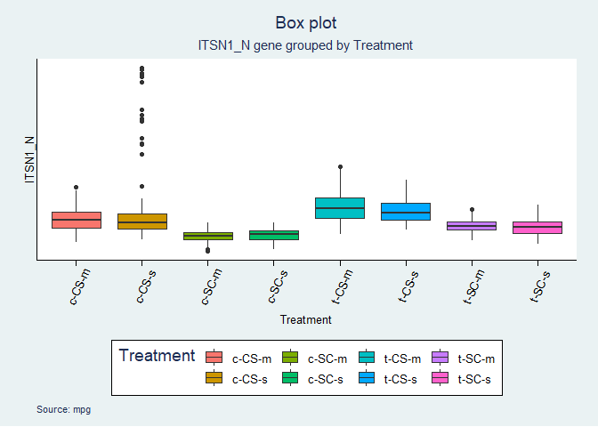<!-- -->

``` r
# #plot_ly
# data2 <- data[,c(70:77,79,80,81,82)]
# df <- melt(data2,id=c("Genotype","Behavior","class","Treatment" ))
# plot_ly(df, x = ~variable, y = ~value, color = ~Genotype,type = "box", colors = "Set3")%>% 
#          layout(boxmode = "group",
#                 xaxis = list(title=''), 
#                 yaxis = list(title='Value'))
```

## Violin plot

``` r
#violin
g+ geom_violin(aes(fill=factor(Behavior))) +
  labs(title="Violin plot") +
  guides(fill=guide_legend("Behavior"))+ 
   theme_economist() + 
  scale_color_economist()+
  theme(legend.background = element_rect(fill="lightblue",
                                  size=0.5, linetype="solid", 
                                  colour ="darkblue"))
```

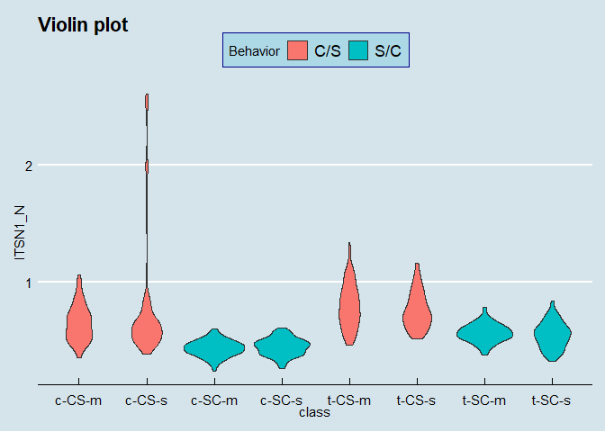<!-- -->

## Dendrogram plot

``` r
library(dplyr) #for dataset manipulation
library(knitr) #for neaty dataset printing
library(car)
data2 <- na.omit(data)
dfdf1<-data %>% group_by(class) %>%
 summarise_at(vars(pMTOR_N:pGSK3B_N),mean, na.rm=TRUE)
dfdf2<-data %>% group_by(class) %>%
 summarise_at(vars(pMTOR_N:pGSK3B_N),mean, na.rm=TRUE) %>%
 filter(class %in% c("c-CS-m"))
dfdf2t <- t(dfdf2)
names <- rownames(dfdf2t)
dfdf3 <- cbind(names,dfdf2t)
dfdf3 <- dfdf3[-1,]
rownames(dfdf3) <- NULL
colnames(dfdf3) <- c("protein","mean")
kable(dfdf3)
```

| protein   | mean      |
| :-------- | :-------- |
| pMTOR\_N  | 0.7610186 |
| DSCR1\_N  | 0.5952344 |
| AMPKA\_N  | 0.3940157 |
| NR2B\_N   | 0.5934115 |
| pNUMB\_N  | 0.4108883 |
| RAPTOR\_N | 0.3276684 |
| TIAM1\_N  | 0.4213292 |
| pP70S6\_N | 0.3228659 |
| NUMB\_N   | 0.1844747 |
| P70S6\_N  | 0.9298689 |
| pGSK3B\_N | 0.166257  |

``` r
means <- dfdf3[,2]
d_mean <- dist(means, method = "euclidean")
fit <- hclust(d_mean)
h <- 2
groups <- cutree(fit, h = h)
plot(fit, labels = dfdf3[,1], main = "Dendrogram")
```

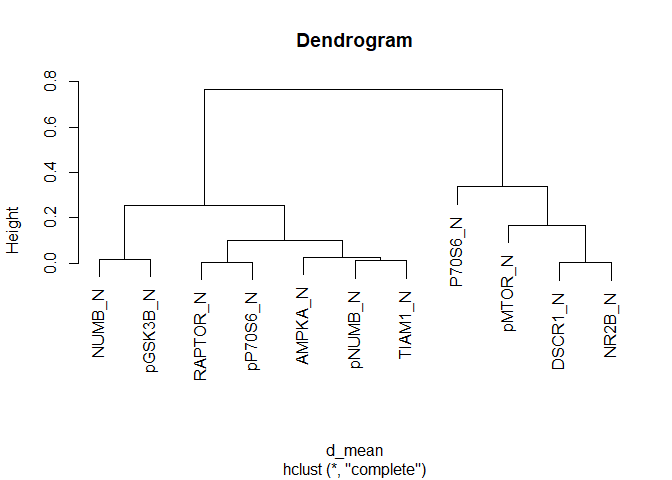<!-- -->

## Chord-diagrams

``` r
library(circlize) #for chord-diagrams
dfdf11<-data %>% group_by(class) %>%
 summarise_at(vars(APP_N:MTOR_N),mean, na.rm=TRUE)
dfdf11 <- as.data.frame(dfdf11)
rownames(dfdf11) <- dfdf11[,1]
dfdf11 <- dfdf11[,-1]
chordDiagram(dfdf11)
```

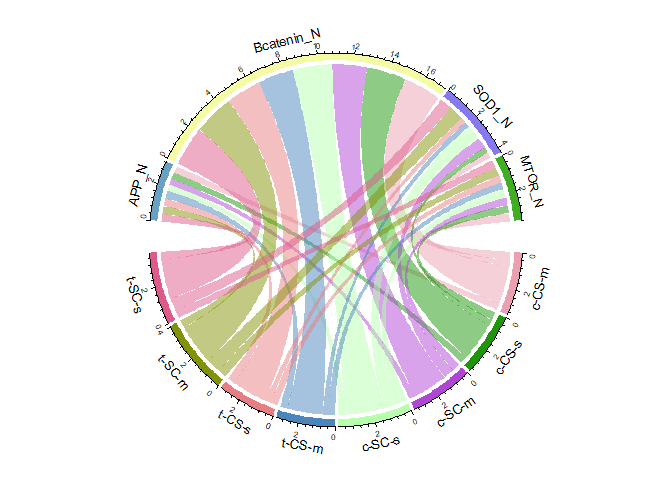<!-- -->

## Radar Plot

``` r
library(fmsb)
par(mfrow=c(1,2))
dfdf22<-data %>% group_by(class) %>%
 summarise_at(vars(pMTOR_N:pGSK3B_N),mean, na.rm=TRUE) %>%
 filter(class %in% c("t-CS-s"))
dfdf22<- dfdf22[,-1]
dfdf23<-data %>% group_by(class) %>%
 summarise_at(vars(pMTOR_N:pGSK3B_N),mean, na.rm=TRUE) %>%
 filter(class %in% c("t-CS-m"))
dfdf23<- dfdf23[,-1]
maxdf <- rep(1,12)
mindf <- rep(0,12)
dfdf3<- data.frame(rbind(maxdf,mindf,dfdf22,dfdf23))
radarchart(dfdf3)


#Fill in
dfdf24<-data %>% group_by(class) %>%
 summarise_at(vars(pMTOR_N:pGSK3B_N),mean, na.rm=TRUE) 
dfdf24 <- data.frame(t(dfdf24))
#firt row as column name
rownames(dfdf24[1,]) <- NULL
colnames(dfdf24) <- as.character(unlist(dfdf24[1,])) 
dfdf24 = dfdf24[-1, ]
#factor to numeric - all variables
con.names = dfdf24 %>% select_if(is.factor) %>% colnames()
dfdf24[,con.names] = lapply(dfdf24[,con.names], as.character)
can.names = dfdf24 %>% select_if(is.character) %>% colnames()
dfdf24[,can.names] = lapply(dfdf24[,can.names], as.numeric)


dfdf1 <- dfdf24[1,]
dfdf2 <- dfdf24[2,]
dfdf3 <- dfdf24[3,]
comparedf <- rbind(maxdf,mindf,dfdf1,dfdf2,dfdf3)
radarchart(comparedf)
```

<!-- -->

``` r
colors_border=c( rgb(0.2,0.5,0.5,0.9), rgb(0.8,0.2,0.5,0.9) , rgb(0.7,0.5,0.1,0.9) )
colors_in=c( rgb(0.2,0.5,0.5,0.4), rgb(0.8,0.2,0.5,0.4) , rgb(0.7,0.5,0.1,0.4) )
radarchart( comparedf  , axistype=1 , 
    #custom polygon
    pcol=colors_border, pfcol=colors_in, plwd=2 , plty=1,
    #custom the grid
    cglcol="grey", cglty=1, axislabcol="grey", caxislabels=seq(0,20,5), cglwd=0.8,
    #custom labels
    vlcex=0.8 
    )
legend(x=1.5, y=1, legend = rownames(comparedf[-c(1,2),]), bty = "n", pch=20 , col=colors_in , text.col = "grey", cex=1.2, pt.cex=3)
```

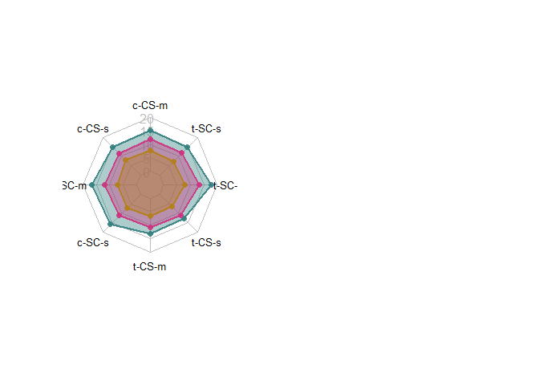<!-- -->

## ggplot2

``` r
library(dplyr) #for dataset manipulation
library(reshape2)
library(knitr) #for neaty dataset printing
library(ggplot2)
data2 <- data[,58:82]
df <- melt(data2,id=c("Genotype","Treatment","Behavior","class" ))
ggplot(df, aes(x=variable,y=value,group=Genotype)) + 
  geom_point(aes(color=Genotype),size=0.5,shape=3)+
  scale_colour_brewer(palette = "Set1") +
  theme_economist() + 
  scale_color_economist() +
  theme(axis.text.x = element_text(angle=65, vjust=0.6))+
  theme(legend.background = element_rect( fill = 'grey95', size = 0.3, linetype='solid',colour ="darkblue"))+
  theme(legend.title = element_text(face="bold"))
```

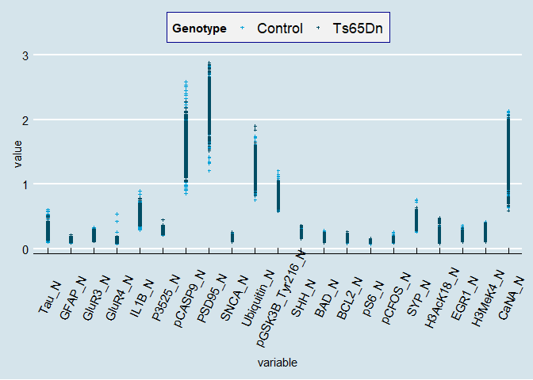<!-- -->

``` r
#facet_wrap
df <- na.omit(df)
mean_df<-df %>% group_by(class,Genotype,variable) %>%
 summarise(mean=mean(value)) 

p <- ggplot(mean_df, aes(x=variable,y = mean,fill=class)) +
  geom_bar(position="dodge", stat="identity")+
  facet_wrap(~Genotype) +
  guides(fill=guide_legend("Treatment"))
p + 
  scale_fill_brewer(palette = "Spectral") + 
  coord_flip()
```

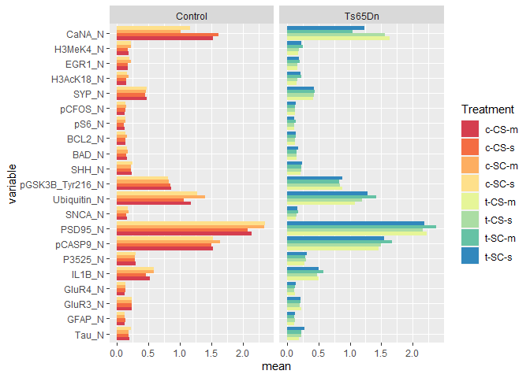<!-- -->

``` r
#facet_grid
df <- na.omit(df)
mean_df2 <-df %>% group_by(class,Behavior,variable) %>%
 summarise(mean=mean(value)) 

p1 <- ggplot(mean_df2, aes(x=variable,y = mean,fill=class)) +
  geom_bar(position="dodge", stat="identity")+
  facet_grid(Behavior~.) +
  guides(fill=guide_legend("Treatment"))
p1 + scale_fill_brewer(palette = "PuBu") +theme_dark() +theme(axis.text.x = element_text(angle=65, vjust=0.6)) 
```

<!-- -->

``` r
#Multiple variables mean
#data1 <- na.omit(data)
#dfdf<-data1 %>% group_by(class..82) %>%
#  summarise_at(vars(Bcatenin_N:MTOR_N),mean, na.rm=TRUE)
#dfdf2<- melt(dfdf)
#kable(dfdf2)
```

## Plotly

``` r
# #Linear
# plot_ly(data=mean_df2, x=~variable,y=~mean,color=~class,type = 'scatter', mode = 'lines') 

# #Scatter
# plot_ly(data=data,x=~Tau_N, y=~ERK_N,
#         marker = list(size = 5,
#                        color = 'rgba(255, 182, 193, .9)',
#                        line = list(color = 'rgba(152, 0, 0, .8)',
#                                    width = 1))) %>%
#   group_by(class) %>%
#   layout(title = 'Styled Scatter')

x <- c(1:1080)
x1<- rep(1:180,6)
data2<- cbind(data,x1)

#smoothing line
ggplot(data2, aes(x=x1, y=SOD1_N,color=class)) + 
  geom_point(size=1) +
  geom_smooth(position = "identity")
```

<!-- -->

``` r
# #line + scatter
# plot_ly(data2, x = ~x1, y = ~pNR2B_N, type = 'scatter',color=~class,mode = 'lines')
# 
# p <- plot_ly(data, x = ~x, y = ~pNR2B_N) 
# add_markers(p, linetype = ~Behavior)
```

## Lollipop

``` r
# Lillopop Plot
ggplot(mean_df2, aes(x=variable, y=mean)) + 
  geom_point(color="orange",size=4) + 
  geom_segment(aes(x=variable, xend=variable, y=0.5, yend=mean),color='grey') + 
  theme( panel.grid.major.x = element_blank(),
          panel.border = element_blank(),
          axis.ticks.x = element_blank(),
          axis.text.x = element_text(angle=65, vjust=0.6))+ 
  labs(title="Lollipop Chart", subtitle="Treatment") 
```

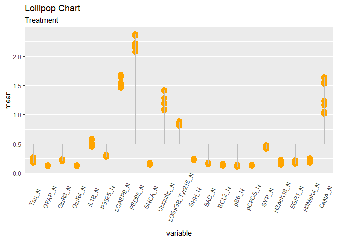<!-- -->

## Density plot

``` r
theme_set(theme_classic())

g <- ggplot(data, aes(pGSK3B_Tyr216_N))
g + geom_density(aes(fill=factor(class)), alpha=0.8) + 
    labs(title="Density plot", 
         subtitle="pGSK3B_Tyr216_N Grouped by classs",
         caption="Source: ",
         x="pGSK3B_Tyr216_N",
         fill="#class") +
    facet_wrap(~Behavior)
```

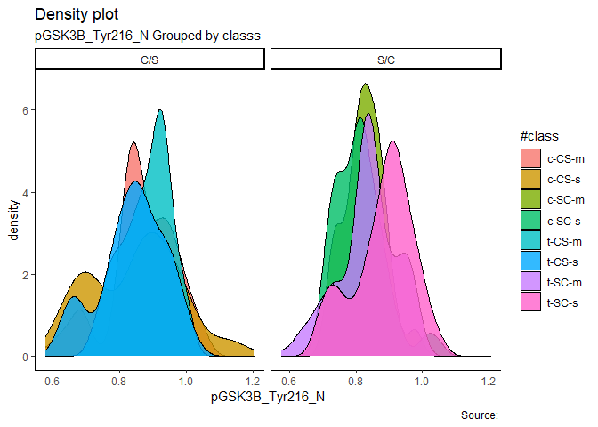<!-- -->
