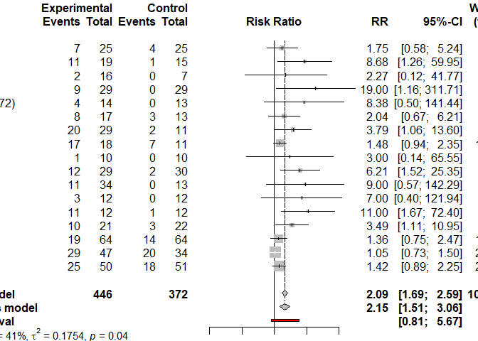
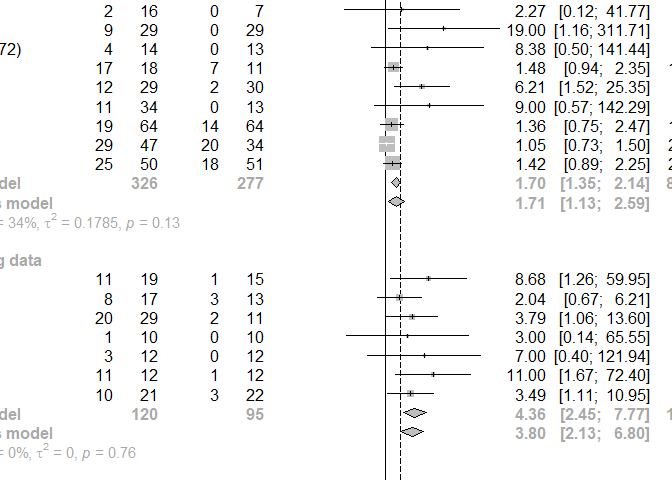
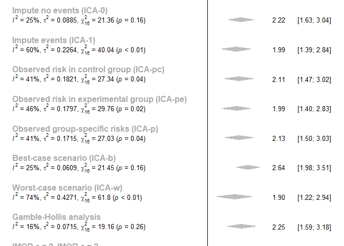
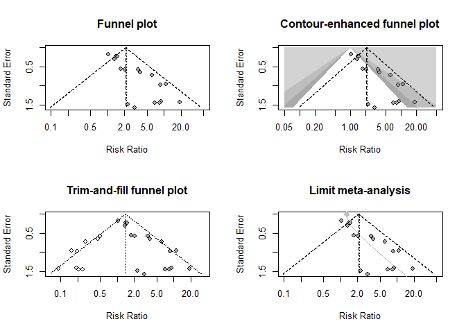

Meta-analysis
================

## R packages

1)  meta: standard methods for meta-analysis
2)  metasens: Advanced methods to model and adjust for bias in
    meta-analysis
3)  metafor: general package for meta-analysis, provides methods for
    multilevel meta-analysis + multivariate
4)  netmeta: frequentist method for network meta=analysis

## Standard pair-wise meta-analysis

  - assumption test: heterogeneity within each direct comparison

## Network meta-analysis

  - simultaneously compare between any pairs of interventions in the
    network.–\> enables the *relative ranking* for a given outcome
  - available both direct and indirect intervention comparisons
  - assume that the amount of heterogeneity is the same for every
    comparison in the network
  - outcome: Ranking probability, such as the mean ranks, median ranks
    and the cumulative ranking probabilities \*\* indirect intervention:
    estimate the relative effect of two interventions when no studies
    have compared. two assumptions; 1) notion of transitivity 2)
    coherence

\*\* transitivity: the average of all important factors should be
similar in different sets of randomized trials \*\*
coherence(consistency): different sources agree with each other \*\*
confounding: complicates interpretation of subgroup analysis and
meta-regressions and lead to incorrect conclusion \*\* pooled variance:
common variance when different populations have the same variance, check
the similarity, use ratio of sample standard deviation \#\# desing of
Cochrane Review with multiple interventions 1) population 2)
interventions \#\# statistical methods \#\#\# hierarchical models can be
found in WinBUGS and OpenBUGS. \#\#\# Multivariate meta-analysis methods
\*\* the heterogeneity among studies in the network as a whole is larger
than the heterogeneity within the direct comparison, and therefore some
uncertainty is added in the network estimates \*\* Odds ratios lower
than 1 favour the column-defining intervention

``` r
# import data
library(meta)
```

    ## Loading 'meta' package (version 4.15-1).
    ## Type 'help(meta)' for a brief overview.

``` r
library(metasens)
```

    ## Loading 'metasens' package (version 0.5-0).

``` r
joy <- read.csv("Data/ebmental_2019.txt")
# manipulate data
joy$miss = ifelse((joy$drop.h + joy$drop.p) == 0, "Without missing data", "With missing data") 
head(joy)
```

    ##      author year resp.h fail.h drop.h resp.p fail.p drop.p                 miss
    ## 1 Arvanitis 1997     25     25      2     18     33      0    With missing data
    ## 2   Beasley 1996     29     18     22     20     14     34    With missing data
    ## 3  Bechelli 1983     12     17      1      2     28      1    With missing data
    ## 4   Borison 1992      3      9      0      0     12      0 Without missing data
    ## 5 Chouinard 1993     10     11      0      3     19      0 Without missing data
    ## 6    Durost 1964     11      8      0      1     14      0 Without missing data

  - responded in the haloperidol arm (resp.h) == true positive</br>
  - responded in the placebo arm (resp.p) == false positive</br>
  - failed to respond in the haloperidol arm (fail.h) == true
    negative</br>
  - failed to respond in the placebo arm (fail.p). == false
    negative</br>
  - who dropped out, for which the outcome is missing, in either arm
    (drop.h, drop.p)

## Fixed effect and random effects meta-analysis

``` r
# print results with two significant digits
settings.meta(digits = 2) 
m.publ = metabin(resp.h, resp.h + fail.h , resp.p, resp.p + fail.p, 
                data = joy, 
                studlab = paste0(author, "(", year, ")"), 
                method.tau = "PM" )
m.publ
```

    ##                        RR         95%-CI %W(fixed) %W(random)
    ## Arvanitis(1997)      1.42 [0.89;   2.25]      21.1       14.1
    ## Beasley(1996)        1.05 [0.73;   1.50]      27.5       15.6
    ## Bechelli(1983)       6.21 [1.52;  25.35]       2.3        4.7
    ## Borison(1992)        7.00 [0.40; 121.94]       0.6        1.4
    ## Chouinard(1993)      3.49 [1.11;  10.95]       3.5        6.3
    ## Durost(1964)         8.68 [1.26;  59.95]       1.3        2.8
    ## Garry(1962)          1.75 [0.58;   5.24]       4.7        6.7
    ## Howard(1974)         2.04 [0.67;   6.21]       4.0        6.6
    ## Marder(1994)         1.36 [0.75;   2.47]      16.6       12.2
    ## Nishikawa(1982)      3.00 [0.14;  65.55]       0.6        1.2
    ## Nishikawa(1984)      9.00 [0.57; 142.29]       0.8        1.5
    ## Reschke(1974)        3.79 [1.06;  13.60]       3.4        5.4
    ## Selman(1976)         1.48 [0.94;   2.35]      10.3       14.1
    ## Serafetinides(1972)  8.38 [0.50; 141.44]       0.6        1.4
    ## Simpson(1967)        2.27 [0.12;  41.77]       0.8        1.4
    ## Spencer(1992)       11.00 [1.67;  72.40]       1.2        3.0
    ## Vichaiya(1971)      19.00 [1.16; 311.71]       0.6        1.5
    ## 
    ## Number of studies combined: k = 17
    ## 
    ##                        RR       95%-CI    z  p-value
    ## Fixed effect model   2.09 [1.69; 2.59] 6.71 < 0.0001
    ## Random effects model 2.15 [1.51; 3.06] 4.23 < 0.0001
    ## 
    ## Quantifying heterogeneity:
    ##  tau^2 = 0.1754 [0.0000; 1.0088]; tau = 0.4188 [0.0000; 1.0044];
    ##  I^2 = 41.3% [0.0%; 67.0%]; H = 1.30 [1.00; 1.74]
    ## 
    ## Test of heterogeneity:
    ##      Q d.f. p-value
    ##  27.24   16  0.0388
    ## 
    ## Details on meta-analytical method:
    ## - Mantel-Haenszel method
    ## - Paule-Mandel estimator for tau^2
    ## - Q-profile method for confidence interval of tau^2 and tau
    ## - Continuity correction of 0.5 in studies with zero cell frequencies

method is used to estimate the confidence interval of τ^2 and ==
estimate the between-study variance in the random effects model </br> -
method.tau = “DL”, “PM(Paule-Mandel estimator)”, “REML”, “ML”, “HS”,
“SJ”, “HE”, or “EB”,

measures of treatment effect</br> - sm = “RR”(Risk ratio), “OR”(Odds
ratio), “RD”(Risk difference), “ASD”(Arcsien difference), or
“DOR”(Diagnostic Odds ratio) - allincr = True , if at least one
study has a zero cell count

method used for pooling == method to calculate the fixed effect
estimate</br> - method = “Inverse”(inverse variance weighting),
“MH(Mantel-Haenszel)”, “Peto”, “GLMM”(generalised linear mixed model),
or “SSW”(sample size method)

method to calculate a confidence interval for τ^2 and τ</br> -
method.tau.ci = “J”(Jackson),“BJ”(Biggerstaff and
Jackson),“QP”(Q-profile method)</br>

–\> test of heterogeneity: (p=0.004), presence of heterogeneous results
–\> heterogeneity statistic I2 is 54%: indicative of moderate
heterogeneity –\> its CI ranges from 21% to 74%: denoting potentially
unimportant to substantial heterogeneity –\> CI from the random effects
model is wider compared with the one from the fixed effect model, but
differ slightly \#\# Forest plot

``` r
# forest plot
forest(m.publ, 
       sortvar = year, 
       prediction = TRUE , #  prediction interval shown
       label.left = "Favo u rs placebo" , label.right = "Favo u rs haloperidol" )
```

<!-- -->

``` r
#help(forest.meta)
```

–\> diamond: estimated RRs and CI do not cross the line of no effect –\>
haloperidol is significantly more effective than placebo –\> cross the
line of no effect: placebo might be superiod to haloperidol in a future
study \#\# Subgroup analysis: impact of missing data

``` r
m.publ.sub = update(m.publ, byvar = miss, print.byvar = FALSE ) # group by 'miss' add new variable 'miss'
m.publ.sub
```

    ##                        RR         95%-CI %W(fixed) %W(random)
    ## Arvanitis(1997)      1.42 [0.89;   2.25]      21.1       14.1
    ## Beasley(1996)        1.05 [0.73;   1.50]      27.5       15.6
    ## Bechelli(1983)       6.21 [1.52;  25.35]       2.3        4.7
    ## Borison(1992)        7.00 [0.40; 121.94]       0.6        1.4
    ## Chouinard(1993)      3.49 [1.11;  10.95]       3.5        6.3
    ## Durost(1964)         8.68 [1.26;  59.95]       1.3        2.8
    ## Garry(1962)          1.75 [0.58;   5.24]       4.7        6.7
    ## Howard(1974)         2.04 [0.67;   6.21]       4.0        6.6
    ## Marder(1994)         1.36 [0.75;   2.47]      16.6       12.2
    ## Nishikawa(1982)      3.00 [0.14;  65.55]       0.6        1.2
    ## Nishikawa(1984)      9.00 [0.57; 142.29]       0.8        1.5
    ## Reschke(1974)        3.79 [1.06;  13.60]       3.4        5.4
    ## Selman(1976)         1.48 [0.94;   2.35]      10.3       14.1
    ## Serafetinides(1972)  8.38 [0.50; 141.44]       0.6        1.4
    ## Simpson(1967)        2.27 [0.12;  41.77]       0.8        1.4
    ## Spencer(1992)       11.00 [1.67;  72.40]       1.2        3.0
    ## Vichaiya(1971)      19.00 [1.16; 311.71]       0.6        1.5
    ##                                     miss
    ## Arvanitis(1997)        With missing data
    ## Beasley(1996)          With missing data
    ## Bechelli(1983)         With missing data
    ## Borison(1992)       Without missing data
    ## Chouinard(1993)     Without missing data
    ## Durost(1964)        Without missing data
    ## Garry(1962)            With missing data
    ## Howard(1974)        Without missing data
    ## Marder(1994)           With missing data
    ## Nishikawa(1982)     Without missing data
    ## Nishikawa(1984)        With missing data
    ## Reschke(1974)       Without missing data
    ## Selman(1976)           With missing data
    ## Serafetinides(1972)    With missing data
    ## Simpson(1967)          With missing data
    ## Spencer(1992)       Without missing data
    ## Vichaiya(1971)         With missing data
    ## 
    ## Number of studies combined: k = 17
    ## 
    ##                        RR       95%-CI    z  p-value
    ## Fixed effect model   2.09 [1.69; 2.59] 6.71 < 0.0001
    ## Random effects model 2.15 [1.51; 3.06] 4.23 < 0.0001
    ## 
    ## Quantifying heterogeneity:
    ##  tau^2 = 0.1754 [0.0000; 1.0088]; tau = 0.4188 [0.0000; 1.0044];
    ##  I^2 = 41.3% [0.0%; 67.0%]; H = 1.30 [1.00; 1.74]
    ## 
    ## Quantifying residual heterogeneity:
    ##  I^2 = 12.1% [0.0%; 49.5%]; H = 1.07 [1.00; 1.41]
    ## 
    ## Test of heterogeneity:
    ##      Q d.f. p-value
    ##  27.24   16  0.0388
    ## 
    ## Results for subgroups (fixed effect model):
    ##                        k   RR       95%-CI     Q   I^2
    ## With missing data     10 1.70 [1.35; 2.14] 13.73 34.4%
    ## Without missing data   7 4.36 [2.45; 7.77]  3.35  0.0%
    ## 
    ## Test for subgroup differences (fixed effect model):
    ##                     Q d.f. p-value
    ## Between groups   8.82    1  0.0030
    ## 
    ## Results for subgroups (random effects model):
    ##                        k   RR       95%-CI  tau^2    tau
    ## With missing data     10 1.71 [1.13; 2.59] 0.1785 0.4224
    ## Without missing data   7 3.80 [2.13; 6.80]      0      0
    ## 
    ## Test for subgroup differences (random effects model):
    ##                     Q d.f. p-value
    ## Between groups   4.80    1  0.0285
    ## 
    ## Details on meta-analytical method:
    ## - Mantel-Haenszel method
    ## - Paule-Mandel estimator for tau^2
    ## - Q-profile method for confidence interval of tau^2 and tau
    ## - Continuity correction of 0.5 in studies with zero cell frequencies

``` r
forest(m.publ.sub, 
       sortvar = year, 
       prediction = TRUE , #  prediction interval shown
       label.left = "Favo u rs placebo" , label.right = "Favo u rs haloperidol" )
```

<!-- -->

``` r
forest(m.publ.sub, 
       sortvar = year,
       xlim = c(0.1, 100), at = c(0.1, 0.3, 1, 3, 10, 30, 100),
       test.subgroup.random = TRUE)
```

<!-- --> –\>
studies without missing data report a larger haloperidol effect compared
with the studies with missing data</br> –\> subgroup differece test test
under the random effects model: missing data might have some impact on
the results (p=0.03)∂

## Sensitivity analysis for missing binary outcomes

to adjust the effect estimate for this bias

``` r
mmiss.1 = metamiss (m.publ, drop.h, drop.p, method.miss = "1" ) # missing value as 1
mmiss.1
```

    ## Sensitivity analysis for missing binary data
    ## 
    ##                        RR         95%-CI %W(fixed) %W(random)
    ## Arvanitis(1997)      1.47 [0.93;   2.32]       5.9       11.8
    ## Beasley(1996)        0.93 [0.77;   1.12]      35.7       14.1
    ## Bechelli(1983)       4.48 [1.42;  14.16]       0.9        5.8
    ## Borison(1992)        7.00 [0.38; 129.34]       0.1        1.4
    ## Chouinard(1993)      3.49 [1.11;  10.95]       0.9        5.8
    ## Durost(1964)         8.68 [1.26;  59.95]       0.3        2.8
    ## Garry(1962)          1.60 [0.60;   4.25]       1.3        7.0
    ## Howard(1974)         2.04 [0.67;   6.21]       1.0        6.0
    ## Marder(1994)         1.31 [0.75;   2.28]       4.0       10.8
    ## Nishikawa(1982)      3.00 [0.13;  70.74]       0.1        1.2
    ## Nishikawa(1984)     10.46 [0.64; 172.21]       0.2        1.5
    ## Reschke(1974)        3.79 [1.06;  13.60]       0.8        5.1
    ## Selman(1976)         1.12 [0.95;   1.32]      47.2       14.2
    ## Serafetinides(1972)  2.94 [0.53;  16.31]       0.4        3.3
    ## Simpson(1967)        0.83 [0.13;   5.36]       0.4        2.9
    ## Spencer(1992)       11.00 [1.67;  72.40]       0.3        2.9
    ## Vichaiya(1971)       6.96 [1.34;  36.11]       0.5        3.5
    ## 
    ## Number of studies combined: k = 17
    ## 
    ##                        RR       95%-CI    z p-value
    ## Fixed effect model   1.16 [1.04; 1.29] 2.59  0.0097
    ## Random effects model 1.99 [1.39; 2.84] 3.77  0.0002
    ## 
    ## Quantifying heterogeneity:
    ##  tau^2 = 0.2264 [0.0351; 1.0462]; tau = 0.4758 [0.1873; 1.0228];
    ##  I^2 = 60.0% [32.0%; 76.5%]; H = 1.58 [1.21; 2.06]
    ## 
    ## Test of heterogeneity:
    ##      Q d.f. p-value
    ##  40.04   16  0.0008
    ## 
    ## Details on meta-analytical method:
    ## - Inverse variance method
    ## - Paule-Mandel estimator for tau^2
    ## - Q-profile method for confidence interval of tau^2 and tau
    ## - Imputation method: impute events (ICA-1)

``` r
#help(metamiss)
```

  - method: “GH”, “IMOR”, “0”, “1”, “pc”, “pe”, “p”, “b”, or “w”
  - small.values: small treatment effects indicate a beneficial (“good”)
    or harmful (“bad”) effect

<!-- end list -->

``` r
## Imputation methods for the meta-analysis of binary outcomes with missing data
# Impute as no events (ICA-0) - default
mmiss.0 = metamiss(m.publ, drop.h, drop.p)
# Impute as events (ICA-1)
mmiss.1 = metamiss(m.publ, drop.h, drop.p, method = "1")
# Observed risk in control group (ICA-pc)
mmiss.pc = metamiss(m.publ, drop.h, drop.p, method = "pc")
# Observed risk in experimental group (ICA-pe)
mmiss.pe = metamiss(m.publ, drop.h, drop.p, method = "pe")
# Observed group-specific risks (ICA-p)
mmiss.p = metamiss(m.publ, drop.h, drop.p, method = "p")
# Best-case scenario (ICA-b)
mmiss.b = metamiss(m.publ, drop.h, drop.p, method = "b", small.values = "bad")
# Worst-case scenario (ICA-w)
mmiss.w = metamiss(m.publ, drop.h, drop.p, method = "w", small.values = "bad")
# Gamble-Hollis method
mmiss.gh = metamiss(m.publ, drop.h, drop.p, method = "GH")
# Informative Missingness Odds Ratio (IMOR): odds of an event in the missing group over the odds of an event in the observed group
# IMOR.e = 2 and IMOR.c = 2: odds for an event is assumed to be twice as likely for missing observations
mmiss.imor2 = metamiss(m.publ, drop.h, drop.p, method = "IMOR", IMOR.e = 2)
# IMOR.e = 0.5 and IMOR.c = 0.5
mmiss.imor0.5 = metamiss(m.publ, drop.h, drop.p, method = "IMOR", IMOR.e = 0.5)
```

``` r
# Label
meths = c("Available case analysis (ACA)",
          "Impute no events (ICA-0)", "Impute events (ICA-1)",
          "Observed risk in control group (ICA-pc)",
          "Observed risk in experimental group (ICA-pe)",
          "Observed group-specific risks (ICA-p)",
          "Best-case scenario (ICA-b)", "Worst-case scenario (ICA-w)",
          "Gamble-Hollis analysis",
          "IMOR.e = 2, IMOR.c = 2", "IMOR.e = 0.5, IMOR.c = 0.5")
# Use inverse-variance method for pooling (which is used for imputation methods)
m.publ.iv = update(m.publ, method = "Inverse")

# Combine results (random effects)
mbr = metabind(m.publ.iv,
               mmiss.0, mmiss.1,
               mmiss.pc, mmiss.pe, mmiss.p,
               mmiss.b, mmiss.w, mmiss.gh,
               mmiss.imor2, mmiss.imor0.5,
               name = meths, pooled = "random")
forest(mbr, xlim = c(0.25, 4),
       label.left = "Favours placebo", label.right = "Favours haloperidol",
       leftcols = "studlab", leftlab = "Meta-Analysis Method",
       type.study = "diamond",
       hetlab = "", print.Q = TRUE, fs.study = 10)
```

<!-- --> –\>
all sensitivity analyses for missing data resulted in similar
results.</br> –\> there’s benefits of using halloperidol over placebo

## Small-study effects

*small study effect: sometimes, small study shows larger or different
treatment effect than larger studies</br> *check asymmetry using funnel
plot

``` r
# Harbord's score test for funnel plot asymmetry
metabias(m.publ, method.bias = "score")
```

    ## 
    ##  Linear regression test of funnel plot asymmetry (efficient score)
    ## 
    ## data:  m.publ
    ## t = 4.5551, df = 15, p-value = 0.0003793
    ## alternative hypothesis: asymmetry in funnel plot
    ## sample estimates:
    ##        bias     se.bias   intercept 
    ##  2.21062613  0.48531007 -0.09141715

``` r
par(mfrow=c(2,2))

# Funnel plot
funnel(m.publ)
title(main = "Funnel plot")

# Contour-enhanced funnel plot
funnel(m.publ, xlim = c(0.05, 50),
       contour.levels = c(0.9, 0.95, 0.99),
       col.contour = c("darkgray", "gray", "lightgray"))
# legend("topright",
#        c("p < 1%", "1% < p < 5%", "5% < p < 10%", "p > 10%"),
#        fill = c("lightgray", "gray", "darkgray", "white"),xpd="NA")
title(main = "Contour-enhanced funnel plot")

# Trim-and-fill method
#summary(trimfill(m.publ))
funnel(trimfill(m.publ), legend=TRUE) # with missing studies filled in
title(main = "Trim-and-fill funnel plot")

# Limit meta-analysis
funnel(limitmeta(m.publ))
title(main = "Limit meta-analysis")
```

<!-- --> fixed
effect model: dash-line</br> random effect model: dotted line in
centred.</br> middle line: no effect</br> –\> funnel: both estimates are
similar; They cannot be well distinguished. The funnel plot clearly
looks asymmetric</br> –\> contour-enhanced funnel: publication bias
seems not to be the dominant factor for the asymmetry</br> as most small
studies with large SEs lie in the white area, non-significant treatment
estimates</br> –\> The Harbord test: is highly significant (p\<0.001),
presence of small-study effects –\> trim-and fill: add 9 studies.
adjusted random effects estimate RR=1.4, non-significant treatment
benefits –\> limit meta-analysis: some funnel plot asymmetry,adjusted
estimate RR=1.29</br> \*\* RR larger than 1 meaning that haloperidol is
better than placebo
